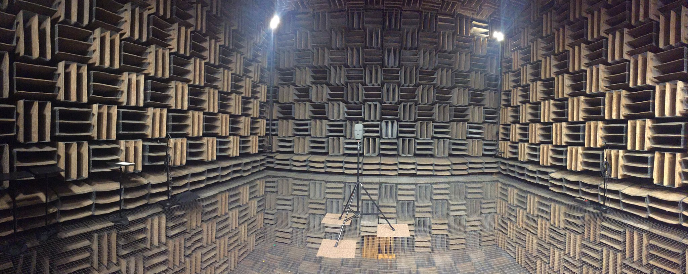
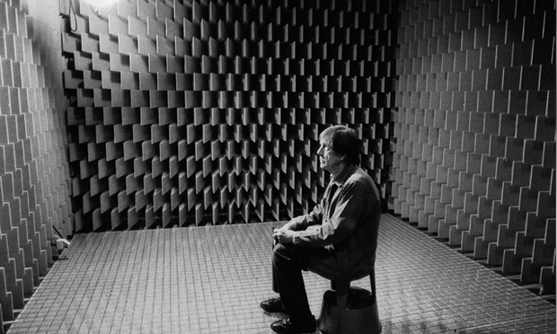

 

<iframe class="embed-responsive-item" src="https://www.youtube.com/embed/B730Kngh9aw" frameborder="0" allow="accelerometer; autoplay; encrypted-media; gyroscope; picture-in-picture" allowfullscreen></iframe>

## Silence in Theory

_Silence_, as a theoretical notion, is the idea that there is a complete lack, void, or absence of sound. However, as we can deduce, this theoretical idea is not the reality we experience...

 

In music, _silence_ is the absence of any musicians playing. That is, it occurs during rests. This is true in classical music as well as pop music. Silence is used as an effect, the sudden absence of sound is typically significant to a listener, and it serves to setup tension which can then be released through the reoccurrence of "the music".

In film, _silence_ may be used to indicate an affect, such as impending doom in a thriller, or serenity in a love story.

However, even during these artificial and manufactured moments of _silence_, we, the listeners/viewers, do not truly experience silence as defined above. Instead, there is always _sound_ present. As proof, please perform the following;

**_{ TODO: }_**

- Wherever you are right now, I want you to sit, in perfect silence for 30 seconds.
- If your TV, radio, record player, etc. are on or if you have loud electronics running, please turn them off (where possible).
- Try not to move, try to sit perfectly still.
- Sit with your eyes closed or open.
- Finally, over the course of these 30 seconds ask yourself the question... "What do I hear?"

Even in the quietest of apartments, the answer to "What do I hear?" is _something_.

As I sit in my office writing this, I have also just performed the above work. I shut my office window, turned off my fan, and turned off the lights (which emit a slight electrical buzz). Yet, I can still hear a cacophony of various sources creating a complex soundscape. The constant drone of the HVAC system piping that runs through my office includes a wide-band noise profile, along with a steady low-frequency hum. This sam HVAC system also causes a slight rattle to occur every few moments, as the piping adjusts to temperature and air pressure changes. This all mixes with the faintest sound of children playing in the ASUM Childcare playground outside, even with my window closed (the playground is below my office window). The final sound event I experienced in this moment of _silence_ was of involuntary swallowing. I did not mean to, but I believe I became parched and in order to rehydrate my throat I swallowed, creating a series of high-pitched clicks of my tongue moving in my mouth, accompanied by a lower-frequency sound of my throat moving saliva downward.

Now, you might declare that I didn't perform the above work honestly or faithfully, as I did not turn off the HVAC system. Likewise, I could have done a better job of sound proofing my window. Finally, instead of sitting perfectly still, I spoiled the 30-second event through my involuntary swallow. But, this is exactly the point, it is incredibly difficult, if not impossible, to actually create a theoretically perfect moment of silence.

There are spaces, known as [anechoic chambers](https://en.wikipedia.org/wiki/Anechoic_chamber), which serve to keep all outside sounds out, and also absorb all radiating sounds within. This results in a space free from outside sound and devoid of any reflections or ambience (terms we will talk about later this semester). These types of spaces are used in acoustics research to test and measure qualities of sound. These spaces also come as close as is possible to creating a space that approaches a theoretically _silent_ environment. If we placed a microphone in such a space and recorded, we would notice that there is absolutely no sound being captured within.

However, the point we are missing in such an exercise is that this is the microphone's experience, and not ours. So, if _you_ were placed in a completely silent, anechoic chamber, what would you hear something?

John Cage, who was one of the most important composers and artists of the 20th century asked this same question. Here is a recounting of his experience;

> 
>
> "There is no such thing as an empty space or an empty time. There is always something to see, something to hear. In fact, try as we may to make a silence, we cannot. For certain engineering purposes, it is desirable to have as silent a situation as possible. Such a room is called an anechoic chamber, its six walls made of special material, a room without echoes. I entered one at Harvard University several years ago and heard two sounds, one high and one low. When I described them to the engineer in charge, he informed me that the high one was my nervous system in operation, the low one my blood in circulation. Until I die **there will be sounds**."
>
> - John Cage
>

What Cage discovered during this experience was that even in the quietest places that a human could be, there are still sound events that we hear and can listen to.

One of the realities you will discover through a practice of listening is that "silence", as an absolute idea, is false. Instead, _silence_ is just another opportunity for you to hear other sounds. _Silence_ is the moments where sound is not purposefully being created, but instead is everything else that vibrates and radiates in our sound filled worlds, including our own bodies, as they make sound just by being alive.


CANNOT FIND A CURRENT VERSION OF THIS VIDEO AVAILABLE ON YOUTUBE

Here is Cage discussing this experience (you only need to watch from 25:58 till 27:11. NOTE: It should start in the right spot, but you will need to end the video.)

<iframe class="embed-responsive-item" src="https://www.youtube.com/embed/UaNGeuDuXl4?start=1558" frameborder="0" allow="accelerometer; autoplay; encrypted-media; gyroscope; picture-in-picture" allowfullscreen></iframe>



The next video is an excerpt from a larger movie on avant-garde artists. It is a brief interview with John Cage, and allows you a moment to hear his thoughts on hearing vs. listening, as well as his appreciation for _silence_.

<iframe class="embed-responsive-item" src="https://www.youtube.com/embed/pcHnL7aS64Y" frameborder="0" allowfullscreen></iframe>

<h2>References and Resources</h2>

Portions of the above content was adapted from:

<ol>
<li><a href="https://monoskop.org/images/b/b5/Cage_John_Silence_Lectures_and_Writings.pdf">Cage, John. "Experimental Music", from Silence: Lectures and Writings. Wesleyan University Press, 2010.</a></li>
</ol>

