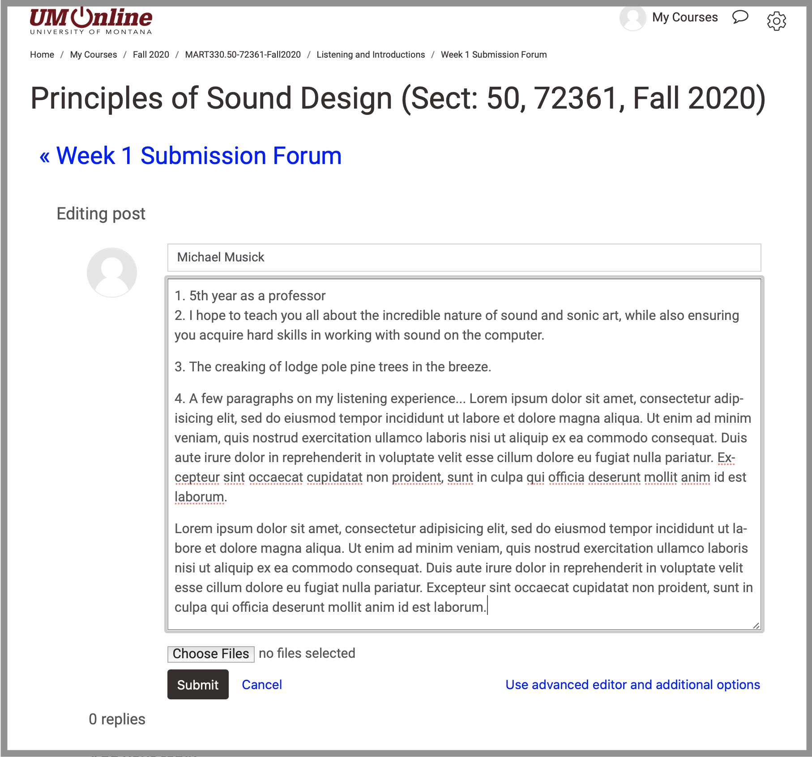

You have a number of steps for your homework this first week. MOST IMPORTANT among them is to spend time actively listening!

Listen as you sit, listen as you walk, listen and you lay. Think about sound and about the qualities of sound.

## One More Reading

I want you to read one more article, by Pauline Oliveros for this week.

- Oliveros, Pauline. "Some Sound Observations", from Audio Culture. Edited by Christopher Cox and Daniel Warner, Bloomsbury Academic, 2004.
  - [Available through the course Moodle site](https://moodle.umt.edu/pluginfile.php/2159960/mod_resource/content/0/Oliveros-SoundObservations.pdf)
  - You only need to read pages 102-106

## Listening Response

Having read the Oliveros chapter, "Some Sound Observations", I would like you to sit outside of wherever you live and listen. As you experience this time, try to really _hear_ the sound events that are creating your soundscape.

You may ask yourself questions such as;

- Can I identify the source of the sound?
- Can I describe the quality of the sound?
- What is the effect of all of these sounds mixing together?
- Do I like these sounds, find them interesting, appreciate them?
- What mode of listening am I using (considering the modes of listening by Chion)
- Is there silence, and if so, what is its quality?

After listening and observing for a while, please create a new note to write. In this note, I would like you to try and describe the soundscape or sound events that you hear. You are welcome to mimic Pauline and write as she does, or you may choose to write about this soundscape with prose that are authentic to you.

## Homework Specifications

1. Listen constantly
2. Create a new discussion post on the course Moodle site, in the [**Week 1 Submission Forum** under the **1. Listening and Introduction** section](https://moodle.umt.edu/mod/hsuforum/view.php?id=1654466).
3. In this discussion post, please put your name as the "Subject" and then include the following;
   1. What year/level you are (i.e. second year or junior)
   2. A few sentences on what do you hope to get from this class?
   3. What is your favorite sound?
   4. Finally, include your listening response from above.

