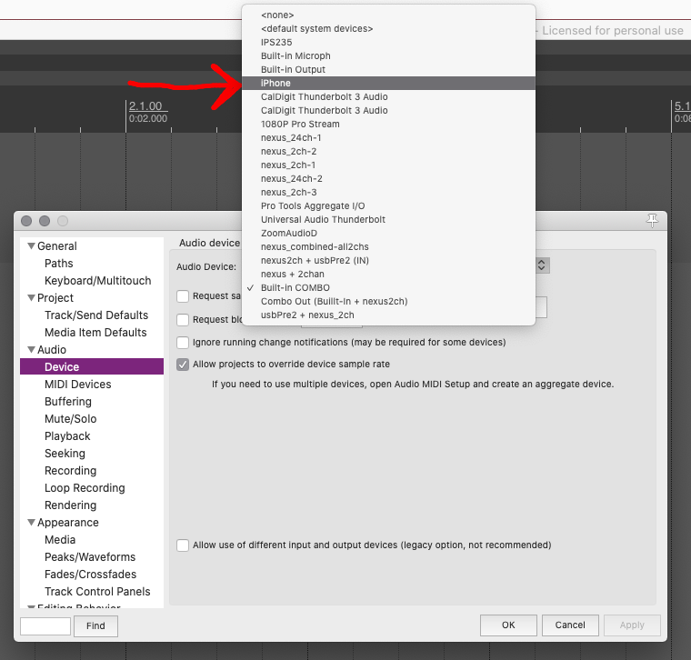

On both Windows and Mac, it should be possible to use your mobile phone as live, connected microphone for your DAW on your computer. Unlike our older method, where you would record using the Shure mobile app, then import it, this method will allow you to create multi-track recordings within you DAW, where the captured audio content can be "in time" and responsive to existing content.

## PC / Windows

For those of you on a PC or Windows machine, please navigate to the below pages and follow along to get setup (_note: each page us showing the same tools, they just approach it differently. I am proving multiple sources in case one does not make sense to you_):

- [_How to Use Your Smartphone as a Windows Microphone_ - Make Use Of](https://www.makeuseof.com/tag/use-smartphone-windows-microphone/)
- [_How to turn your Phone into a Microphone for PC_ - The Windows Club](https://www.thewindowsclub.com/turn-your-phone-into-a-microphone-for-pc)

The software referred to is available from:

- [WO Mic - FREE microphone](https://wolicheng.com/womic/)

In Reaper, you would now select this new device as your audio input device.

## Mac


Add a demo video


On mac, assuming you have an iOS device, you can send audio to your Mac automatically.

To do this, connect your device to your computer via a lightning to USB cable. Then open the `Audio MIDI Setup` application.

Then, scroll to the bottom and `enable` the device that appears. After you press enable, you should see your phone show up as an input audio device.

In Reaper, you can now select this device as your input device.

Now any audio you play on your phone, will get sent to your Mac.

To use your phone as a live microphone, you will need to download any number of free, microphone or megaphone type apps. This will take the signal from your microphone on your phone, and send it to the audio output on your phone, thereby sending it to the computer. I suggest an app called "Megaphone: Voice Amplifier".

- [‎Megaphone: Voice Amplifier on the App Store](https://apps.apple.com/us/app/megaphone-voice-amplifier/id304955183)
