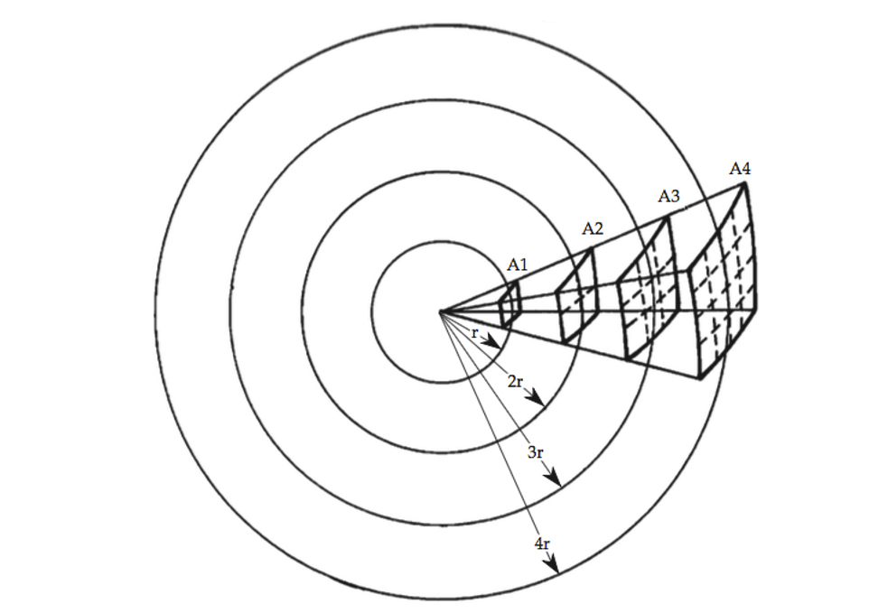

When we introduced the concept of capturing field recordings with your mobile device, you were [briefly introduced to how mic placement]({{site.baseurl}}/modules/week-3/captureYourWorld/#my-example-1) is a critical choice to be made for recording audio.

As you read in the [Indiana text](https://cmtext.indiana.edu/studio/chapter2_mics2.php), there are a number of concepts to keep in mind with respect to mic placement.

## Trust Your Ears

When preparing to capture audio, for any application or purpose, you should always preview and test where you place your microphone in relation to your sound source.

To do this, you will need to listen to the sound source, through the microphone, then move the microphone around until you find the best sounding place. You can of course do this through headphones, if you are producing capturing audio/sound in your bedroom or our in the field. But if you are in a studio, you will likely utilize a pair of studio monitors.

Testing mic positions may seem like a tedious task. Especially if you are the only recording engineer on a project. As this will likely mean that you will need to place the mic, go to the gear to audition the placement (whether this is a control room or a field recording rig), then go back to the mic to try a new placement. And you will likely need to repeat this process multiple times, to find the best placement. (This process is immensely easier when you have an assistant who you can work with to move the mic while you preview the positions.)

At each placement, you are listening to whether that current placement best represents and captures the source. You will be able to hear how various placements alter how the source sounds. **Trust your ears in this process.** As a sonic artist or audio engineer, your ears are your greatest tool, and you need to trust them to tell you where the best placement is.

In addition to trusting your ears, knowing a few technical details about sound and microphones will assist in knowing how to place a microphone.

## Inverse Distances law

> What you need to know: _for every doubling in distance, loudness / Sound Pressure Level (SPL) is reduced by $$3dB$$, or half_.

Every time you double the distance from a sounding source, the sound is spread out over a much larger area, as it radiates outward. This results in reduced loudness levels, and can greatly effect how a recording sounds.

As you can see in the above image, as sound radiates outward in a single direction it is spread over increasingly greater areas as the radius is increased. Thus, sound intensity decreases with distance. This decrease is due to geometric spreading of the sound energy. The intensity of a point-source sound in a free field is inversely proportional to the square of the distance from the source. This means that with every doubling of distance, the sound intensity level is cut to $$I/4$$. This is because at twice the distance, the sound passes through an area that is four times the previous area. This is the inverse square law.

The increase in surface area that a sound occupies results in a reduction of $$3dB$$. A $$3dB$$ change in sound loudness resulting in either a doubling or halving.

This also means that for every doubling of distance of a microphone to the  source, the loudness of that source is also reduced by half. This is true regardless of whether we are talking about 3" to 6" or 2' to 4'.

When testing a microphone for the best sounding place, you should ensure that wherever the microphone is positioned in relation to the source, that the distance will be able to be maintained.

## Signal to Noise Ratio

Signal to Noise Ratio (_SNR_) refers to the amount/loudness of desirable or wanted audio signal verses the amount/loudness of noise or unwanted audio signal. This concept is discussed and referred to throughout the audio production process. It creeps up as a consideration when choosing what pieces of analog hardware to run audio signals through, which microphones to pick, and for us currently, where to place a microphone.

Since know that with every doubling of distance of a microphone from the source, that the loudness of that source is cut in half, it makes sense that at some distance, the loudness of the source may only rise slightly above the noise if a space. This ratio of wanted signal to background noise can be referred to as the Signal to Noise Ratio.

Typically, as audio professionals, we want to maximize the SNR, so that our captured recordings are primarily composed of the direct, wanted sound, of our chosen source. However, problems such as _proximity effect_ (which you will read about directly below this), physical practicality, or the loudness of the desired source vs the external noise, will cause situations where you capture unwanted background noise.

Whenever possible, you should try to choose a recording environment absent of undesirable noises. Likewise, if that is not possible, you should try to remove, turn off, or minimize those noises, so that they are removed from your recording.

In theory, you should work to place a microphone in a position that captures the best sound quality or timbre, without undesirable colorations. 

## Proximity Effect

Most microphones, and almost all directional microphones, will exhibit a something known as "proximity effect" when a sound source is place close (i.e. within about 2 feet) of the mic. This proximity effect results in a boost to bass frequencies in the sound spectrum.

Proximity effect can be a good or bad quality. Proximity effect is what gives many radio announcers and DJs that characteristic "deep sound", that we are accustomed to. Many radio personalities will place their voice mics within in inches of their mouth to accentuate this principle and leverage it for that characteristic sound.

There are times however, where proximity effect can make a sound too "muddy" or overpower the captured sound with bass frequencies.

## Axis

Many sound sources that you may want to capture are directional in how the radiate sound. Sources such as human voices, guitar amplifiers, or violins are directional instruments, where the source has a "main sound axis".

The human voice is the easiest to understand, as the axis comes directly out of the mouth, in a straight line.

As you move up or down from this axis in the vertical plane, the ratio of bass to higher frequencies will change. Likewise, as you move up and down the vertical plane, the amount of plosive pops (air sounds that are created from 'p' and 'b' types consonants) and harsh sounding sibilance ('ssss' sounds that are overwhelmed by high frequencies) also reduce. Therefore, by moving a mic up or down from a mouth, you can greatly effect the resulting audio that is captured.

This is known as "on-axis" and "off-axis" placement. When a mic is placed "on-axis" it is directly in front or in line with the main sound axis of the source. When a mic is placed "off-axis", it is at an angle to this line.
