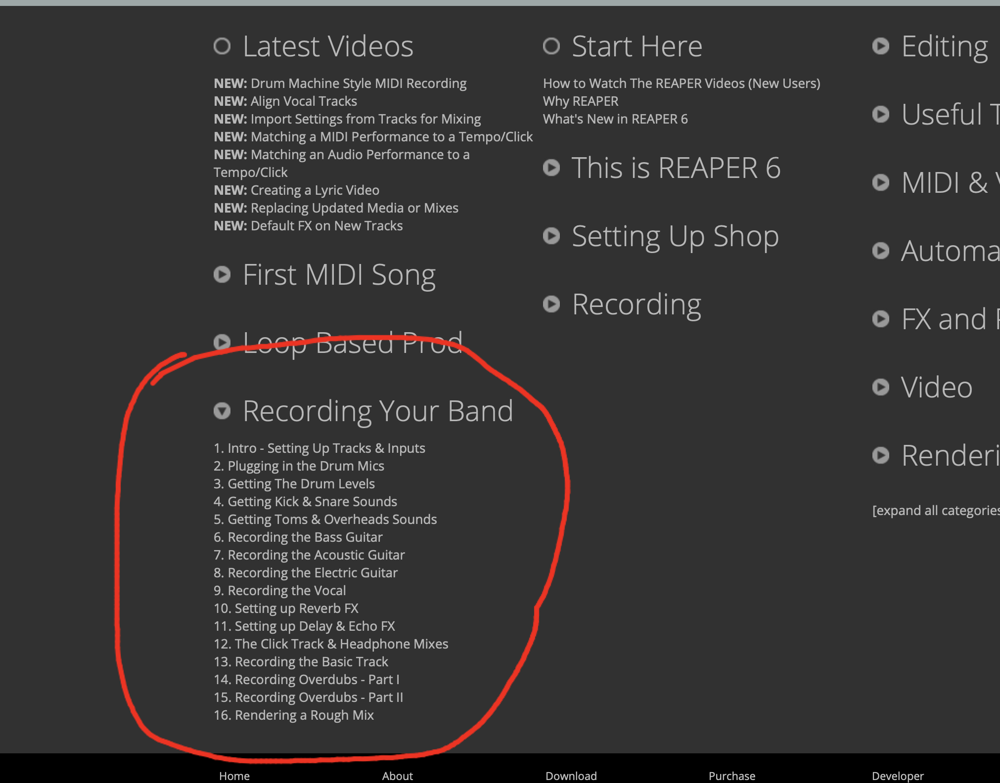

As an asynchronous, online class, we regrettably do not have the ability to get you into the studio to live track a band. However, for those of you who are interested in this aspect of sonic arts, you are encouraged to watch Kenny Gioia from Reaper discuss the process of live tracking a band playing a song.

You can watch these on the Reaper website at the following link:

- [Kenny Gioia on "Recording Your Band"](https://www.reaper.fm/videos.php#qWrIGtLR5dg)

