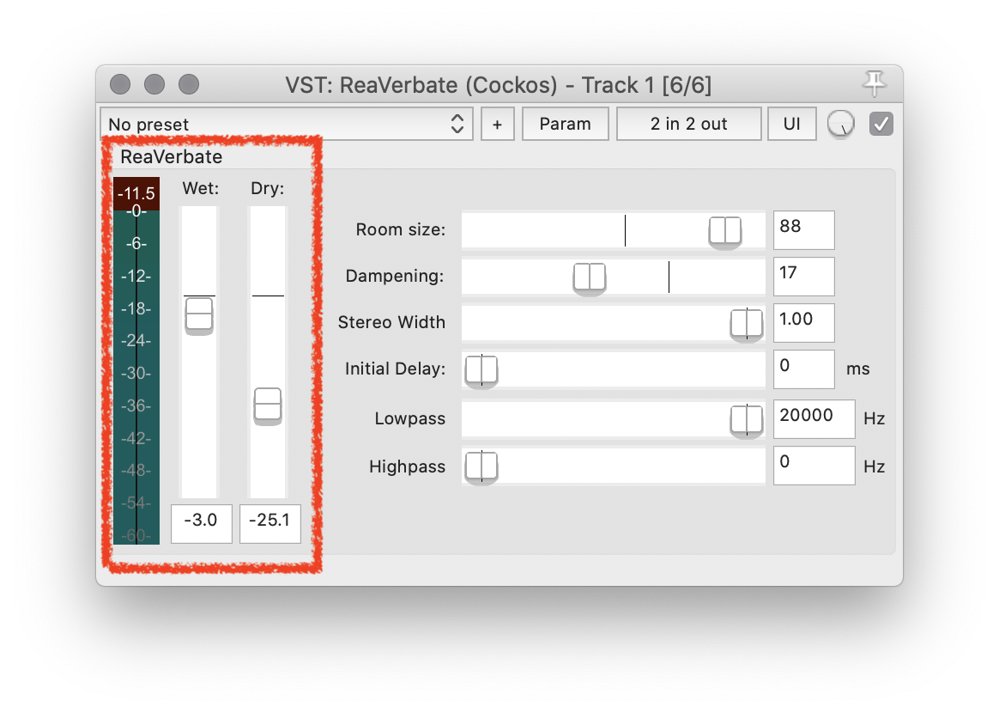
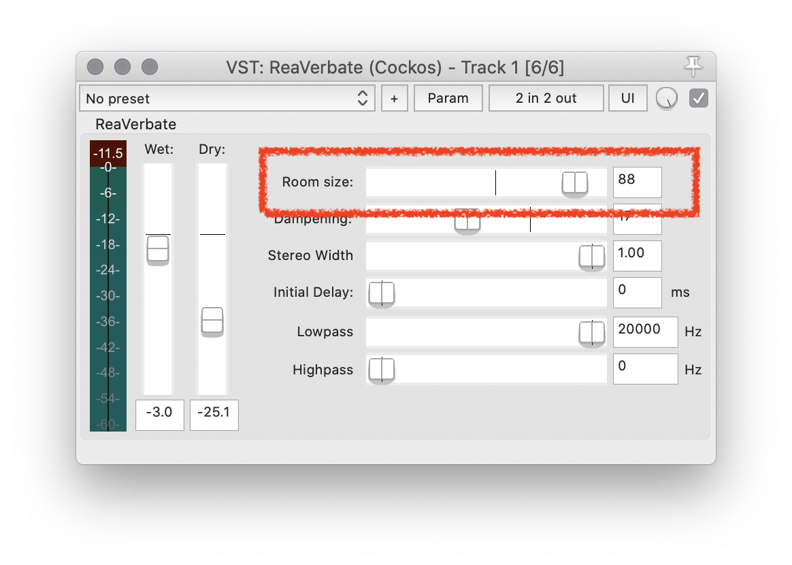
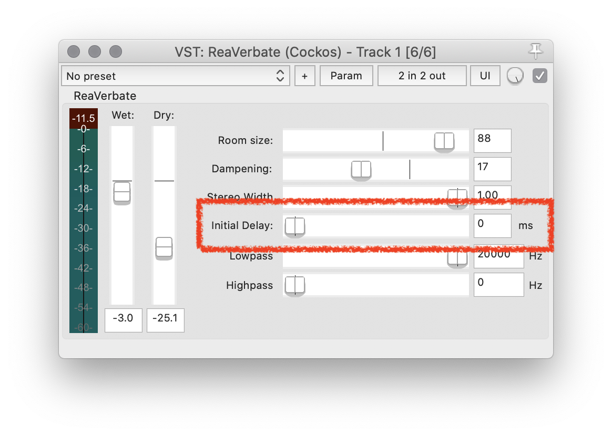
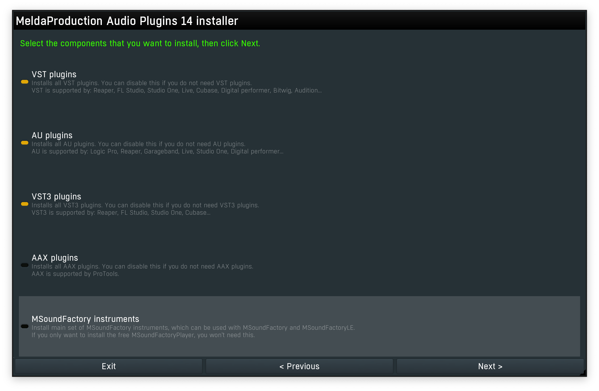

# What is Reverb?

**Reverberation** is the result of a sound event reflecting and refracting in a space (as opposed to a free field, i.e. no surfaces for a sound to interact with). Reverberation occurs in resonant spaces, such as enclosed rooms, concert halls, canyons, between tall buildings, or even small concrete boxes. All of these example spaces include hard surfaces that allow sound to "bounce" or reflect off of them, then do the same with another surface, and so on. When a sound can be reflected numerous times, it will pass through a single point (like where someone is listening or a microphone is places) numerous times. With each successive iteration of the sound, some energy will have been lost, and therefore the sound will _decay_ or attenuate naturally over time. This is referred to as a reverberation tail or decay time.

[Delay, like you learned about a few weeks back]({{site.baseurl}}/modules/week-7/delay/) has some similar qualities and properties to reverberation. Both extend a single sound event, by duplicating the sound event later in time. However, a delay is defined as being a periodic duplication, that occurs at a specified amount of time after the onset of the initial event. In the real-world, this is like yelling into a ravine or valley. If you yell "hello", after some amount of time (depending on how far away the reflecting surface is) you will hear "hello" again. This is the result of your voice traveling to the reflecting surface (in this case, likely the other hill in the valley), reflecting or bouncing off this surface, then traveling back to you. Instead, reverberation is compromised of multiple delays, with various delay times, resonances (i.e. frequencies that the size of a space emphasizes), and filtering qualities of the sound defined by the space. As a result, whereas you can hear a sound again in a delay, the sound is extended, and smeared with a reverberation.

The following image demonstrates a sound impulse radiating outward, reflecting and refracting multiple times, and passing by the same point multiple times.

<iframe class="embed-responsive-item" src="https://www.youtube.com/embed/xvm0PKdYDuQ" frameborder="0" allow="accelerometer; autoplay; encrypted-media; gyroscope; picture-in-picture" allowfullscreen></iframe>

# Reverb to Place Sounds in a Space

There are many reverb plug-ins that can be utilized in a DAW. These serve to add reverberation to sound sources. The use of reverb is especially common in studio recording of music and sound design for film/games/theater. Reverb serves to place an otherwise dry sound (i.e. one recorded at close proximity to a microphone in a dry environment) in a larger space. This allows the engineer to place a recording of a violinist made in a studio virtually into a famous concert hall. Or for an engineer creating sound for a movie, to make it sound like footsteps are approaching from down a particularly reverberant hall.

Reverb is also useful helping an engineer make it sound like tracks recorded separately, dislocated in time and/or space, are sharing space with each other. By placing two or more tracks through the same reverb plugin, it allows these sounds to feel "together".

# Reverb Characteristics

As with the signal processing plug-ins we have examined so far, there are parameters that are common across most plugins, and parameters to are unique to reverb processing.

## Wet/Dry

As with most plugins, nearly every reverb plug-in will have parameters to adjust the wet/dry ratio or mix. Again, this is the amount of dry sound that passes through the plugin unaffected, versus the amount of signal that IS processed by the plugin.

## Room Size

Another common parameter is Room Size. Depending on the plugin, this typically corresponds how large the simulated reverb space is. This will result in how long the reverberation lasts for, as well as some timbral characteristics to the sound.

## Length or Decay

Alternatively, some reverb plugins may instead use a Length or Decay parameter. This will correspond to how long a decay tail should last for the algorithm. In turn, this will effect our perception of the size of the space.

## Initial Delay or Pre-Delay

Another parameter that can effect a listeners perception of the size of a space, as well as where they are in relationship to the sounding source is the "Initial Delay" or "Pre-Delay" parameter.

This parameter sets how long it will take before a sound is passed through the reverberation algorithm. When this time is greater than zero, it tricks the brain into thinking that we are rather close to the sounding source, and that the space we are in must be sizable, as it takes time for the first reflections to reach our ear. When this value is set at 0, this signals to our brains that the source must be further away and/or that the space is such that the first reflections do not have a further path to travel than the direct sound.

# Some Additional Free Reverbs

Reaper comes with a nice reverb plugin included: ReaVerbate.

However, I encourage you to also download at least one (if not all) of the following, to expand the reverberation palate you have at your disposal.

## Melda Productions

- [Plugin installer - MeldaProduction](https://www.meldaproduction.com/downloads)

For the Melda installer, there is a couple things to note.

First, when you come to the page where it allows you to select the plugin types you want to install, you can unselect "AAX" and "MSoundFactory Instrument".

Then on the next page, when you can select what plugins to install, select the "MFreeFXBundle" on the right side of the window, to select all of the free plugins. (The others require purchasing a license.)

You can then allow the installers suggestions to direct the rest of your install process.

## TAL Reverb 4

- [TAL Software - Reverb-4](https://tal-software.com/products/tal-reverb-4)

From the same makes are the TAL-NoiseMaker Synth. This is a great basic reverb.

## u-he Protoverb

- [Protoverb: Experimental research reverb - u-he](https://u-he.com/products/protoverb/)

This is another great, and simple to use reverb.
