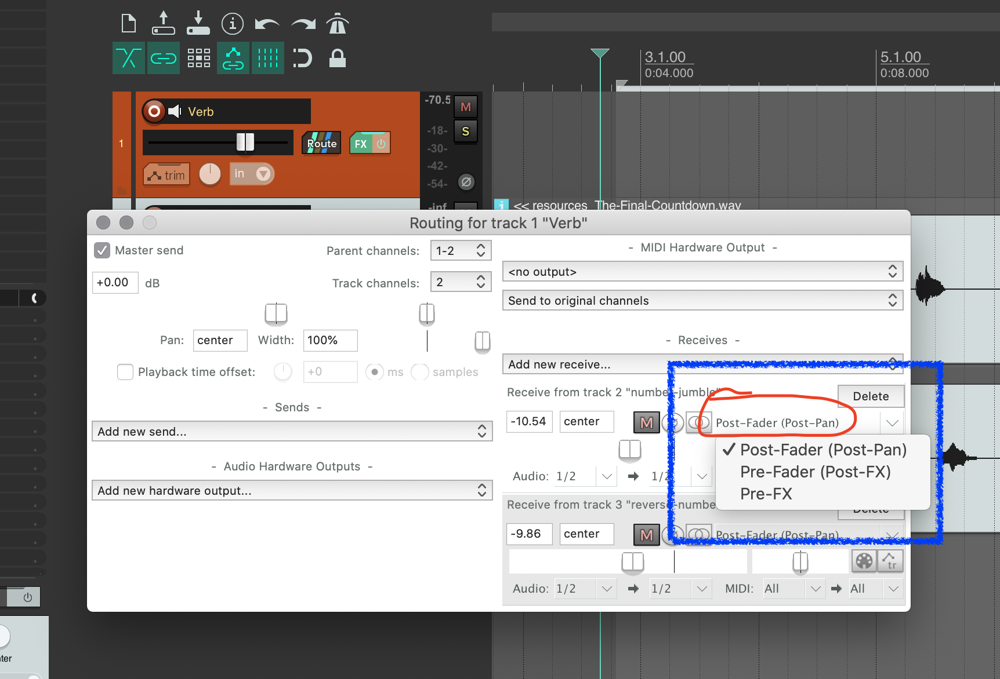

So far, wee have shown you how to apply signal processing plugins or FX directly on tracks in Reaper. This has the benefit of allowing you to know exactly what you are working on.

<iframe class="embed-responsive-item" src="https://www.youtube.com/embed/Pn0MCi3j_A8" frameborder="0" allow="accelerometer; autoplay; encrypted-media; gyroscope; picture-in-picture" allowfullscreen></iframe>

# Reasons for Shared Processing

However, there may be times that you need or want to process multiple tracks through the same signal processing plugins.

## To Bring Sounds Together

The first reason you may want to process multiple tracks through the same signal processing plugins is when you want to "bring sounds together". One specific instance is when you may want shared process is when you have multiple sounds that were recorded dislocated in time and/or space (i.e. multi-track recording, where you record, bass, then drums, the guitar, then lead vocals, etc.). By running these tracks through the same reverb, they will start to sound as though they are playing in the same space together.

## To Reduce Processing Overhead

A more practical situation for wanting to run multiple tracks through the same signal processing plugin is when you run out of CPU or processing power.

If you are working on a really big project, you may come to a point where your computer can no longer process the amount of voices you have in real-time. You have two options in this instance. One, you can bounce effect onto a track, thereby removing the need for live processing. Or, you can consolidate similar processing plugins and run multiple tracks through a single instance.

# Buses in DAWs

There are two approaches we can take to shared processing. Both involve the concept of "busing".

An audio _Bus_ can be thought of as an internal routing path, that takes audio from one place in the signal chain, to another.

In Reaper, we currently use one bus, the Master Bus. Each individual track sends its audio through a shared Bus to the Master Track or Master Bus. These audio buses take audio signals, combine them together, and deliver them to a shared point.

## FX Buses

The first common way of using a bus is as an FX bus. In this use instance, we setup a new track, with a specific signal processing unit on it. (For our current discussion, we will assume this is a reverb track). You then set the plugin to 100% wet (i.e. no dry signal is sent through the track). Finally, you tap, or split each track you want to send through the bus, so that it duplicates its signal, then sends a copy of that signal to the FX Bus (Reverb) track. The amount that you send from the main track to the FX track, results in the amount of signal processing effect that is in the final mix.

### 1. Create a new track

To do this, first create a new track, locate it near you master bus track, and label it 'Verb'.

### 2. Add a reverb plugin

Next, add a reverb plugin to this track. Then set the wet/dry mix to be 100% wet (0% dry).

### Route Tracks to FX

To route tracks through a bus to the new FX-Verb track, you can do one of two things.

1. Click and grab the "route" symbol from the send track. Once your mouse turns into a TRS-style jack, drag it over to the receiving track, and unclick.

2. Alternatively, you can click the "Route" button for either track, and then manually specify what tracks this new FX-Verb track should receive from. This is useful, as you can also double check that the track is setup correctly for routing, if you did the drag-and-drop method.

### Dial in the Reverb

Now that you have sound coming through your FX track, you should dial in the type and quality of your reverb FX.

**{ NOTE: }** If you use a preset, and it alters the wet/dry mix, then change that mix back to 100% wet and 0% dry.

### Mix in the appropriate amount of verb for each track

Finally, you can now "mix" in the appropriate amount of reverb for each track. To do this, open up the routing or send box for each track, then adjust the send amount until it sounds good. You can do this for each track, or if you open up the routing window for the FX track, you can adjust each tracks amount of send in one place.

### **{ NOTE: }** Pre-Fader vs Post-Fader

By default, sends are set to "post-fader". This means that if you change the amount of gain being applied to an individual track through its gain fader, then this will effect in equal proportion the amount of sound sent to the FX track. This is _likely_ what you want in the system we have just described.

However, if you find you want the amount of send gain to be independent of the main tracks gain fader, then clicking where it says "Post-Fader" will bring up a dialog box that allows you to change the behavior of this send; such as setting it to one of the Pre-Fader options.

