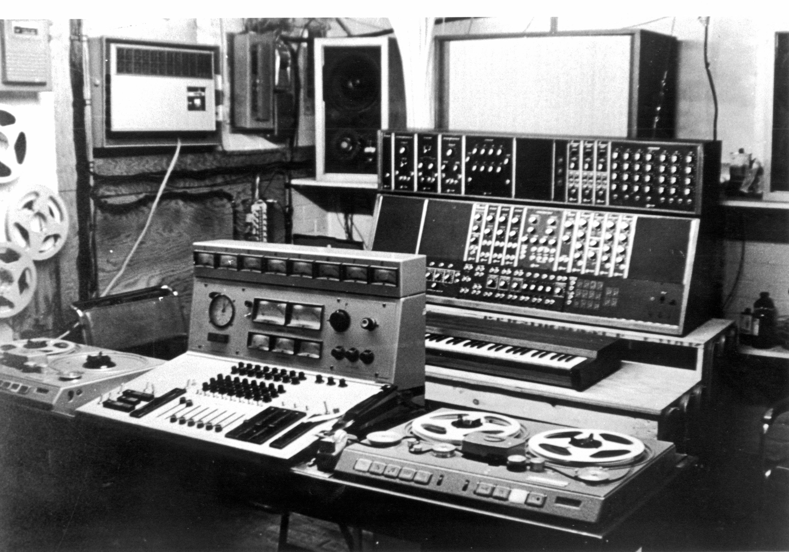
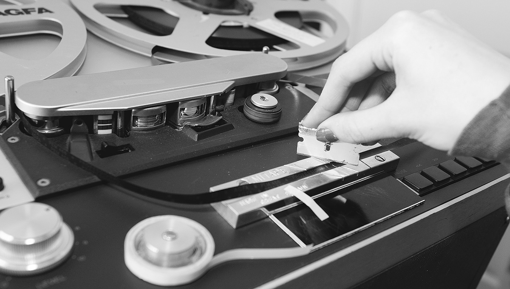
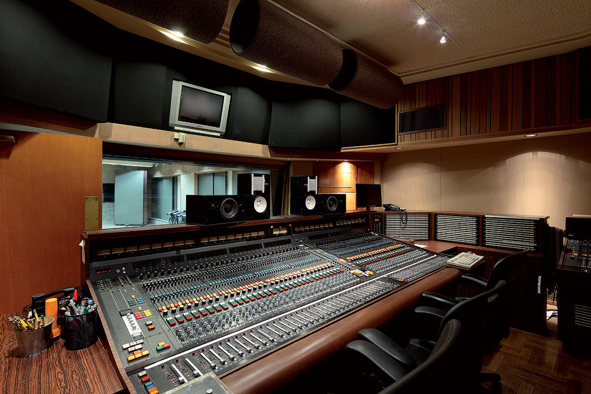

The DAW, in many ways, democratized the ability of people to work with audio using the same tools as professionals. Today, the DAW is the heart of almost all major recording studios, allowing for producers and artists to move from home to the studio with ease. Whereas, prior to the DAW, if you wanted to produce music or work with sound there was no way to get comparable results as professionals without major investments in gear or rental of a studio. The following image shows an early, tape-based studio setup.

# The Tape-Based Sound Studio

Prior to digital audio, all sound had to be recorded onto, mixed on, edited with, and eventually transferred from a reel-to-reel tape. In the above image, you can see two Studer reel-to-reel tape decks flanking either side of a mixing console.

There are of course many early forms of recording mediums that represented ingenuity, creativity, engineering milestones, and the desire by humankind to be able to capture the time-based phenomenon of sound, which had previously been fleeting and was considered "un-capturable". These of course included technologies like the [wax cylinder](http://cylinders.library.ucsb.edu/history-brownwax.php) and [phonograph](https://en.wikipedia.org/wiki/Phonograph). At the end of World War 2, America and the rest of Europe learned that the Germans had developed a technique for capturing sound on thin strips coated in magnetic material. This magnetic material can have individual elements oriented (using magnetic fields) such as to represent audio waves. This technology greatly increased the fidelity of recorded audio, while also offering unique new capabilities for the manipulation, cutting, and splicing of tape together.

## Multi-Track Tape

The discovery of Germany's mastery of tape technology after WWII offered the capability for people to capture high fidelity, stereophonic audio (one channel for both the left and right side) in ways previously unimaginable. Not only did the medium of tape offer superior sound, but since each section of tape only contains a single section of audio (unlike a wax cylinder of phonograph, where time is compressed vertically in space), it became possible for new manipulations of audio previously unavailable.

With tape, engineers could cut the tape (slice it) at a specified point and then tape it together with another piece of tape (splice it), thereby creating a linear editing process. This allowed for multiple recordings or _takes_ to be edited together.

In the 1940's, 50's and 60's experimental sound artists and musicians like Pierre Schaeffer, Bebe and Louis Barron, and John Cage, as well as popular music groups like The Beatles and Beach Boys would fundamentally alter the role of tape. Whereas tape used to be a medium for the capture and straight reproduction of audio, these artists exploited its potential through editing, mixing multiple tape tracks "down" to a single track, reversing tape, and altering the speed of tape.

> **_{ TODO: }_**
>
> Please read the following article:
>
> - [Michael Barron’s Brief History of Tape — in Music & Literature](https://www.musicandliterature.org/features/2015/3/28/a-brief-history-of-tape)
>
> Please listen to all of the examples as well. These will help you place some of the techniques that we will explore in the next few weeks.

Multitrack tape is audio tape with multiple parallel _tracks_ for recording discreet and separate audio sources. These are then time-locked with each other for playback. This could allow for an engineer to capture multiple instrument groups separately (such as drums, bass, guitar, and vocals), thereby later adjusting their relative levels to each other. Durin the so-called "golden age of large format recording consoles" tape machines could range in track count from stereo (2-track), 4, 6, 8, 16, and 32 track counts. With big Hollywood studios having multiple 32-track machines in order to often record 64-tracks or more.

During mixdown, a process where multiple tape tracks are mixed down to 1-track (mono) or 2-track (stereo) these tracks can be routed through a mixing console, where an engineer can adjust relative levels, alter frequency curves, place sounds in the stereo field, and other processes. The resulting master mixdown can then be re-recorded to tape.

# Moving to the DAW

DAWs are based on the workflow common in the great tape-based studios that reined supreme through the 1990's. As a result, many of the terms, processes, and even visual design/layout mimic or borrow from these great studios.

As a few examples;

- we still refer to individual processing units for audio files as "tracks"
- DAWs often represent track amplitude or panning with visuals reminiscent of console faders and potentiometers
- the process of combining multiple tracks down to stereo (or other modern formats) is still referred to mixdown

In addition, there are many things that the modern DAW-based studio holds onto from tape-based studios. As an example, although it is entirely possible to mix completely within your computer, many studios still utilize consoles in some form or fashion. Sometimes a console is a giant mouse, offering tactile feedback for the mixing engineer to set levels, and in some studios, audio is still routed through analog or analog-hybrid consoles so that the final mixdown of audio occurs in the analog domain, instead of the digital domain. 
