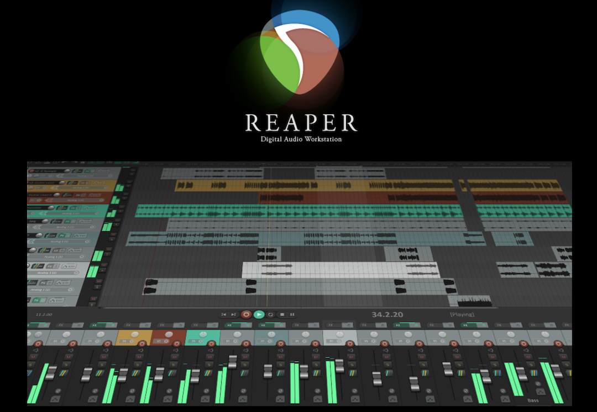
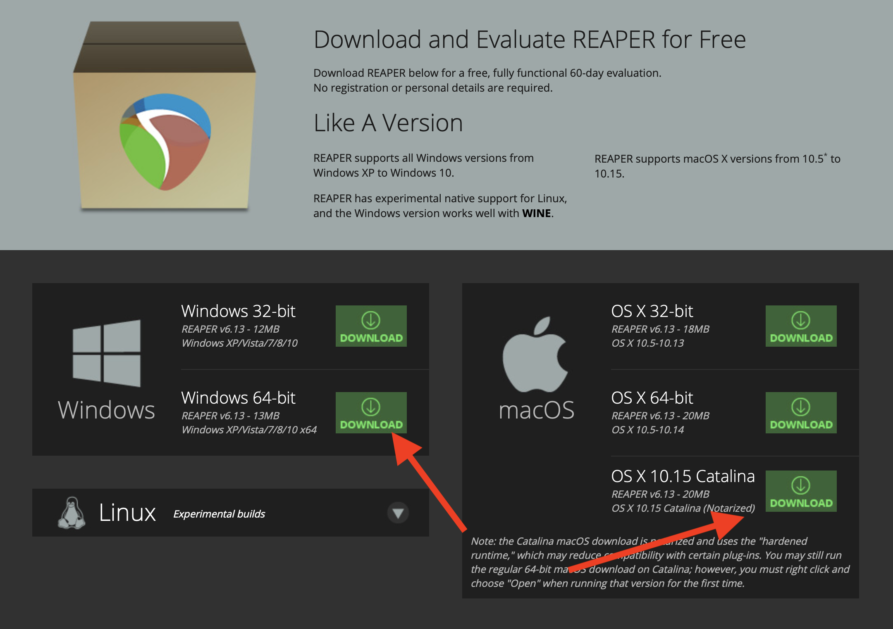
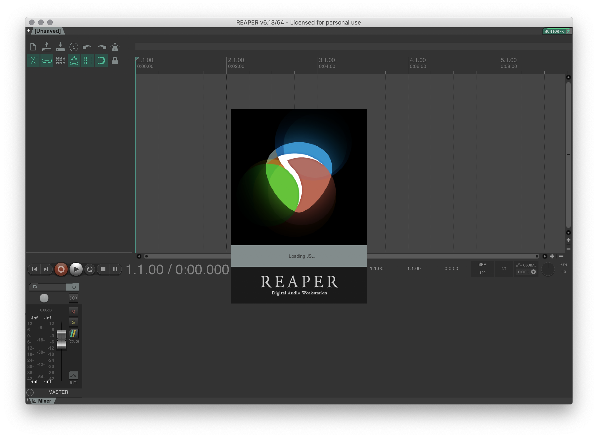

 

<iframe class="embed-responsive-item" src="https://www.youtube.com/embed/56iZZMhApbw" frameborder="0" allow="accelerometer; autoplay; encrypted-media; gyroscope; picture-in-picture" allowfullscreen></iframe>

Now that you know some basic info about what DAWs, where the evolved from, and the basic categories of components in a studio, it is time to dive into learning your first DAW!

As I have mentioned before, we are going to utilize a DAW this semester that is multi-platform, approachable financially, actively supported and developed, and has a large and diverse user-base. [Reaper](https://www.reaper.fm) fits our needs nicely.

# Getting Started

To get started the first thing you need to do is download Reaper. To do this, please go to the Reaper downloads page and select the appropriate version for your computers operating system.

- [reaper.fm/download.php](https://www.reaper.fm/download.php)

After downloading the appropriate Reaper version, please follow the install instructions associated with the appropriate download for your operating system.

**{ NOTE: }** On macOS, since this is an application downloaded from the internet and not the Mac App Store, it will ask you if you "are sure you want to open it". Select the "Open" option.

After installing the software, locate and open Reaper. If successful, you should see a blank "session" with the defaul slate grate Reaper theme.

