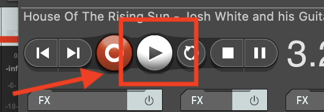
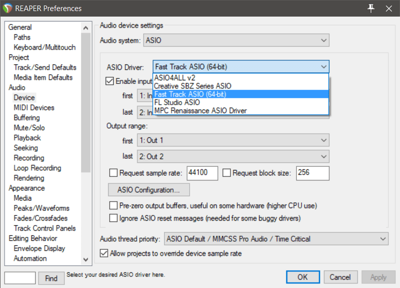

<iframe class="embed-responsive-item" src="https://www.youtube.com/embed/GL5CalyhLt0" frameborder="0" allow="accelerometer; autoplay; encrypted-media; gyroscope; picture-in-picture" allowfullscreen></iframe>

To play audio, you should simply need to press the "Play Button" in the Transport section.

## Preferences

You may need to specify an audio device in order to hear the output from Reaper. To do this, we will need to open "Preferences".

- Navigate to and open the Preferences box for Reaper.
- Then under the "Audio" section on the left, select "Device"

**macOS**

On macOS, if you are using headphones or your built-in speakers, you should make sure the "Built-in Output" is selected as your device (like in the picture above).

**Windows**

On Windows, You should set Audio System to ASIO and below that, click on the Audio Device drop-down box and select your audio interface. Your options will likely be different than mine. However, you should select the relevant "built-in output" or "headphone" option.

Regardless of OS, please select "Apply" and then "OK" to approve the changes and close the preferences window.

Now, hit play again, you should now hear sound.

> Whenever you cannot get sound out of Reaper (or any DAW), this is the first thing to check. Insure that your audio device is properly selected.

> **{ NOTE: }** You should also insure that the volume is turned up on the device you are listening through (i.e. turn up your computer volume).
