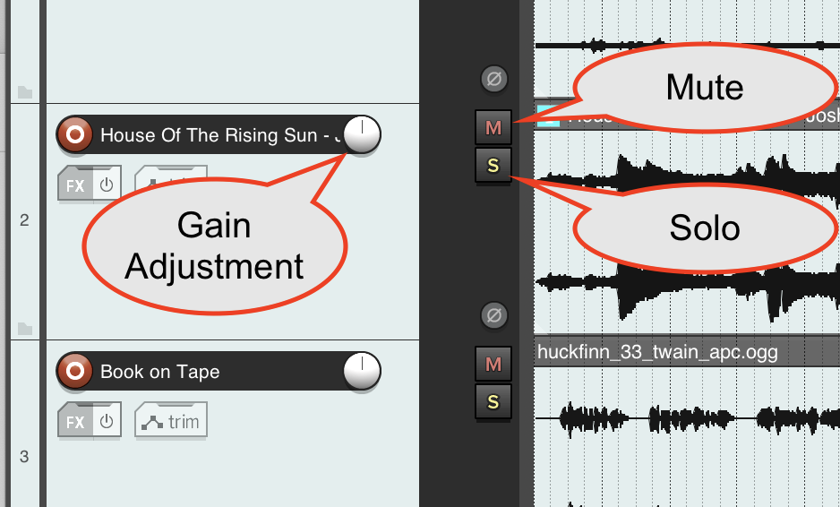
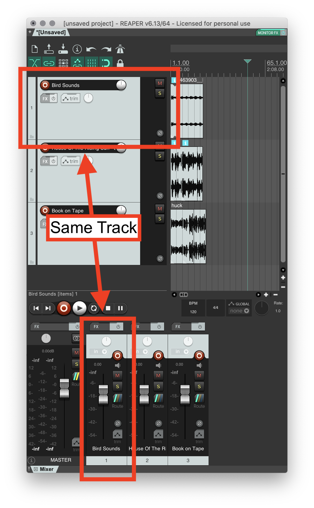
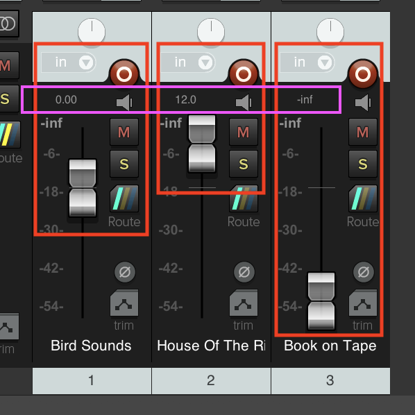
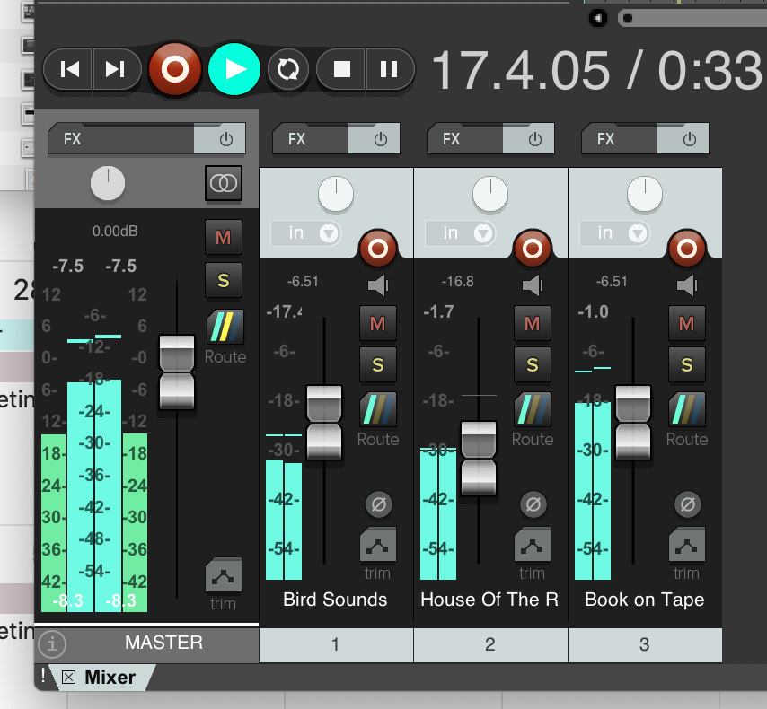
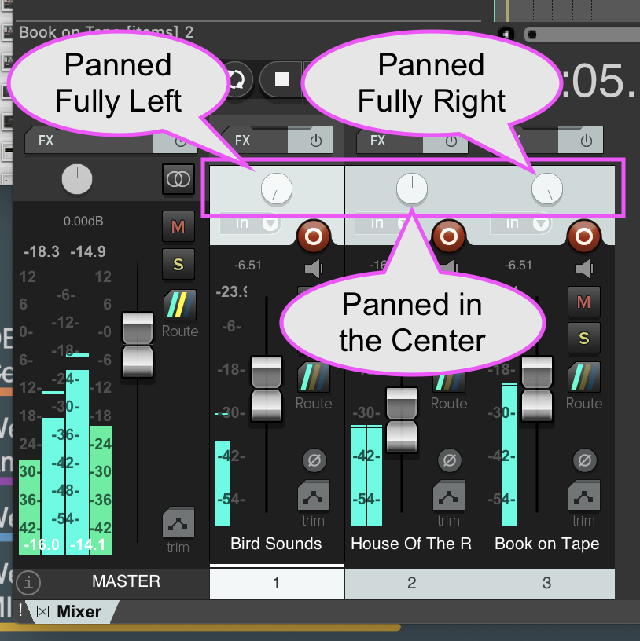
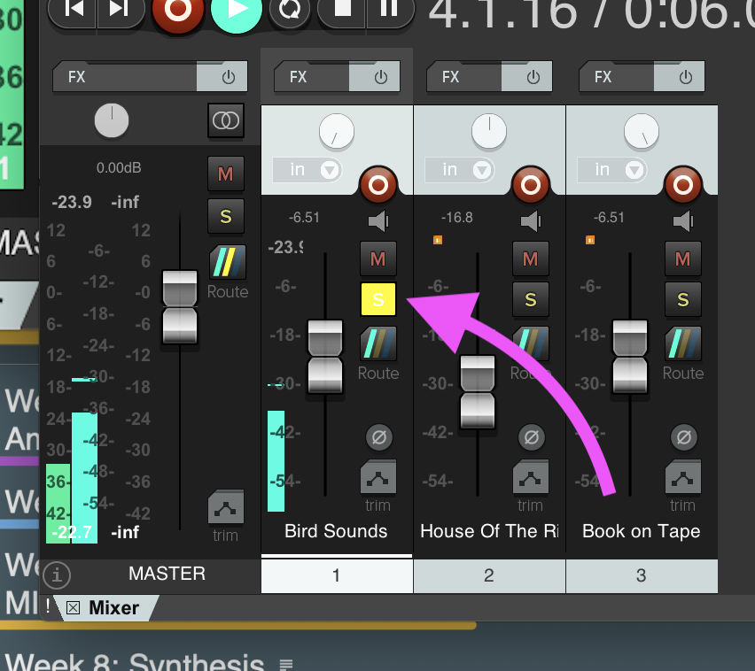
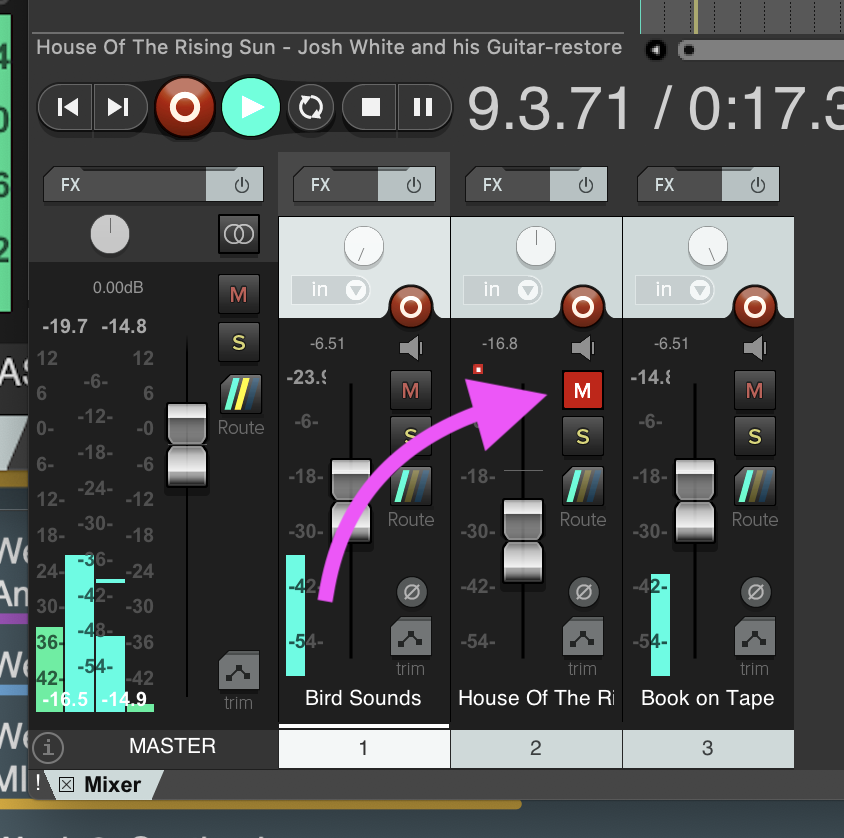

Now that you can drop in digital audio files and hear them back when you hit play, it is time to start having some fun in our exploration.

First, just so we have some content to work with, create additional tracks by double-clicking left window of the arrangement view, or by dropping additional audio files into the arrangement view below the already existing tracks.

As you want to hear and review your work, you should click with your mouse in the arrangement view anywhere that you want to start playback. The playhead should snap to wherever you click your mouse. Then, you can click the play button to start and utilize the stop button to stop. Alternatively, the `space bar` should allow you to start and stop playback in your project.

As you preview your project, changes you make will be heard in real-time. This allows you the ability to work on your project by utilizing your listening skills as the primary driver.

# Track Control Panel (TPC)

The left portion of each track is the _Track Control Panel (TPC)_.

")

In addition to showing you the track name, the TPC allows for the individual adjustment of tracks within the project. The features we are currently interested in are;

- gain level
- amplitude meter
- pan position
- mute
- solo

This information is mirrored in the Mixer window in the lower half of the Reaper Window. Each visible horizontal track in the Arrangement View corresponds to the identically named and horizontally arranged tracks in the Mixer window. Changing information in either spot will cause the identical information to be presented in the other.

## Gain Level

In audio, _gain_ is the amount of change applied to boost or attenuate an audio signals amplitude. (I.E. You will typically have referred to this as _volume_.)

In the mixer window, the gain adjustment looks like a physical fader (vertical slider). This fader allows you to specify _how much_ gain adjustment will be applied to all of the audio files within a track.

> **{ NOTE: }** The gain fader does not specify the actual output level, instead, it specifies the amount of gain addition or reduction that will be applied to audio.

If you notice, by default the slider is set to 0.00dB (dB stands for Decibels, which are a relative way of measuring sound level. We will learn more about this later in the semester.) In the TPC, this 0.00dB is represented with a line that is pointed to twelve o/clock.

The gain fader will allow you to adjust the relative gain applied to audio up to +12dB and down to -inf (which will result in no audio being played, as it is effectively multiplied by 0).

If you playback your project and adjust these fader positions, you will hear the level of your individual tracks also be adjusted.

**{ NOTE: }** If you increase the gain of a track so much that it causes the resulting audio to be greater than 0dBFS ("0 decibels, full-scale", which means it exceeds the maximum amplitude available for any track) then you will see the meters turn red (and will also likely hear digital distortion).

## Amplitude Meter

The amplitude meters show the artist, in real-time, a visual representation of the track's amplitude. This allows you to know information such as;

- Is this track clipping (exceeding 0dBFS)?
- Is there sound currently present on this track?
- How much head room is left on the track? (What is the range from the loudest sound of the track to 0dBFS)

## Pan Position

Panning is the technique of moving a sound source around within a multi-channel sound field. Typically, panning moves a sound source around a stereo field; that is from left to right over two speakers.

The _"pan pot"_ (short for "panning potentiometer", which you can colloquially think of as a "knob") allows you to move the position of a track within the resulting stereo field.

The following images shows the pan pots for the three tracks placed in different position. Track 1, shows that the track is panned fully to the left. Track 2 shows the track panned center. And, track 3 shows that the track is panned fully to the right.

To move the pan position, simply click and drag on the pan pot.

> **{ NOTE: }** Notice that the audio in the meters also mirrors the pan position? In Track 1, only the left meter channel has value. In Track 2, the meter is even on both the left and right channel. And, on Track 3, the meter only shows value on the right channel.

## Solo

When you _"solo"_ a track, it becomes the only track that the DAW plays. Soloing a track allows the engineer to search for and quickly identify problems or work on individual tracks in detail.

To solo a track, press the corresponding "s" button for the track. To stop soloing a track, you can either press another tracks solo button (thereby soloing that track), or press the solo'd track to unsolo.

## Mute

Opposite to soloing a track, you can also _"mute"_ a track. When a track is muted, it no longer adds its audio the mixed output.

You may find yourself needing to mute a track when;

- You may want to check if something sounds better with, or without a certain sound.
- You may be building up a mix and working between multiple tracks, requiring the muting of some tracks.
- It might be a reference track of some sort that you only need to hear sparingly.

There are many reasons why you may reach for the mute button on a track.

One thing to be aware of though is that unlike solo, mute buttons do not cancel other mutes, but instead are additive.

