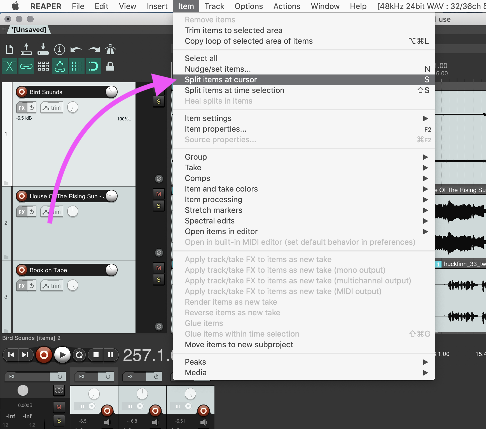
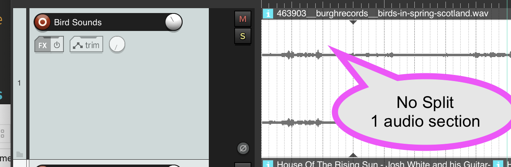
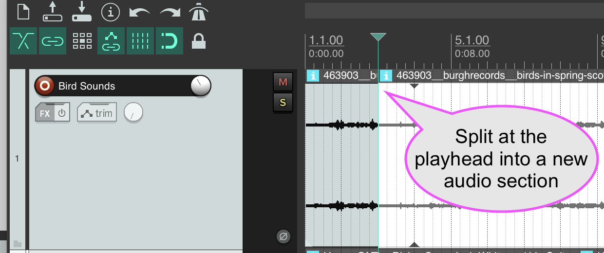
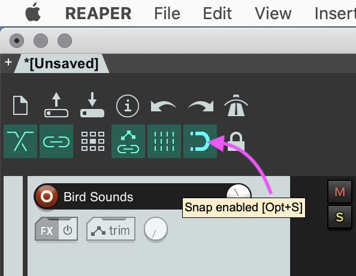

 

<iframe class="embed-responsive-item" src="https://www.youtube.com/embed/RoutcGt9F5Q" frameborder="0" allow="accelerometer; autoplay; encrypted-media; gyroscope; picture-in-picture" allowfullscreen></iframe>

In addition to basic mixing techniques afforded by the mixer, you also need a few basic editing techniques. Particularly, you need to know how to _split_ and _splice_ audio. This allows you to _edit_ together the portions of audio that you want.

## Split

_"Splitting"_ an audio file separates everything before the split point from after into a new audio section. Once you split an audio file into multiple sections you can move them independently of each other, delete part of the audio file, or edit together the best parts of an audio file.

To split an audio file, place the playhead at the location you want to split by clicking at that point in the audio section. Then either select "Split Item at Cursor" from the "Item" menu, or press the 's' key.

In the following two images, you can see how after splitting the audio at the playhead, there is now a new audio section label (the blue "i"), a line between the sections is also now present.

Now, if you click in the section, you can then drag it around, or hit the "delete" key to remove it.

## Splice

In tape-based audio editing work, _splicing_ is the act of literally taping, two discontinuous sections of audio tape together, so that they playback sequentially. In the DAW, this is similar, in that we will move an audio section that was discontinuous from to some point in or next to another audio section, thereby splicing them together.

To move an audio section, click in the section, so that it is highlighted, then move it left or right by pointing-and-dragging.

> **{ NOTE: }** Notice right now that if you move an item, it "snaps" to the visible grid. If you like this behavior, then great. But if you want the ability to precisely place an audio section on the arrangement view, you will need to turn off snapping. This is accomplished by pressing the "magnet" looking button in the top control panel, so it is "de-selected".
>
> 
