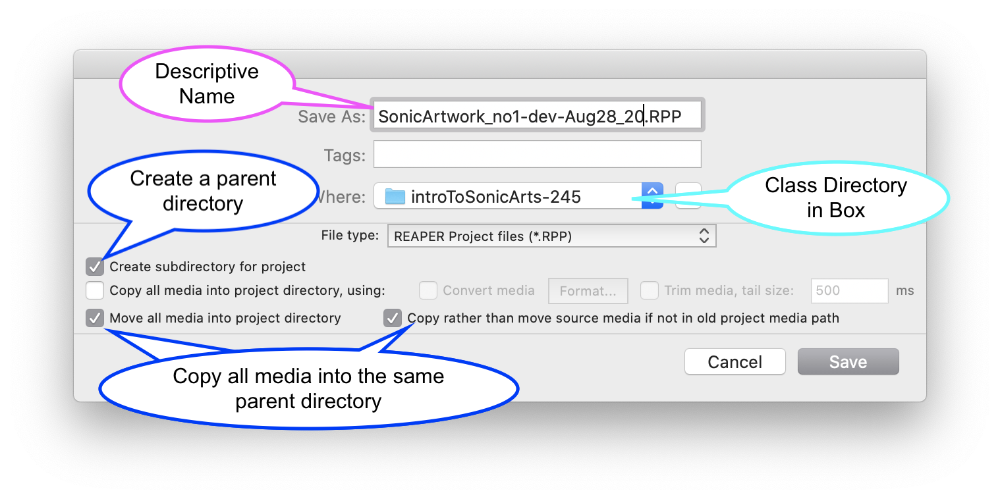
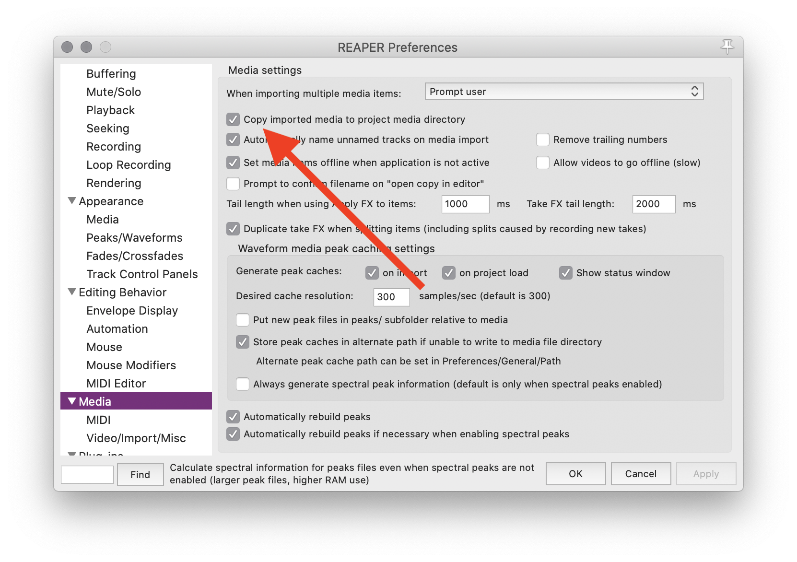

 

<iframe class="embed-responsive-item" src="https://www.youtube.com/embed/pZxQ6L1bgkY" frameborder="0" allow="accelerometer; autoplay; encrypted-media; gyroscope; picture-in-picture" allowfullscreen></iframe>

## Save Project

You should save your project often and in multiple places. Please, please please, do not forget to save your project, complete hours of work, then lose all of it because of a software crash. When you start a new project, you should save it immediately.

When you open Reaper, you can start working without saving your project. That is fine for scratching ideas out, but once you start to get something you may want to keep, SAVE YOUR PROJECT.

In Reaper, to save your project, select "SAVE PROJECT" under the "File" menu, or press the corresponding global key command for your operating system.

When you save a project in Reaper for the first time, it will offer you some choices. There are a few things I would suggest.

### Naming Your Project

When naming a project, I like to use descriptive names, so that I know what project it is. If it is a song, you may choose to utilize the name of the song, the current process, and the date (i.e. `Beauty_Song-mixing-Aug28_2020` or `Beauty_Song-tracking-Aug28_2020`). This format can be followed for any project.

### Where to Store Your Project

I mentioned in Week 1, that you should create a directory in a cloud-based storage solution. Store your projects in the class directory within this cloud-based storage solution! Do not store your things on the desktop!

### Sub-Directory

The first box you should select is "Create subdirectory for project". This will create a directory, in the location you just chose, with the same name as the project.

I think this is important, as it creates a place where you can store all of your media assets, as well as project notes, or related documents.

### Move/Copy Media

The other box I would often select is "Move all media into project directory", as well as the following, "Copy rather than move source media".

This has will ask Reaper to copy any media that you may have used into the newly created project sub-directory. This way, all of your media is in the same place, and if you ever want to share this project, all you need is to share the parent directory.

## Copy All Future Media to Project

There is one other preference I would change. If you open preferences, and navigate to "Media", there is an option to "Copy imported media to project media directory".

I would encourage you to select this.

By selecting this option, whenever you add new media to the project, the associated media file will be copied to your project directory. This ensures that you will not accidentally lose your media files that you have worked with.
