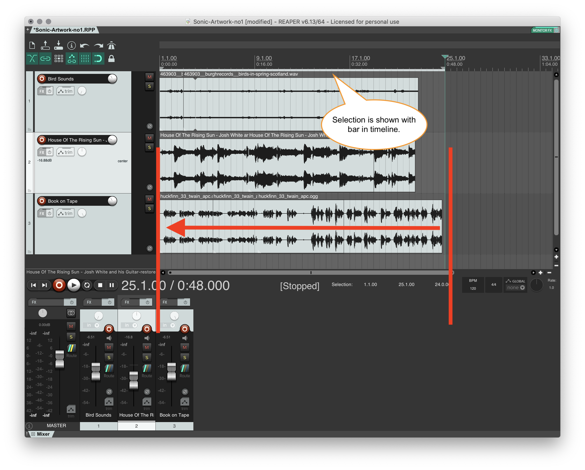
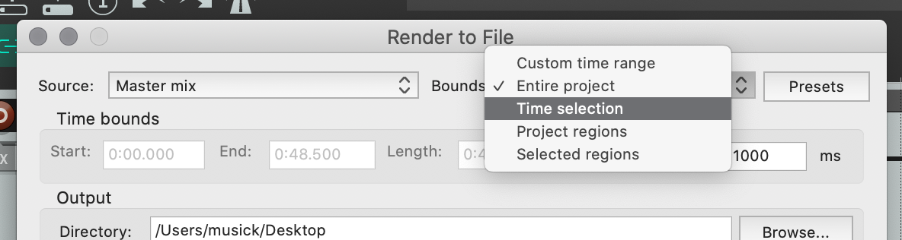
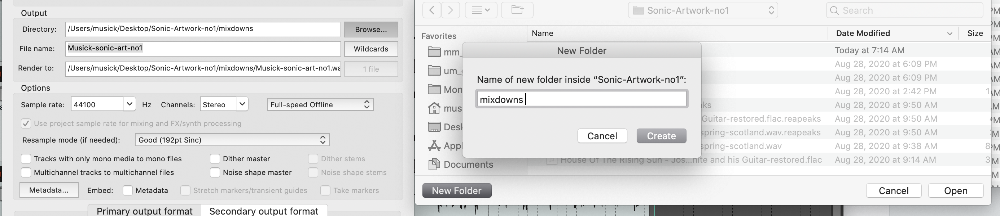
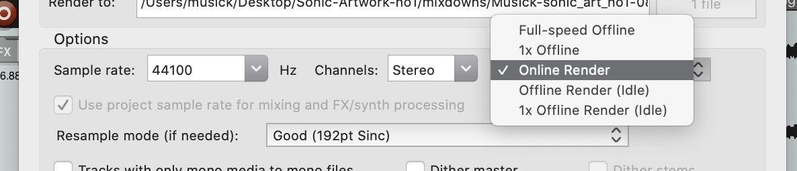
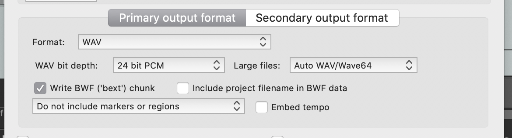
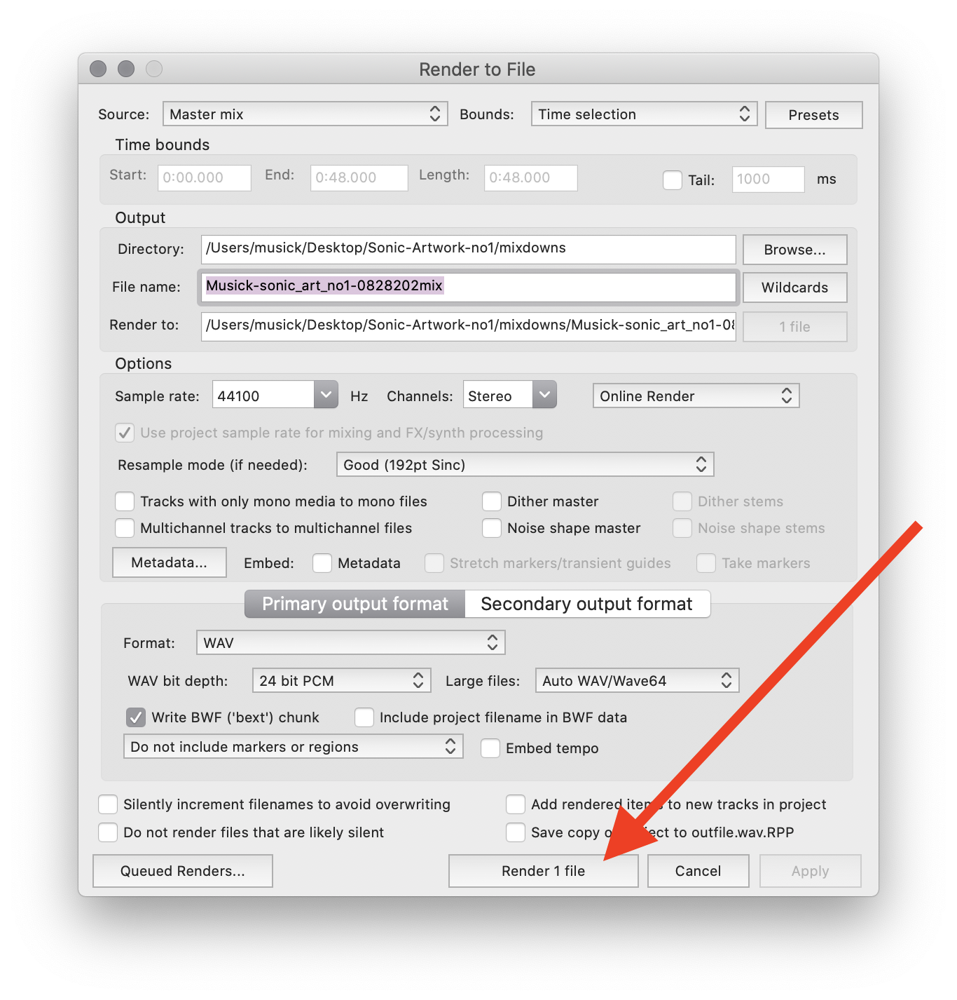
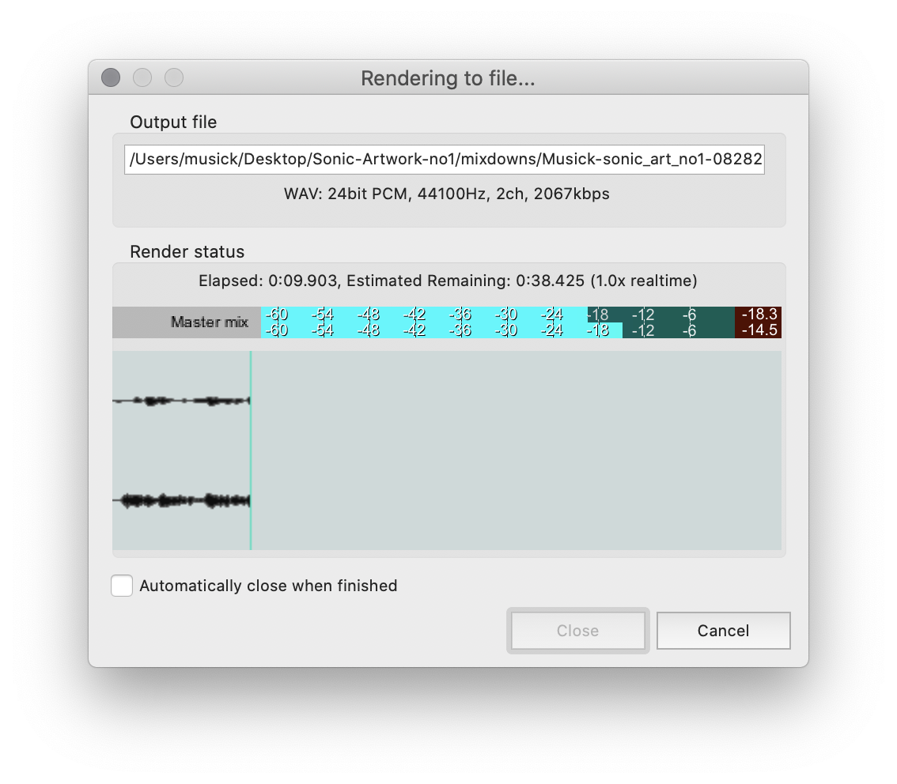
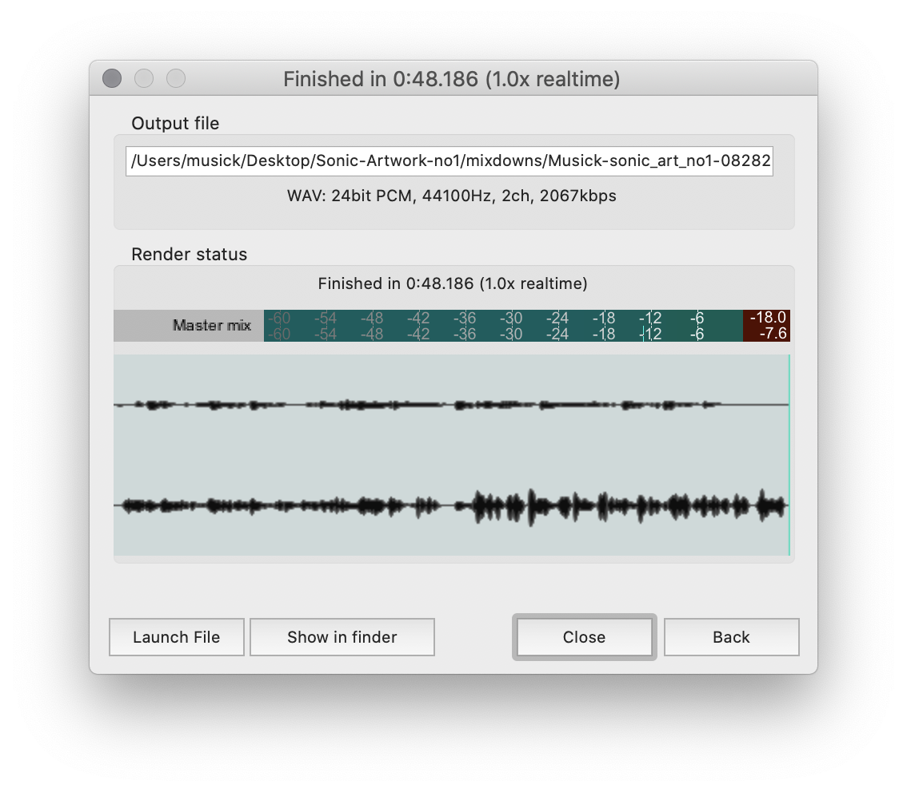

Obviously, none of this information is good if the audio cannot be bounced down and sent out as a finished project. The final step of the processes is _"mixing down"_ the project to a single audio file. You can then take this _"final mix"_ and share it however you need, since it is a standard audio file. This process, depending on the person and software/DAW may be referee to as;

- "bouncing"
- "bouncing to disk"
- "mixdown"
- "render"

Reaper uses the "render" terminology. However, I am going to refer to this process as "the mixdown".

In the process of the mixdown, all of the tracks in the project are "mixed down" through the "master bus" (we will get to that later as well). The output of this master bus is then captured as a new audio file, which gets stored on your computer.

> ## **{ NOTE: }**
>
> I personally think it is "best practice" to make a mixdown of your project at the end of every work/play session. This serves as a recorded stamp in time as to the status of the project. This allows you to go back and hear the progress to a sonic artwork over time. It also allows you to hear how your thinking or approach has changed.
>
> I like to store my daily mixdowns in a separate folder

## Prepare for Mixdown

To prepare your session for mixdown, you should insure that no tracks are unintentionally solo'd or muted.

Additionally, I ALWAYS prefer to select the section that I want rendered. This is as opposed to letting the DAW try and determine what the "end" of the project is. To do this zoom out of your project in the arrangement view so that you can see the entirety of the project. Then place your mouse at the end of the track, click, and drag backwards towards the start (00:00), highlighting everything in-between. This highlighted section will also be displayed in the timeline as a bar over the portion of the project you selected.

**{ NOTE: }** It is better to select too much empty space at the end, rather than too little. We can always trim excess silence after a mixdown.

## Perform the Mixdown

To execute the mixdown, select "Render..." under the "File" menu in Reaper.

This will bring up a dialog box with a number of options. We will go into detail what each of these do later. For the time being, use the following options.

### Bounds:

Under the "Bounds" selection box, select "Time selection". This will cause the render to utilize the time selection we just made.

### Directory Selection

Under "Output" select the "Browse" button for the specified Directory. Navigate to the corresponding project directory. Within this directory, create a new sub-directory labeled "`mixdowns`" (if one does not already exist). Click "open" when you are all done.

### Filename

I would suggest you label your mixdown as the name of the project, along with the date as an 8-digit number, and the status (typically `mix`). Since this is a class, I would also encourage you, for the time being to preprend your filenames with your last name. So the resulting filename might be something like;

- LASNAME-nameOfProject-dateProcess
- `MUSICK-sonic_art_no1-08282020mix`

### Options

The "Options" section allows you to specify the quality details of the resulting file, as well as how to create that file. For the time being, you should select the following settings;

- Sample rate:
  - 441000 Hz
- Channels:
  - Stereo

Additionally, where it says "Full-speed Offline", I want you to instead select "Online Render"

> **{ NOTE: }**
>
> The originally select "Offline" render option will create a mixdown as quick as possible. If you are in a rush, and simply cannot wait for a real-time render, you can select this option. However, offline renders do sometimes have pops and mistakes in them that are not part of the mix. For this reason, I always select "Online Render". This option will play the track in real-time, capturing the resulting output. The advantage for you is that this serves as an opportunity for you to preview the rendered file, in full, and insure that it sounds exactly as you intended.
>
> If you choose to do an offline render, you MUST listen to your file before sharing it (or submitting it for this class). You want to make sure there were no issues introduced by the mixdown process.

### Output Format

Under "Primary output format", for the time being, in sure the following is selected;

- Format:
  - WAV
- WAV bit depth:
  - 24 bit PCM

### RENDER THE PROJECT!

It is finally time to render a project at this point. Select the "Render 1 file" button.

This will bring up the "Render" window, where you will see relevant information, as well as hear, the file as it is created.

When the file is finished being created, you will see a "finished" declaration in the render window, as well as additional button options. At this point, you can;

- "Launch File", which will open the file in your system's default media player
- "Show in Finder/Explorer", which will open the directory where your file is stored
- or simply "Close" the render window, so that you can move on.

