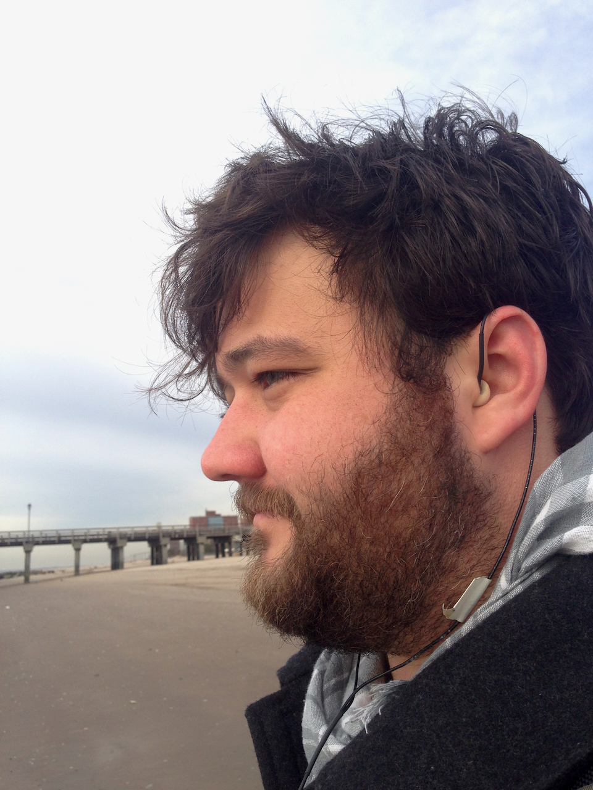

## Background Information

_Soundwalks_ as a practice and art form are a natural extension of our notions of soundscape. The traditional notion of a soundwalk essentially turns it into a "moving soundscape." A practitioner or participant is asked to take a walk, and instead of focusing on the interactions and interplay of sonic events from a single location, the practitioner is asked to listen to a dynamically evolving soundscape that is also in relation to their movement.

When experiencing a soundscape, you would sit still. The only thing to change in a soundwalk is walking around.

Hildegard Westerkamp is credited with the creation of this term and practice.

 

**_{ TODO: }_**

Please read about Hildegard Westerkamp:

- [Biography - Hildegard Westerkamp](https://www.hildegardwesterkamp.ca/bio/)

 

I would also like you to read the following writing about soundwalks by Westerkamp from one of her works _NADA_. In particular, I want you to pay attention to how she relates soundwalks to soundscape. Additionally, there is a list of tips for a soundwalk. Please take a soundwalk, and contemplate each of these tips individually while on your walk.

- [Sound Walk - Hildegard Westerkamp](https://www.hildegardwesterkamp.ca/sound/installations/Nada/soundwalk/)

 

I would also like you to read the following two articles further discussing soundwalks.

- [_Soundwalking_ by Hildegard Westerkamp, 2001.](https://www.hildegardwesterkamp.ca/writings/writingsby/?post_id=13&title=soundwalking)
- [_A Pocket Guide to Soundwalking_. Antonella Radicchi, 2017. (PDF Download)](https://github.com/Montana-Media-Arts/intro-to-sonic-arts/raw/master/resources/Radicchi_2017_A-Pocket-Guide.pdf)

## Recording a Soundwalk

A soundwalk can also be something that is recorded. To do so, a practitioner may either carry a recording device in their hands, or utilize ear-worn mics, so that they can more seamlessly exist on their walk.

The below image is one example of a microphone being worn in my ear. (I recorded a binaural piece a number of years ago out at [Coney Island in NYC](https://michaelmusick.com/coney-island-is-here/))

## Different Kinds of Soundwalks

Soundwalks can also focus on non-traditional types of sonic events. The following link discusses the ideas of soundwalks in relation to a different kind of sound-event.

- [The “Electrical Walks” of Christina Kubisch](http://www.cabinetmagazine.org/issues/21/kubisch.php)
