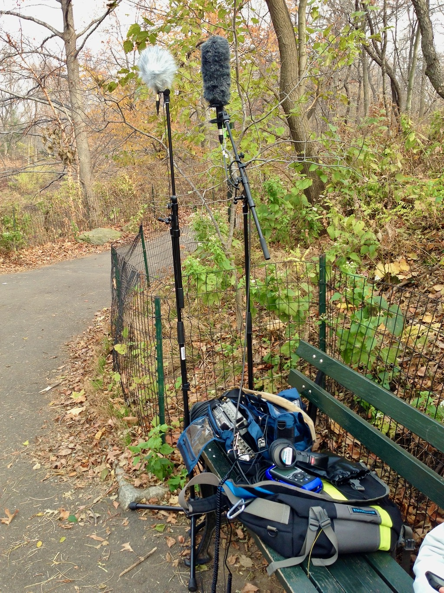

_Field recording_ is the act of taking recording equipment out of the studio to capture soundscapes, specific objects, events, or locations that cannot otherwise be brought into the recording studio.

## Traditional Approaches to Field Recording

Field recording may be a capture of the soundscape of a particular location at a particular time. The above image shows the capture of Central Park in New York City by a microphone designed to capture sound in all directions.

Likewise, field recordings may work to capture individual elements in nature, such as bird song or the sound of individual objects. Unlike soundscape where the goal is to capture all of the sonic events interacting and in relation to each other, these field recordings are concerned with getting "clean" recordings of individual sources, and aim to minimize the capture of competing sources.

## Ego in Field Recording

Field recordings may also work to capture small sounds, unusual sounds, or play with our perceptions of space and size. Field recording used to be approached from the philosophical view that the recordist should attempt to capture the world impartially, in order to represent it as it truly is/was. Early groups such as the World Soundscape Project (WSP), that you learned about last week, followed these types of principles. They believed that the recordist should choose equipment and recording techniques that were transparent. However, this philosophical ideal is impossible. As humans, we make choices about how to capture an individual phenomenon. Even small choices like where to place the microphone, or the angle that it is placed will change the resulting capture. This is further complicated by the fact that equipment choices will all result in different sonic fingerprints being imprinted on the resulting recordings (we will discuss why this happens more in the coming weeks). These seemingly innocuous choices all impart ego and choice, and ultimately effect the way that the recording is captured and is experienced by the listener. As a result, since no capture of the real world (regardless of whether it is visual, sonic, or otherwise) can be done without imparting the ego from the individual capturing the phenomenon, modern field recording sound artists have realized that in addition to trying to capture the world "as it is", there is also significant value and reason to capture phenomenon of the world through conscious choices that emphasize or highlight aspects.

> ## A Beginner’s Guide To… Field Recording
>
> Please read the following article by Lawrence English
>
> [English, Lawrence. A Beginner’s Guide To… Field Recording. in FACT. 2014.](https://www.factmag.com/2014/11/18/a-beginners-guide-to-field-recording/)
>
> **{ NOTE: }** This is an older article, and some of the linked youtube and other media links are no longer valid. Please listen to what is still available, and feel free to move past the rest.

 

The following example is from Toshiya Tsunoda, a Japanese Sound Artist known for his exploration of space, size, and time through unique field recordings (he is mentioned in the linked reading above). The following track is a recording of the vibrations of a mooring rope for a boat. Presumably, the recording was made by placing a microphone as close to the rope as possible, then allowing nature to activate the rope. As a result, you hear the emergent composition created by the rope, as well as the related sonic events occurring throughout the soundscape. One of the goals for this work is to capture a phenomenon that is only possible to be heard through the use of technology to emphasize it.

<iframe style="border: 0; width: 100%; height: 120px; margin: 0 auto;" src="https://bandcamp.com/EmbeddedPlayer/album=3948296033/size=large/bgcol=333333/linkcol=e99708/tracklist=false/artwork=small/track=1839450716/transparent=true/" seamless><a href="https://erstwhilerecords.bandcamp.com/album/extract-from-field-recording-archive-reflection-revisiting">Extract From Field Recording Archive: Reflection-Revisiting by Toshiya Tsunoda</a></iframe>

This is not to suggest that there is no ego in more traditional soundscape works. As evident by the above logic, there is no way of escaping ego from effecting the resulting sound art work.

 

The following work, "La Selva", is from musician and sound artist Francisco López. It explores the rich composition that can emerge through soundscape-style artworks. Please read the following article by López on this work and then listen to it (I encourage you to listen to the entire work, but you are welcome to skip around and instead only experience portions of the 1+ hour long work).

- [francisco lópez  essays // environmental sound matter ](http://www.franciscolopez.net/env.html)

 

<iframe src="https://open.spotify.com/embed/track/0dxLjcizK0MgBXB7cWEZOS" width="100%" height="300" frameborder="0" allowtransparency="true" allow="accelerometer; autoplay; encrypted-media; gyroscope; picture-in-picture" allowfullscreen></iframe>

 

## Interesting Sound Artists in Field Recording

> Please also read the following article (and listen to examples) exploring 10 field recording based sound artists.
>
> [10 of the Most Interesting Field Recordists Working Across Aesthetic Boundaries – Soundfly](https://flypaper.soundfly.com/discover/10-of-the-most-interesting-field-recordists-working-across-aesthetic-boundaries/)

 

Please also watch the following video on field-recording artists working at the edge of soundscape art;

<iframe class="embed-responsive-item" src="https://www.youtube.com/embed/esfUwg1-xrI" frameborder="0" allow="accelerometer; autoplay; encrypted-media; gyroscope; picture-in-picture" allowfullscreen></iframe>

