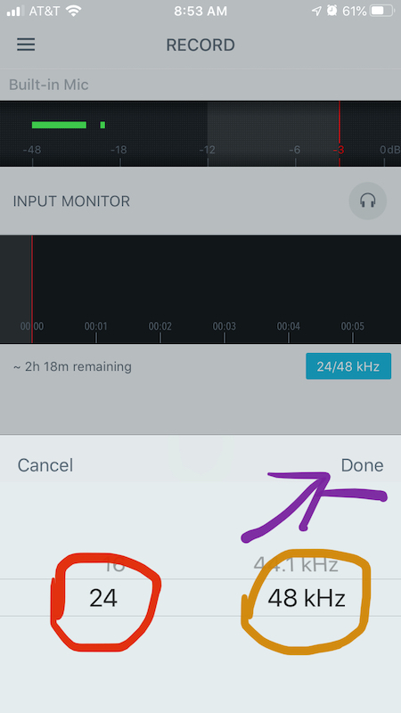
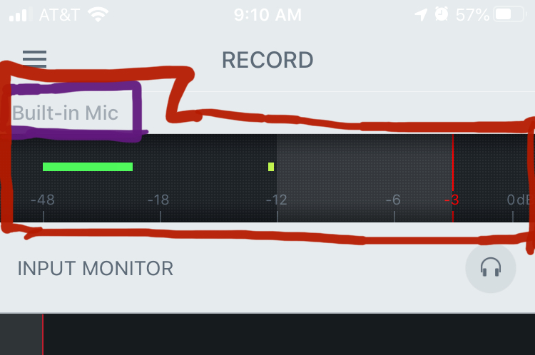
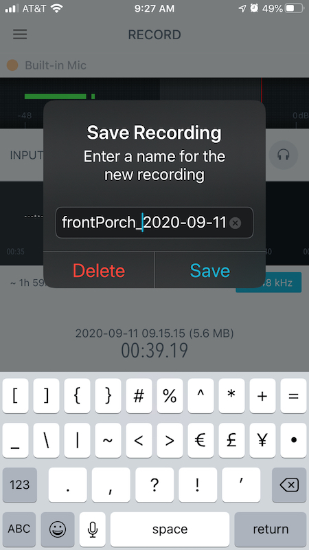
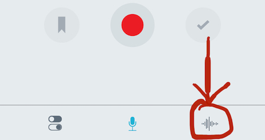
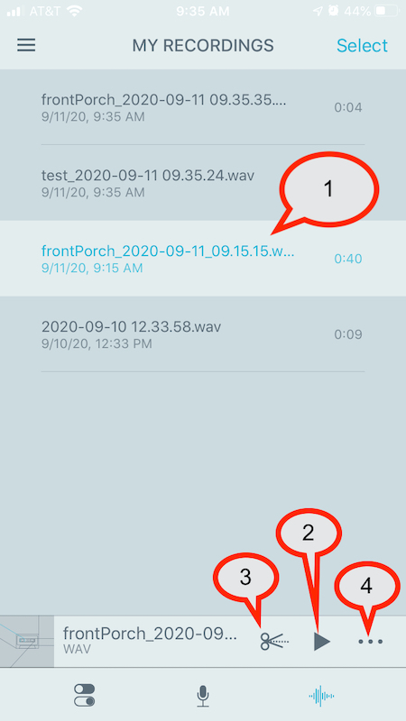

#### It's time!

It is time for you to start going out and capturing your own sounds.

Now, there is still much you do not know. (Like..., so much, including details about microphones, signal chains, gain staging, preamps, analog to digital conversion, how digital audio is stored, differences between lossy and lossless audio, etc.) BUT, I want you to start capturing sounds and playing with them!

And on top of all of this, you are taking this class as an asynchronous, distance-based modality. This means, that we do not have an easy ability to check you out gear like specialized microphones (we just don't have a mail-based equipment check-out system). As a result, you are going to use your phone/mobile-devices, as well as potentially the inbuilt microphones on your personal computers.

Your mobile-device (typically a smart phone), comes with built-in microphone. This is a compromised device with respect to capturing high-quality recordings (as you will learn more about later this semester). This is because microphones on phones are optimized for voice-based sound/communication. Some optimizations include frequency equalization to emphasize voice, and typically also include reduced frequency range pick-up. However, they are always in your pocket, do not cost you additional money, and are "good enough" to capture a lot of interesting and usable sounds.

# Suggested Mobile-Computing Apps

When considering an app for recording/capturing audio on your mobile device there are a number of factors that you should consider. Chief among them is the ability to record audio at a high-resolution (so-called, _lossless, uncompressed_ audio), as opposed to compressed audio. The resulting filetype that we are typically looking for is either Waveform audio files (`.wav`) or AIFF (Audio Interchange File Format, `.aiff` or `.aif`). These filetypes will create larger file sizes (compared to `.mp3`, `.aac`, `.flac`, or `.m4a`) and the audio will not have been compressed in anyway beyond the initial alterations that occur through the analog-to-digital conversion process.

There are obviously two major mobile-phone operating systems (OS), iOS and Android. Both OS's have built-in recording applications. Additionally, these built-in apps should have the ability to select the use of `.wav` or `.aiff` filetypes.

In addition to these two apps, I will also suggest you consider;

- [ShurePlus MOTIV mobile recording app](https://www.shure.com/en-US/products/software/shure_plus_motiv)

The ShurePlus MOTIV is what I will demo for this class, as it is available on both major OS's, the operation is similar, and it is a high quality recording application.

# Getting Started with ShurePlus MOTIV

When you open the ShurePlus MOTIV app, you should automatically be on the "RECORD" screen. If you are not, press the "mic" icon-button, near the bottom of the app in the middle.

After ensuring that you are on the correct screen, there is one other detail we want to check before we start to record. To the bottom right of the timeline, there should be a blue button that lists two numbers, separated by a `/` with the letters `kHz` proceeding them. This is the recording resolution settings button. Press this to pull up a an option screen.

Once you pull that up, select `24` for the left number (this is the _bit depth_) and `48 kHz` for the right number (this is the _sample rate_). You can then select `done` to confirm these settings.

> **{ NOTE: }**
>
> Whenever you open an app to record, or when you start taking out hardware-based recordings in later semesters, the first thing you should check is the recording resolution settings. You want to make sure that the settings are allowing you to capture audio at a high resolution (depending in the device, you may not need to max out these settings). Typically, we want a **bit depth** of at least 24, and a **sample rate** of at least 44100 Hz or 44.1 kHz (note: this is the same value, the latter is just written with a base of 1000).

The last thing you should check is that you are indeed receiving signal from your microphone. Running across the top of the app should be a black, horizontal bar, with light grey numbers ranging from -48 on the left to 0dB on the right. Above that, you should "Built-in Mic". This is telling you that the app is using your built-in microphone. (If you have headphones connect with a microphone, it may list them, and you can choose which to utilize.) You should also see a green bar, moving slightly from left to right. This is your "signal meter", and if it is moving around slightly, then you are indeed receiving signal from your microphone.

## Time to Record

OK, we are finally ready for our first recording. Press the red filled-in circle.

> The red, filled-in circle, is a near universal icon for recording. Typically, this is what you are looking for in any app or on hardware with recording functionality.

When you press "record", you should see the record-button change to a "pause" button (`1`). Likewise, you will see a temporary name for the file (`2`), the current size of the file (`3`), the current length of the file in time (`4`), and you can see a visual representation of the recorded sound waveforms in the second horizontal black bar (`5`).

When you are done, hit the "pause" button. If you want to add more to this recording, hit the "record" button again.

**{ IMPORTANT }:** When you have finished with your recording, you MUST PRESS the "check mark" button to save your recording. The ShurePlus MOTIV app, DOES NOT automatically save your recording.

This will bring up a labeling scree, where you can label your recording something more sensible, before clicking the save button.

> As with tracks in Reaper, I suggest you label your recording something that will make sense to you later.
>
> I would suggest something about the location, and prepend that in-front of the date the Shure provides.
>
> I.E. `front-porch_2020-09-11_09.27`

## Your Recordings

To view your recordings, or rather, _saved files_, click the bottom right button that looks like a sound wave. This will bring up the "MY RECORDINGS" page of the app.

On the "MY RECORDINGS" page, you can select which file you want to work with. It will be highlighted in a lighter color than the other files (`1`).

Once you have selected a file you can;

- play it back (`2`)
- trim it (`3`)
- or select the 3-dots (`...`) to get to more options (`4`)

## Sharing Your Files With Yourself

To share your files, press the 3-dot button on the bottom right of the app, AFTER selecting the file you want to share.

This will bring up an additional menu. There you should select the "SHARE" option.

This will bring up another option window. Depending on the size of your file, you may be able to email it to you-self using the "MAIL" selection. However, there is the potential it will be too large to send as an email attachment. In which case, you will want to select the 3-dots next to "MORE", where you will be able to access the entirety of your phones sharing options. If you have the Box app installed and connected to your university account, I would suggest you save it as a file in the Box app. Otherwise, you are welcome to share to your computer in anyway you normally would share a large file from your phone to computer.

## Use it in Reaper

Now that the file is on your computer, you can drop it in Reaper like you learned to do with audio files two weeks ago! There you should be able to play it back, edit it, and use it as source material in your sound art pieces.

# Video Walkthrough

<iframe class="embed-responsive-item" src="https://www.youtube.com/embed/QEjgEnNGB4Q" frameborder="0" allow="accelerometer; autoplay; encrypted-media; gyroscope; picture-in-picture" allowfullscreen></iframe>

