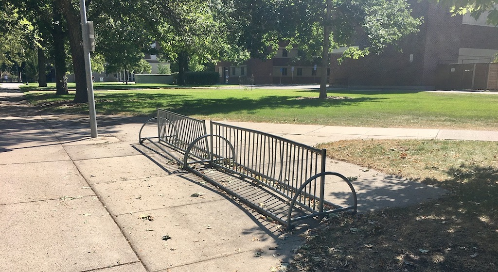

 

<iframe class="embed-responsive-item" src="https://www.youtube.com/embed/dsWPQfhVQ60" frameborder="0" allow="accelerometer; autoplay; encrypted-media; gyroscope; picture-in-picture" allowfullscreen></iframe>

Your main goal this week is to go out and capture field recordings of your world.

I want you to approach this two ways.

## 1. Capture a soundscape.

Place your phone somewhere that captures a soundscape. This soundscape should include a multitude of sonic events, interacting with each other in time. Your phone should be placed such that it is able to pick-up a wide range of sounds from an area.

For this assignment, I would like your soundscape to be captured outside. It can be busy with lots of sounds, or it can be quite sparse, instead emphasizing a few event over time.

You should record more than you will ultimately end up using. I would encourage you to take a few 10-15 minute records of various locations. After capturing your locations, load the recordings into Reaper. Then listen back to them and select the best 60-90 seconds. I will leave the subjective decision for what defines "best" to you. But this is your opportunity to select a representation from these recordings that you find most engaging.

Please also take a picture of the locations you record in.

### My Example

In testing this assignment, I walked around campus and took 10 recordings in 5 locations. Upon listening back from my computer, the recording I found most interesting was one taken by the Griz statue on the oval on campus. I placed my phone on the cement and walked away. I did this to emphasize the way the hard ground would amplify certain frequencies.

Although I certainly did not set out to capture a "musical" moment, I was engaged with this recording for its capture of the carillon (the bells that are played from main hall). The carillon was playing patriotic selections, and I realized this was in honor of 9/11, which was the day I captured this soundscape. I found the relationship between the patriotic music, the long decay and sustain of the bells at moments of musical pause, and the sound events of students playing volleyball to represent a moment of normalcy, during a pandemic, on a a day of remembrance. It was a powerful combination for me. But, perhaps more engaging, is the complex sound in those moments of sustain by the bells, while the sounds of people on the oval slowly overtake them.

<iframe style="border: 0; width: 100%; height: 120px;" src="https://bandcamp.com/EmbeddedPlayer/album=1498841382/size=large/bgcol=333333/linkcol=0f91ff/tracklist=false/artwork=small/track=126323811/transparent=true/" seamless><a href="https://michaelmusick.bandcamp.com/album/examples-from-intro-to-sonic-art">Examples from Intro to Sonic Art by Michael Musick</a></iframe>

<!-- Place in recording here. -->

## 2. Unique Field Recording

The other field recording I want you to capture is one where you impart your own ego through choosing a unique, non-obvious, or effected recording position.

You can take inspiration from the work of Toshiya Tsunoda, the field recording video from last week, or bizarre places you are interested in. This can be small spaces that are sonically "interesting", resonant spaces, under things, etc. Or this could be trying to capture specific objects that make interesting sounds. Maybe this is a flag blowing in the wind, a rope bouncing against a wall, or leaves of a tree just starting to dry out as the brush against each other.

This recording should be taken outside, no inside. Again, you should take a number of recordings, then load them in Reaper and pick the most engaging 60-90 seconds for your tastes.

### My Example

I tried three locations for this project. The first was on-top of a metallic box that resonating strongly. For the second, I placed my phone inside a downspout of a gutter outside the fine arts building. The third was placing my phones microphone inside the long, horizontal tube of a bike rack.

For me, this last placement produced the most engaging example. I enjoyed how the resonant properties of the pipe filtered the sound and created an "other-worldly" recording. The events picked up are primarily people walking, the far off sounds of people drumming, and some sounds of people talking. But all of these events interact with each other, and the sonic properties of the bike rack in un-natural ways. I like this ability to capture the world not as we are accustomed to it normally, but as though we had been able to place our head in this 1-inch diameter pipe.

<iframe style="border: 0; width: 100%; height: 120px;" src="https://bandcamp.com/EmbeddedPlayer/album=1498841382/size=large/bgcol=333333/linkcol=0f91ff/tracklist=false/artwork=small/track=3905826912/transparent=true/" seamless><a href="https://michaelmusick.bandcamp.com/album/examples-from-intro-to-sonic-art">Examples from Intro to Sonic Art by Michael Musick</a></iframe>

