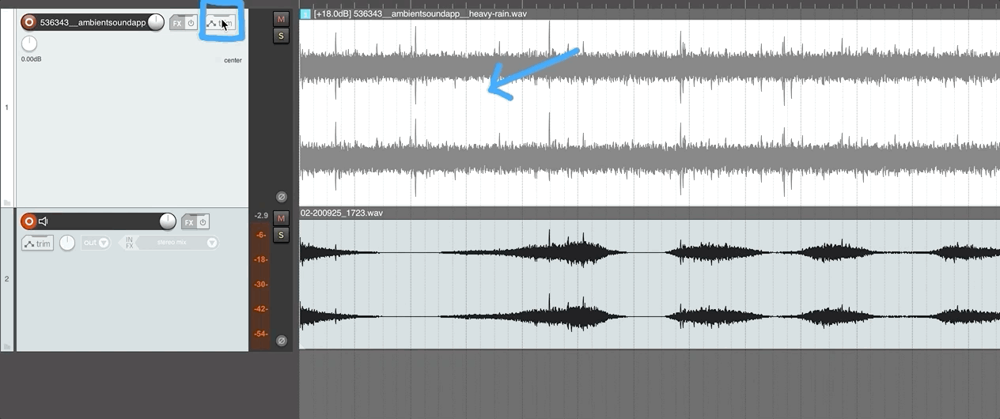
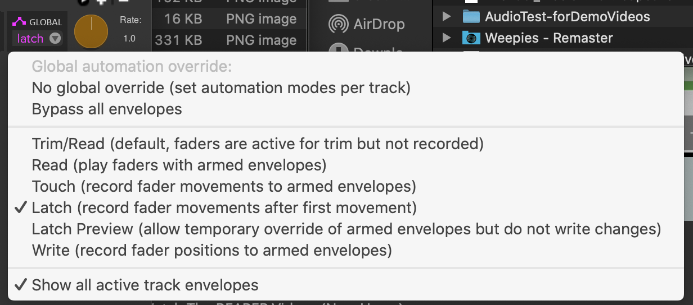

 

<iframe class="embed-responsive-item" src="https://www.youtube.com/embed/WMLLaSZbTqQ" frameborder="0" allow="accelerometer; autoplay; encrypted-media; gyroscope; picture-in-picture" allowfullscreen></iframe>

**_Automation_** allows the sound engineer the ability to automate, with respect to time, various parameters within the DAW. One of the most used parameters for automation, and the one we will demo first, is track fader gain. By automating fader gain, we can create mixes where individual sound sources change in volume, with respect to time, in the same way every time we playback the work. This allows the engineer the opportunity to build up complex works.

Like [fades]({{site.baseurl}}/modules/week-3/DAW-Techniques/#fades), automation "envelopes" can be shown visually in relation to an audio section. For every moment in time, the audio file is multiplied by the gain amount represented in the automation envelope, resulting in a new volume for the audio at that moment in time. The below image shows two tracks. The upper track is an original audio file of rain. Laid on top of the track is a gain automation envelope (the green line). The lower track shows the resulting audio file; notice how the audio shape now follows the gain automation envelope shape.

# View Automation in Reaper

As with almost anything you want to do, there are multiple ways of viewing and working with automation in Reaper. To view automation in Reaper, as its own lane (i.e. in a "track" below the corresponding audio track), click the "trim" button in the TCP, then select "Visible" for "Volume".

# Manual Work with Automation

There are two basic ways of adding and working with automation, "manually" editing automation envelopes with the mouse, and "recording" automation envelopes during playback.

Manually editing automation envelopes allows you to methodically add, edit, or delete automation directly in the arrangement view. This can be nice to create complex automation envelopes or edit automation envelopes that do not sound "quite" right.

When we record in automation, we will actually use a tracks fader (or relevant controller) to write the automation in real-time, as we listen to the project play.

## Add Automation Points

Once the automation lane is pulled up, you can start to add in your own automation.

To add an additional "point", press and hold the `Shift` key, then click with your mouse where you want the automation point to lay. After creating the point, you can click-and-grab the point, then move it with respect to time (left or right), or with respect to track gain (up or down).

**_{ TODO: }_** Add some automation, via single points to a track. Then listen back to hear the resulting effect.

To delete a point, press and click on the offending point while holding the option/alt key.

#### Automation Curve Shape

You can also use the option/alt key to effect the curve shape of an automation line segment. To do this, hold the option/alt key, then click and drag in the middle of the desired line segment.

## Draw in Automation

You can also draw in automation in Reaper. With your mouse over the automation lane, if you press and hold the command (macOS) or control (windows) key, your mouse will turn into a pen icon, and you can then click and draw automation envelopes in the lane. This is useful for creating complex automation envelopes.

# Record in Automation

Manually editing automation envelopes is an important skill, and certainly has its place in the production process. In the earlier analog studio days, this was not an option. If an engineer wanted to automate or print changes to a track, they had to perform the action in real-time, recording the resulting output to tape. This meant that engineers would rehearse fades, fader movements, pan movements, etc. and then record the movements on the board to tape. Luckily, we do not have to be that exact in our work today, but there is still a place for recording the automation envelopes in real-time. By listening to the track in real-time and recording the fader (or relevant parameter) to the automation lane, you can trust that your artistic/musical skills/ear can guide your work. Rather than do something manually, then audition it to see if you did it correctly, when recording automation, you can respond in real-time to the work as you hear it.

## Faders for Trim and Automated Gain

> Reaper has some unique functionality for automation compared to other DAWs. If you have experience in other DAWs, please pay particular attention to some of the following peculiarities in Reaper.

In Reaper, we can set a fader trim level independently of automation envelopes. Notice now, that if you play back your track, with automation envelopes in place, you should hear the automation envelope effect the tracks amplitude, but you do not see the fader move. This is by design in Reaper.

However, we can set Reaper to show us automation envelopes through the faders. To do this, we need to perform two actions;

1. Change the "Global Automation" setting to "Read", "Touch", "Latch", or "Write". This is located on the right-side of the transport. It is a drop-down menu. For the time being, select, "Read".
2. Turn the "Arm for Recording" flag in for each automation lane. This is a green record-like button on the left of the TCP in the automation-lane of the track.

## Record Automation

The "Global Automation" setting also offers the engineer the opportunity to tell Reaper to actually record movements at the relevant user interface element (in our current case, the fader) to the automation envelope.

In the following GIF, the Global Automation setting is switched to "Latch", then notice that as the fader is grabbed by the mouse, the automation is recorded in the automation lane.

**_{ TODO: }_** Try recording automation onto a track using the fader.

## Read, Touch, Latch, & Write

You hopefully noticed that there are a number of options in the Global Automation setting drop-down menu. These all serve different purposes and act slightly differently.

- **Trim/Read**
  - This setting shows the current trim position of the fader. This setting will not show any automation movement on the fader, nor allow you to record automation envelopes.
- **Read**
  - This mode will allow you to see automation movement via the faders, for any track where automation is armed. (The green record-like button in the automation lane) This is useful when wanting to preview and watch automation on individual tracks.
- **Touch**
  - When in touch mode, clicking on the fader will record the fader position into the automation envelope, as long as the mouse is being held. After you release the mouse and fader, the automation envelope will return to its previous position.
- **Latch**
  - When in latch mode, like touch mode, clicking in a fader will record the value of the fader into the automation envelope. However, unlike touch, latch will hold and record the last value of the fader until playback stops.
- **Write**
  - In write mode, the current value of the fader is recorded, regardless of whether you are interacting with the fader via the mouse or not.

**_{ TODO: }_** Please play with the various automation modes to get a sense for how they record automation.

> You will often times use both modes of working with automation, manual and record. I often find that after recording automation, I need to go back and manually clean up what gets recorded.

## Another Note on Trim vs Automation Read

Please note, that each track still has a fader-based track trim level as well. This level is separate from the automation gain level. You can use the two of these together to set amplitude levels correctly, AND to insure that tracks do not clip when adding automation.

# Pan Automation

Just like amplitude or volume, you can also automate the pan parameter for individual tracks (you will learn later in the course that you can actually automate nearly everything!).

To see and edit pan automation envelopes, select the track automation window again, then click on "Visible" for pan. (If you want, you can also unselect Visible for Volume)

# **_{ TODO: }_**

To learn more about automation, I would suggest you read [chapter 18, from the Reaper User Guide](https://www.reaper.fm/userguide.php).
