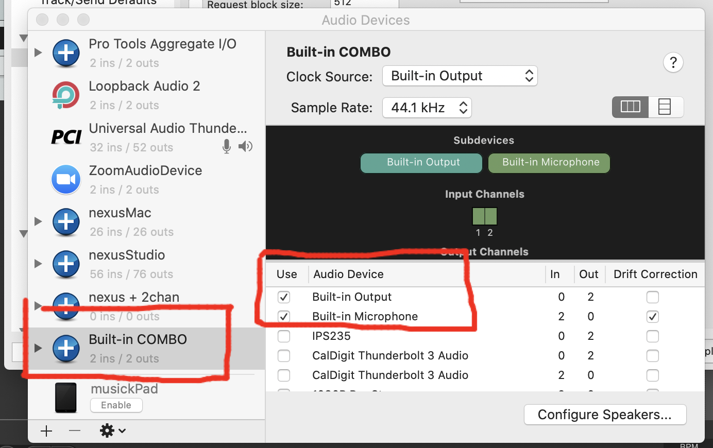
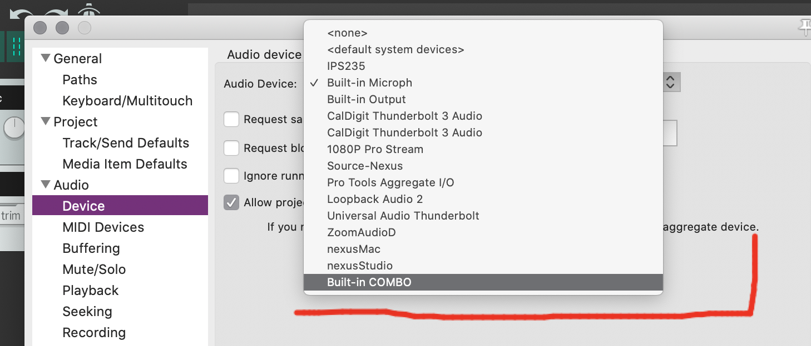
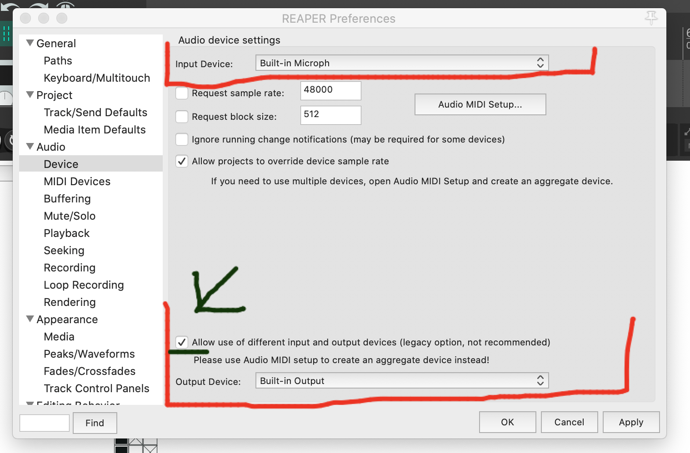
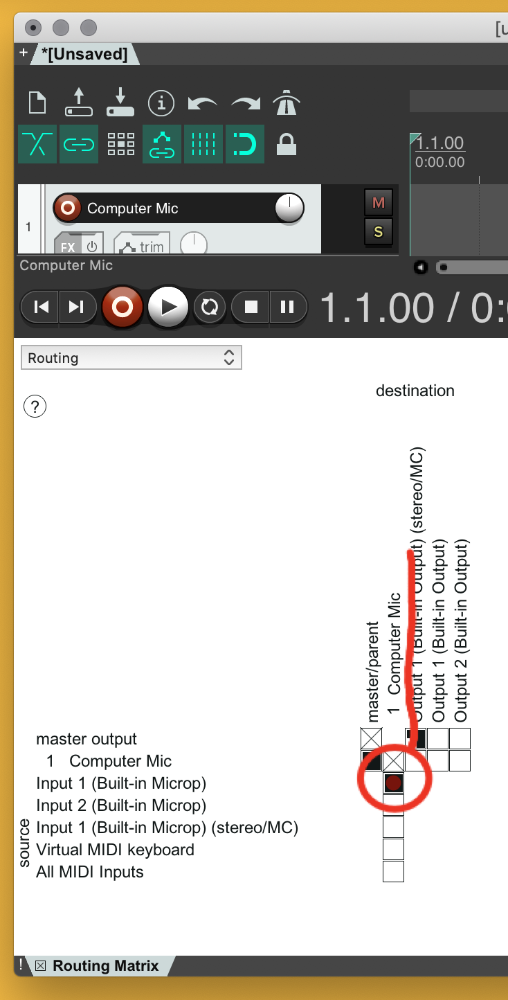
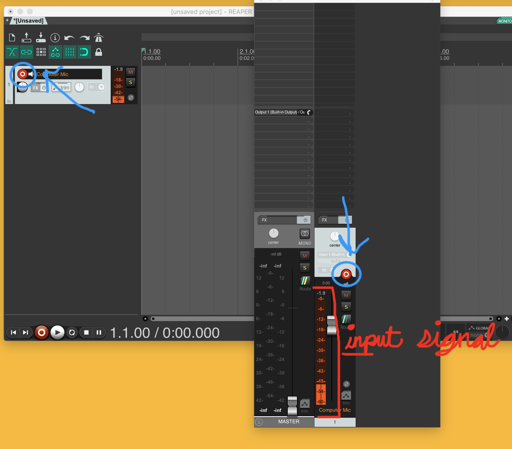

Up to this point in the semester, you have always recorded using your mobile phone, then brought the files into the DAW (Reaper). This method was taught and utilized, as it allowed you to capture sound events anywhere you could take your phone. Likewise, it allowed you to place the microphone on your phone close or far away from the sounding source, there by increasing the proximity of the sound in the captured file.

There are, however, obviously times that you will want to be able to record directly into Reaper.

<iframe class="embed-responsive-item" src="https://www.youtube.com/embed/3JLX8877kxY" frameborder="0" allow="accelerometer; autoplay; encrypted-media; gyroscope; picture-in-picture" allowfullscreen></iframe>

## Create a New Track

When recording in any DAW, the first thing to do is to create a new track where the recording will occur and to label it accordingly.

For the time being, I am labeling my track as `Computer Mic`, as we will be using the built-in microphones on our computers.

## Select Appropriate Audio Device

In order to record in a DAW, we need to ensure that our newly created track is _looking at the correct hardware input_.

> An **audio interface** is an integrated device that gets digital audio in and out of your computer.
>
> Often times, an audio interface will be a multi-function device, and may include other processes, such as microphone preamplifiers, analog-to-digital conversion, and digital-to-analog conversion.
>
> All computers come with a "built-in" audio interface, which is internal within the computers hardware. This audio interface allows you to capture analog sound on the built-in microphone, amplify this sound to line-level, convert this signal from analog to digital, and then capture it onto your computer's hard drive. Likewise, the "built-in" audio interface handles audio output, by converting audio from digital to analog, then routing it to the selected hardware output (either built-in speakers or a headphone jack).

The first step in this process is to ensure Reaper is addressing the correct audio interface. To do this:

1. Open Reaper's preferences (under the main "Reaper" menu).
2. Navigate to the "Device" tab under the "Audio" section.
3. Under the "Audio Device" drop-down menu, select the appropriate device for your operating system and computer.

_{ NOTE: } You may need to select separate devices for the input and output device._ There will be many times where you will need your DAW to address separate input and output devices. This is in fact an immediate problem for anyone on macOS. macOS treats the "Built-in Microph" separate from the "Built-in Output". In fact, if you look at the above image of available devices, you will see both the "Built-in Microph" as well as the "Built-in Output."

Essentially, we need to tell Reaper to use one for the input and one for the output. There are two ways of doing this.

### Aggregate Audio Device

On both macOS and Windows you can create an _aggregate audio device_. An _aggregate audio device_ is a virtual device that looks at separate hardware/physical devices as though they are a single device.

How you create an aggregate device depends on your OS.

- If you are on Windows, you will need to download something like [ASIO4ALL](http://www.asio4all.org).
- If you are on macOS, you will use the "Audio MIDI Setup.app" to do this.

The process is similar for each OS after opening the app.

- Create a new aggregate device. On macOS, click the plus button in the lower-left corner of the Audio MIDI Setup app. Then select "Create Aggregate Device".

- After the creation window opens, select the devices that you want to be part of the aggregate device.
   - For our proposes, we will select "Built-in Output" and "Built-in Microphone"

- You should then relabel the aggregate device as something that's meaningful to you. I relabeled mine, `Built-in COMBO`.

 

Now, in Reaper, you can select your newly created aggregate device.

### Different Devices in Reaper

The alternative method is to actually select separate devices within Reapers preferences.

- At the bottom of the Device preference tab, there is a check box for "Allow use of different input and output devices (legacy option, not recommended)."
- If you select this box, you will now be able to select a different Input Device and Output Device.
- This allows you to select the "Built-in Microph" for input, and the "Built-in Output" for output.

Supposedly, this method is less efficient and has a tendency to introduce excessive latency. So the first method is preferred. However, for our current purposes, either will work fine.

> **Latency** is the time it take for a sound to get captured by a microphone, pass through Reaper, then get played through a corresponding speaker. When recording musicians who are playing together live, latency needs to be low enough that it is not perceptually noticeable.
>
> For more on latency, please read [“Living With Latency” Sound on Sound, 2007.](https://www.soundonsound.com/techniques/living-latency).

## Open Routing

Next, we want to double-check the routing of hardware inputs and outputs for our track. To do this, we will want to open Reaper's "Routing Matrix." To make the Routing Matrix window visible, select it under the "View" menu.

The Routing Matrix allows you to specify what hardware inputs and outputs each track is addressing. As you will notice in the below image, the "1 Computer Mic" track has has "Input 1 (Built-in Microph)" mapped to it. This means that the track will look at the first input of the Built-in Microphone's internal audio interface.

We are now ready to close the Routing Matrix and try to record using our built-in mic.

## Record Arm

Regardless of whether you are working with a digital audio workstation or a tape-based studio, when recording, we need to specify which tracks we want to record to. There will be many instances where you want to preserve and playback audio on other tracks, while capturing new audio to specific tracks.

To tell a track to prepare itself for recording, we **Record Arm** the specified track. Once a track is in record arm mode, it will pass audio from it's input to the master track/fader, allowing the engineer to preview what is occurring. It will also tell the hard drive to prepare to store audio file data.

To place a track in record arm mode (or to take a track out of record arm mode), press the round record arm button on the track, either in the TCP or mixer window. This will cause the button to illuminate. Also, if the track is routed correctly, you should see some level of signal in the meter, representing what is being captured by the microphone.

> If you are using the actual speakers on your computer, as well as the built-in microphone, you likely just experienced feedback. To alleviate this do one of two things.
>
> 1. Use your headphones. The easiest solution is to monitor with headphones. This way, the microphone cannot hear the speaker output.
> 2. Mute the track until finished recording.
> 	- After you finish recording, take the track out of record arm, then unmute the track. Now you can listen to the audio, without the feedback.

## PRESS RECORD!

The final step is to press record! To do this, press the record button in Reaper's transport. (_This is the red record button_). When you are finished, you can press the record button again, or the stop button to it's right.

You should have seen waveforms recorded in the track. To hear them back, press the play button, next to the record button in Reaper's transport.
