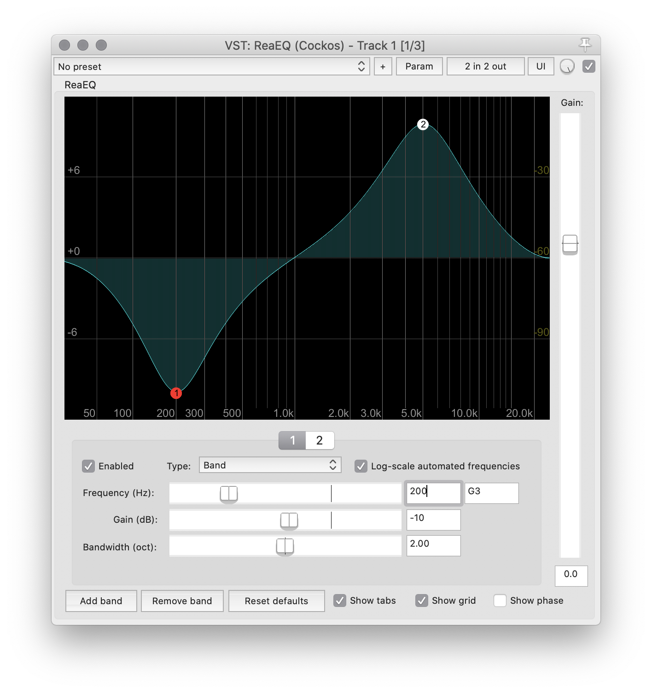
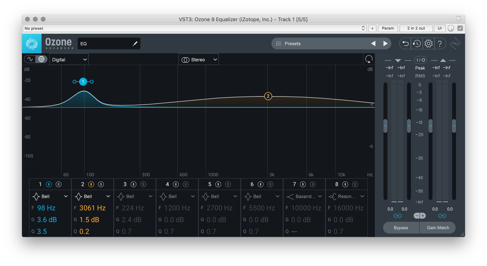

An **_Equalizer_** is a  signal processing technique that allows an audio engineer or artist to alter the frequency content of an audio signal. (_Often times, equalizer will be abbreviated to **EQ**_.) We will often also describe EQ's as an "EQ Filter," or simply as a "filter". Just like visual filters for video or photography production, a filter, in this case, is a process that we pass a signal through. The output of this filter will result in changes to the original audio signal.

There are multiple types of equalizers, but, we are going to focus on _parametric equalizers_. A parametric eq consists of 1 or more "eq bands." Each eq band is used to adjust some element of an audio signal's frequency spectrum. A parametric EQ is really a series of connected EQ filters, housed within a single filter unit or instance.

Generally, for parametric EQ's, there are a number of specific filter types that get grouped together.

## To Attenuate or to Amplify, that is the question

When working with filters, there are generally two ways of approaching their use.

1. You can amplify some frequency component of a signal, thereby making it louder than the rest of the signal.
2. You can attenuate (make quieter), some frequency component of a signal.

Many young sonic artists and audio engineers get in trouble because they try to adjust frequency problems by almost always "boosting" or "amplifying" frequencies using an EQ. The problem with this is that when you amplify a frequency component without doing anything else, you make the signal louder overall. This can of course result in peaking (where the signal goes louder than 0dBFS, can change the mix between signals, and may also result in distortion).

As a simplified rule of thumb, in general, when possible, _it is better to attenuate frequencies rather then boosting them_. This is obviously not always possible, and there will be times where you want to boost (like the homework assignment from this week). But when you make a choice to boost a frequency, first ask yourself if there is a way of achieving the same outcome through attenuating.

## Types of EQ Filters

There are a number of EQ filter types that you can choose from when working with parametric EQ filters. Which one you choose depends on the situation.

### Band Filter

A **Band Filter** amplifies or attenuates specific frequency bands within an audio signal. These frequency bands are typically defined by the following parameters;

**Frequency (Hz)**:

The frequency of a band filter refers to the _center_ frequency, which is the middle point of a band filter. In the below image, there are two band filters visualized. The first attenuates frequencies around 200Hz, and the second band filter amplifies frequencies centered around 5000Hz.

**Gain (dB)**:

The Gain of a band filter specifies how much to amplify or boost the audio signal in decibels. The following image shows 6 band filters, with gain amounts of; -9dB, -6dB, -3dB, 3dB, 6dB, 9dB, respectively.

**Bandwidth (oct)** or **Q**:

The Bandwidth or _Q_ (depending on the filter plug-in you utilize) specifies the width of the filter from the center frequency.

When expressed as "bandwidth," this value is supposedly describing how many octaves will be affected between the 3db mark of the band. The following image makes this more clear. The EQ filter's center frequency is labeled as $$f_{0}$$. From this position, $$f_{1}$$ and $$f_{2}$$ are calculated by finding where the frequency response curve drops by 3dB on either side. The bandwidth then is a calculation of how many octaves are represented by $$f_{2} - f_{1} = bandwidth$$.

So, at least in the Reaper EQ, you will be using a large _Bandwidth_ value, which results in a wider frequency band. Whereas a smaller _Bandwidth_ value results in a narrower filter band. The following image demonstrates three bandwidths for a 3dB filter increase.

**{ NOTE: }** Some EQ Plug-Ins will use **_Q_** instead of bandwidth. Functionally, these values are equivalent. However, there is a reciprocal relationship between _Q_ and _Bandwidth_, meaning smaller _Q_ values result in larger or wider bandwidths for a filter. Likewise, larger _Q_ values result in more narrow bands for a filter.

The following filter from iZotope demonstrates two filter bands, with the narrower band having a much larger Q value than the wider band.

The following video allows you to hear the results of a band filter on my voice and pink noise.

<iframe class="embed-responsive-item" src="https://www.youtube.com/embed/6Nem-yVq1yE" frameborder="0" allow="accelerometer; autoplay; encrypted-media; gyroscope; picture-in-picture" allowfullscreen></iframe>

### Band Pass

A **_Band Pass_** filter is similar to a band filter, in that it is concerned with only a narrow frequency range. This filter attenuates all other frequencies except for the active band, which it _passes_ through. In the following image that demonstrates this, you can see that all frequencies on either side of the active filter are attenuated fully to $$-inf$$.

<iframe class="embed-responsive-item" src="https://www.youtube.com/embed/FFhmPaLBzBc" frameborder="0" allow="accelerometer; autoplay; encrypted-media; gyroscope; picture-in-picture" allowfullscreen></iframe>

### Notch Filter

A **_Notch Filter_** is the exact opposite of a band pass filter. A Notch Filter instead removes all sound around a center frequency.

### Low/High Shelf

A **_Shelf_** filter comes in two varieties, either as a _Low Shelf_ or a _High Shelf_. These filters amplify/attenuate all frequencies evenly above or below a specified frequency amount. They are called a "shelf" filter, since they visually look like a "shelf."

The following image shows the use of two shelf filters. A "Low Shelf" filter, which is attenuating frequencies below 250Hz, and a "High Shelf" filter, which is amplifying frequencies above 2000Hz.

The **Bandwidth** for a shelf filter affects how quickly the filter engages around the specified frequency. The following image shows three filters with varying bandwidth values.

### Low/High Pass

The final filter type you need to be aware of are Low/High Pass Filters. These filters, as with the others, do exactly what they say; they either _pass_ low or high frequencies. These filters are often colloquially referred to by related names of Low/High Cut, because what they perceptually do, often, is _cut_ low or high frequencies.

A High-Pass Filter is used to pass high frequencies above a specified frequency value. These are often used to _cut_ low frequencies which are distracting or unneeded. In particular, audio engineers usually use High Pass filters to "clean up" audio signals, by removing sub-bass frequencies, which serve to "muddy" a mix.

Likewise, a Low-Pass Filter is used to pass low frequency content below a specified frequency. This can be useful when trying to removing high frequency noise or hiss.

The following image shows two separate filter modules, with the left one demonstrating a High Pass filter, and the right one demonstrating a Low Pass Filter.

<iframe class="embed-responsive-item" src="https://www.youtube.com/embed/aKx4nM9QMP4" frameborder="0" allow="accelerometer; autoplay; encrypted-media; gyroscope; picture-in-picture" allowfullscreen></iframe>

## **_{ TODO: }_**

Please watch the following video for a different take on parametric filter parameters.

<iframe class="embed-responsive-item" src="https://www.youtube.com/embed/hNVdvsOEF7w" frameborder="0" allow="accelerometer; autoplay; encrypted-media; gyroscope; picture-in-picture" allowfullscreen></iframe>

 

Please also read from an **Introduction to Computer Music**:

- [Synthesis Chapter Four: Filters](https://cmtext.indiana.edu/synthesis/chapter4_filters.php)
    - Please note that there are 2 pages.

-[EQ Reference Guide For Reaper ReaEQ Plug-in](https://moodle.umt.edu/pluginfile.php/3803890/mod_resource/content/1/EQ%20Cheet%20Sheet_Reaper_createdBy%20kt8.pdf)

-[Anatomy Of an EQ](https://moodle.umt.edu/pluginfile.php/3803832/mod_resource/content/0/Anatomy%20of%20an%20EQ.pdf)

-[The 4 Ways To Use An EQ](https://moodle.umt.edu/pluginfile.php/3803831/mod_resource/content/0/The%204%20Ways%20to%20Use%20an%20EQ.pdf)
