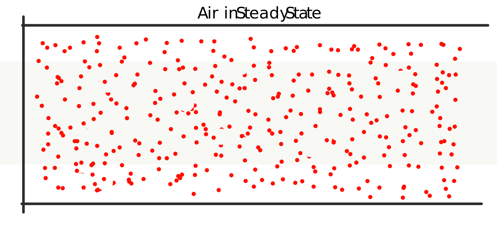
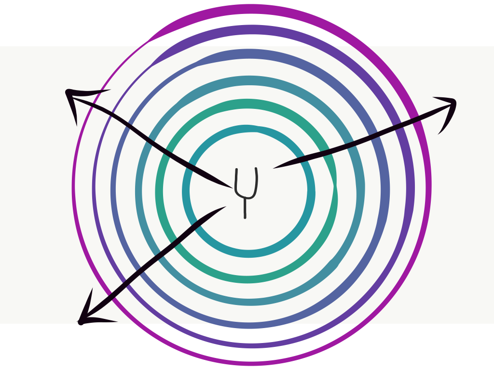

As mentioned on the last page, _sound_, as well the properties of sound, have objective and subjective meanings and qualities.

# Acoustics

Sound, with respect to acoustics, is the propagation of energy waves within a medium. The medium that we are most familiar with regard to our experiencing of sound is _air_. However, sound can (and does) propagate through any medium through the molecules that comprise that medium. This is sound as an objective phenomenon.

## How Waves Move Through a Medium

Waves can move _longitudinally_ or _transversely_ through mediums in the physical world. Sound waves move _longitudinally_. They are compression waves that move horizontally, as opposed to vertically. The following gif demonstrates the movement of this type of wave as a spring.

<!-- Add additional videos or animated examples. Particularly of a particle system example. Melecules hanging in air normally, and with sound wave propagation  -->

 

In air, sound causes a displacement of air molecules from their steady state (i.e. even distribution) to a compression wave, where there are clumpings of air molecules.

<!-- -->

<table>
	<tr class="figureCaption">
		<td width="100%" style="max-width: 800px; padding-left: 20px; text-align: left;">
		<b>Figure 1.</b>&nbsp; A Sound Wave.    Very much slowed down and very much zoomed in 
		   animation from: <a href="https://jackschaedler.github.io/circles-sines-signals/sound.html">jackschaedler.github.io/circles-sines-signals/</a> 
		</td>  
	</tr>
	<tr>
		<td>
		<svg id="physicalWave" class="svgWithText" width="100%" style="padding: 20px; height: 250; max-width: 800px;"></svg>
		

		

			<table width="100%" style="max-width: 800px;">
				<tr>
					<td style="text-align: center;" width="50%">
						<label for=vibSpeedFader style="margin-left: auto; margin-right: auto">Vibration Speed</label> 
						<input type=range min=4 max=20 value=12 id=vibSpeedFader step=1 oninput="updateSpeed(value);">
					</td>

					<td style="text-align: center;" width="50%">
						<label for=vibAmountFader style="margin-left: auto; margin-right: auto">Vibration Intensity</label> 
						<input type=range min=0 max=100 value=25 id=vibAmountFader step=1 oninput="updateAmount(value);">
					</td>
				</tr>
			</table>
		

		</td>
	</tr>
</table>

### Difference in Mediums

Hopefully, you remember back to your high school physics classes and that there are three types of mediums; _gas, liquid, and solid_. The major difference between these mediums to remember for the purposes of acoustics, is that the density of molecules comprising the medium is higher as we move from gasses to solids. Energy is able to propagate more quickly through mediums with molecules that are denser.

### Propagation in All Directions

It should also be noted, that assuming a free-field (an ideal situation where there are no obstructions) that sound will propagate (travel) in all directions (360°) outward from the sounding source.

<!-- Add image/gif demo-ing -->

## Sounding Sources

A sounding source is one that moves molecules in a medium. As these molecules move, they cause the subsequent movement of molecules propagating outwards from the sounding source. Typically, this sounding source exhibits periodic vibration, which results in sound waves propagating outward. These sound waves exhibit periodic behavior, meaning that there is a repetition of movements, which cause a series of waves.

Sound waves are created by these sounding sources pushing and pulling against a medium (typically the atmosphere or air).

## Mechanical Waves

Sound waves in the physical world are [mechanical waves](https://en.wikipedia.org/wiki/Mechanical_wave). A mechanical wave oscillates matter (gas, liquid, solid), and thereby transfers energy through a medium.

<!--

## Speed of Sound

!!! Enter info on Speed of Sound!

-->

## **_{ TODO: }_**

Please read from an **Introduction to Computer Music**:

- ["2. Sound" in Chapter One: An Acoustics Primer, from Introduction to Computer Music](https://cmtext.indiana.edu/acoustics/chapter1_sound.php)
	  - Note: There are 3 pages.
- ["2. The Speed of Sound" in Chapter One: An Acoustics Primer, from Introduction to Computer Music](https://cmtext.indiana.edu/acoustics/chapter1_speed.php)
	  - Note: There are 2 pages.

 

Please read and complete the test questions from the following lessons in
**["Waves" from The Physics Classroom](https://www.physicsclassroom.com/class/waves/)**

- Lesson 0 - Vibrations
	- [Vibrational Motion](https://www.physicsclassroom.com/class/waves/Lesson-0/Vibrational-Motion)
	- [Properties of Periodic Motion](https://www.physicsclassroom.com/class/waves/Lesson-0/Properties-of-Periodic-Motion)
	- [Pendulum Motion](https://www.physicsclassroom.com/class/waves/Lesson-0/Pendulum-Motion)
	- [Motion of a Mass on a Spring](https://www.physicsclassroom.com/class/waves/Lesson-0/Motion-of-a-Mass-on-a-Spring)
- Lesson 1 - The Nature of Waves
	- [Waves and Wavelike Motion](https://www.physicsclassroom.com/class/waves/Lesson-1/Waves-and-Wavelike-Motion)
	- [What is a Wave?](https://www.physicsclassroom.com/class/waves/Lesson-1/What-is-a-Wave)
	- [Categories of Waves](https://www.physicsclassroom.com/class/waves/Lesson-1/Categories-of-Waves)

# Psychoacoustics

Sound, with respect to psychoacoustics, is our perception of heard sound events within out brains. As sound waves vibrate our ear drums, these signals are converted to electrical signals in our brains, where meaning and classification are made by the auditory cortex. In this way, sound is a subjective phenomenon. We make meaning of sounds and not all individuals make the same meaning of the same sounds.

It is possible to measure qualities of our hearing. However, it is not possible to measure human perception of sound in the same ways that it is possible to measure the physics-based qualities of mechanical sound in the world. But, the qualities that define mechanical sound are requisite to understand our perception of sound.

_You will lightly explore some topics around hearing and psychoacoustics this week. However, the majority of this content will be more thoroughly presented in a later week._
