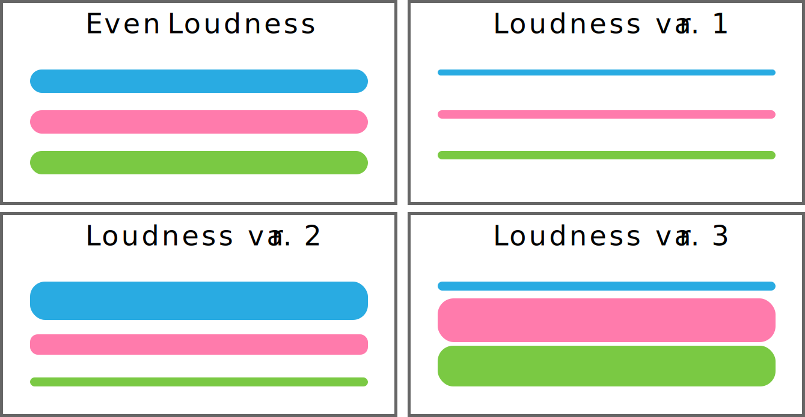
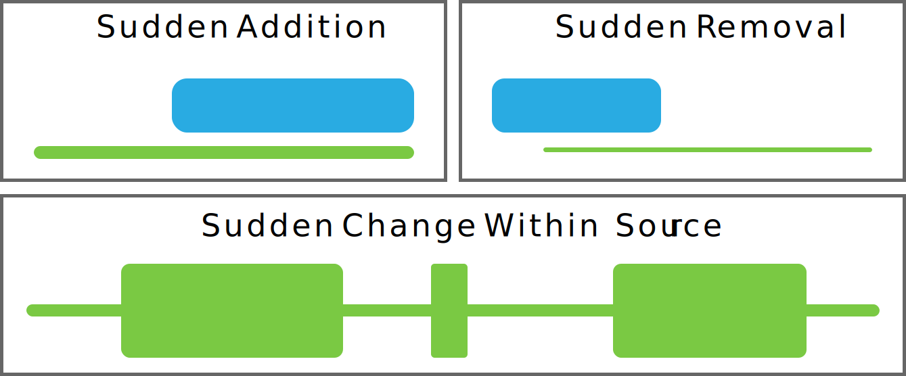
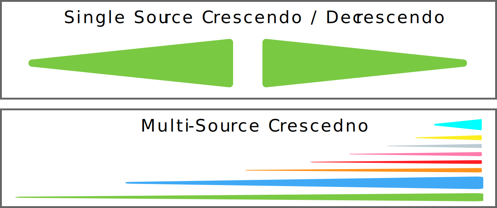
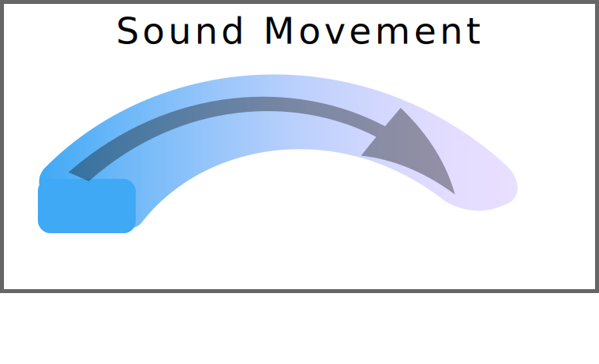

**_Mixing_**, for me, has two goals. The first is to get all of the sounds the constitute a sonic art work/project to work together. The second goal is to create the most meaningful representation of the piece that is possible for the desired output medium or mode of presentation.

Essentially, mixing can be thought of in the moment-to-moment of getting sounds to work with each other. It can also be thought of in the totality, in getting a project or work to sound good from start to finish.

Mixing can refer to the combining of hundreds of tracks and sources into a single stereo track, or it can refer to the balancing and work paid to a single sound source. Initially, you will likely consider this as a process in which we combine multiple sources together, as the first technique that will be explored is adjusting amplitude. But, even when only considering amplitude, you may still find yourself adjusting the gain and resulting amplitude for a single source, if it is a long recording, and the source needs adjustments throughout the project. The techniques can be applied to complex projects, and simple ones.

As with editing, I break mixing down into creative and technical processes.

# Creative Applications of Mixing

When creating, devising, or composing as a sonic artist, you will consider the mix and relationship of sound sources to each other and over time throughout the entire life cycle of the project. The major difference will be in how you approach this work. When involved in the creation of a work, these balance relationships will inform how the work is perceived artistically.

This week, we will only be looking at gain/amplitude-based and sound-field placement mixing techniques. These two qualities will greatly impact the quality and emergent results of your sound work. As we move forward and introduce further techniques, you will start to see more and more how these techniques can be utilized during the creative phase as tools for your artistic voice.

## Amplitude in Mixing

Amplitude and loudness in mixing between various sources will alter the experience for a listener. This is an important tool for you as a sound artist to always consider and to explore.

### Relative Amplitude Differences

Obviously, the easiest consideration of amplitude and loudness is that of relative amplitude or loudness differences. By altering the loudness relationships between two sources, you will greatly alter the resulting relationships that emerge.

Consider four situations and how they might sound different. In each situation, there are three sound events occurring simultaneously.

1. All sounds at a medium level
2. All sounds at a quiet level
3. Source 1 is loud, source 2 is medium loud, and source 3 is quiet
4. Source 1 is quite, and sources 2 & 3 are loud.

These relationships will obviously change how we perceive this moment in time. It is important while you are creating to contemplate these possibilities.

### Sudden Amplitude Differences

Another creative possibility to consider is when there are sudden differences in amplitude or loudness levels of sound sources.

This can occur when sound suddenly drops out or is added. This can also occur within a single sound source.

### Crescendos and Decrescendos

The last basic idea to consider this week is that of _crescendos_ and _decrescendos_. These two terms are Italian, and are borrowed from music language.

We will consider a **_Crescendo_** to be an increase in loudness of a single source or totality of all sources over time. Likewise, we will consider a **_Decrescendo_** to a a steady decrease in loudness over time.

These changes can occur in one of two ways. The first is where a single sound source's loudness is altered steadily over time.

The other is where multiple sources are stacked over time, thereby resulting in an increase to loudness of the work over time.

## Sound-Field Placement in Mixing

Placing sound sources at different places in the stereo sound-field will change how these sources are perceived.

If all sources are placed in the center of the stereo-image, then the width of the work collapses. The only way of distinguishing the relative importance of these sources then is through amplitude and loudness differences.

However, if sources are placed throughout the stereo sound-field, the width of the work is expanded. Creatively, this offers space to a work, it also offers the listener aural cues as to the potential importance or role of sound sources. Typically, we would consider sources "panned" to the center to be more important than sources panned to one side or the other. The most obvious example if this is in popular music, where the lead vocals and instruments are always panned in the center, with supporting instruments panned wider in the stereo sound-field.

The movement of a sound source within the stereo field will also catch the listeners attention and suggest varying levels of importance. Consideration of how sources move in space is also something that the sound artist should consider during the creative phase.

# Technical Applications of Mixing

When switching "hats" to the technical mixing hat, the goals are similar to creative ones, except that instead of trying to alter the composition, the goal is instead to best represent the art work as it currently is. Mixing involves the balancing and placement of sound events in relationship to each other over time and in the moment. The goal is not to change the intended meaning, but to adjust these relationships so that the work of art is cleaner, clearer, and sounds _even_.

This idea of _even-ness_ is a significant one, especially when working in popular music styles or with vocal applications for radio, TV, or film. The best way to think about this is with respect to yourself as a listener. When listening to "well-mixed" works, they are even, and do not hurt your ears, have moments where frequencies or sources pop-out needlessly, and where all of the sources can be heard throughout the process. We will talk more about technical mixing as we move through this semester and in future semester.

In the meantime, as you are work on your individual projects, I encourage you to try and change the "hat". Where at some point you stop listening as a creator, but instead listen to whether the "mix" sounds even. Do you feel a need to adjust volume constantly, can you hear everything you want to at all moments, is the work even with respect to timbre and harshness?

## **_{ TODO: }_**

In addition to the above reading, please also read chapters 1-4 in;

- [Owsinski, Bobby. _The Mixing Engineer's Handbook_, Mix Books, 1999.](https://moodle.umt.edu/mod/resource/view.php?id=1683184&redirect=1)
