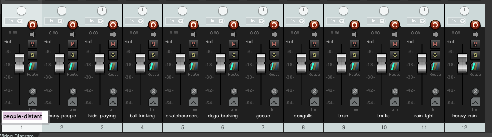
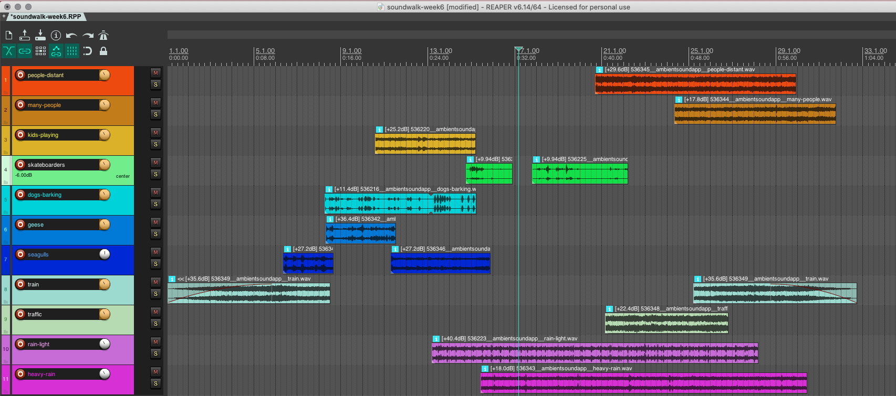
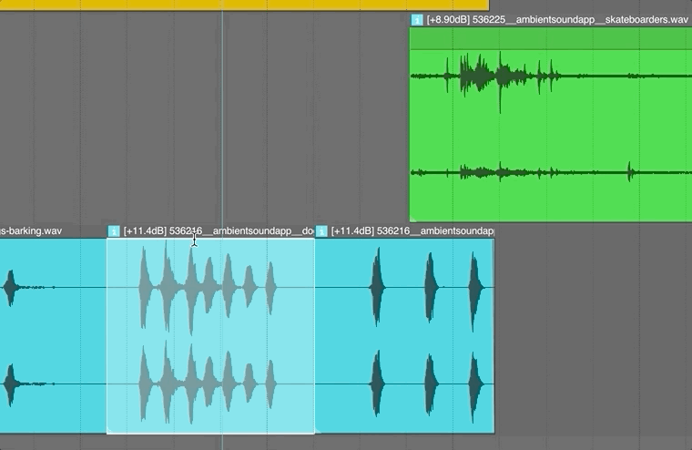
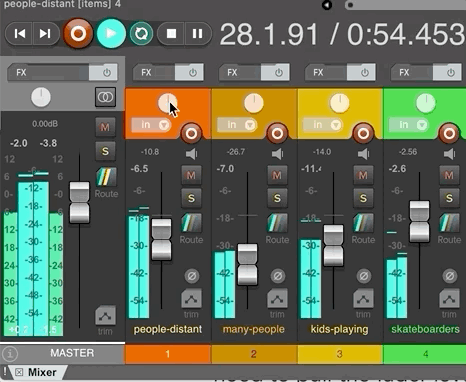
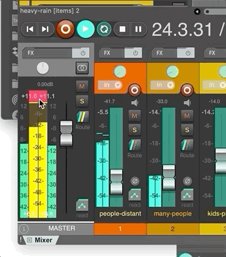

Per the previous page, your homework assignment for this week is to compose a soundwalk experience, using sounds you either record yourself or find online.

# Step-by-Step Help

For this week, I am going to explicitly walk you through most of this process, in order to help with any potential problems.

## 1. Collect Your Sounds

Collect your sounds together. You can get sounds by recording them with your phone or downloading them from the internet.

> Remember that you can utilize sites like;
>
> - [freesound.org](freesound.org)
> - [the internet archive - archive.org](archive.org)
> - [Audio from the Library of Congress](https://www.loc.gov/collections/?fa=original-format:sound+recording)

## 2. Create a Session in Reaper and Save

Before you start doing any actual creative work in Reaper, I would encourage you to create a new blank session, then save it. Remember to check the boxes telling Reaper to create a "parent directory", and to copy over any media.

## 3. Import Audio, Rename, and Organize

After saving your session, you are ready to start playing. The first step is to import your audio samples you are considering using. You can either "Insert Media" under the _Media_ menu, or simply drag and drop your audio files into the arrangement view. (If asked, tell Reaper you want each file on its own track)

After importuning your audio, I would HIGHLY suggest you rename each track to reflect the type of sound source that will be playing through the track. Notice in the following image that I relabeled each track to reflect the sound source present in the track.

> To relabel or rename a track, double-click the name on a track. Either double-click the name in the TCP of the arrangement view, or the name on the "mixer" view.

I would also suggest that you rearrange the order of the tracks so that they are grouped by any similarities or categorization. In the below image, you can see I grouped the "rain" sounds, "people" sounds, and "playing" sounds together.

Finally, I would also encourage you to re-color the tracks, based loosely on these groups. This will help you visually identify tracks while you work more easily.

> To re-color a track, right click on the track in question, and select "Track Color", then select "Set Track to Custom Color".
>
> Alternatively, you can right-click on a track and select "Track Manager". This brings up a new window where you can alter details about all of your tracks more quickly. If you select the small box to the left of each track, it will bring up a color-picker window, where you can set a custom color for each track.

## 4. Normalize Each Audio File/Section

Next, I would [normalize]({{site.baseurl}}/modules/week-4/DAW-Techniques/#normalize-audio) each audio file or section. Some of the sounds you bring in, regardless of whether they are from your phone, or one of the suggested website, will likely have a high variability of amplitude levels. Again, this is not something you should get in the habit of always doing, but early in this semester, we will utilize this technique.

## 5. Preview Each Audio File and Start to Edit

You should now start to preview or listen to each audio file. Use the _mute_ and _solo_ buttons to isolate individual tracks.

As you listen, start to make choices about what audio you want to keep and discard. As a reminder, to cut an audio section, place the playhead at the desired splice, and press the `S` key.

## 6. Turn off "Snap Enable"

I would suggest you turn off "Snap Enable", which will allow you to freely move audio sections around, irregardless of the current grid. To do this, press the "Snap Enable" button in the top-left corner of Reaper, so that it is not highlighted.

## 7. Lower Each Fader to -6dB

I would next suggest you lower each fader, for each track, to -6dB. This will give you room to mix later on, and combine sounds together.

> To set a track's fader to exactly -6dBFSm I find it easiest to open the tracks routing window. To do this, right-click on the tracks main fader. Then type in -6dB.

## 8. Start to Edit the Work

Now it is actually time to start having fun, after making some initial edit choices, you should start to feel empowered to move audio sections around, with respect to the timeline and each other. This is where you will spend a majority of your time this week, working to lock in edits.

You should feel free to play as much as you want here. Move things around, splice, edit, cut, and explore how you can arrange these sounds in time.

<!--  -->

> You can approach this a number of ways. First, you can choose to dig-in to the roots of the Media Arts program and attempt to tell a story. This could be a traditional story with a character or two with their own arc, or this could be a story of place, where you attempt to put the listener into a sonic environment and journey that is recognizable while flooding them with emotions and memories.
>
> Alternatively, you can approach this soundwalk as a collection of "interesting" sonic events that may or may not relate thematically. In this scenario, you are likely more interested in how these sounds mesh together and play with each other from a purely sound perspective.
>
> Finally, you are welcome to be as abstract or literal with this project as you like, so feel free to contemplate what **you** want to accomplish, then try and execute it.
>
> **_{ TODO: }_** Please make some notes about what you think you want to accomplish at the outset of this project. Try and devise a work that fulfills these initial goals and thoughts.

Listen back often in order to assess whether the work that is developing represents the narrative you want to represent and the journey you want to take the listener on.

## 9. Begin to Sculpt out Amplitude Level

After you start to get close to locking in your edit (the timeline-based relationship of your sound sections), you should then start to roughly sculpt in the amplitude level relationships.

#### Item Gain

One way you can begin to sculpt out amplitude levels is with individual item gain settings. This is when you take your mouse near the top of an audio item, until it turns into a horizontal line, with vertical arrows, then pull the gain for the item down.

This is particularly useful for setting the relative level of items within a track.

#### Set Initial Fader Levels

Another way to start to sculpt out your amplitude levels is to adjust the fader gain for each track. **{ NOTE: }** This will of course effect all of the audio items within a track, but can be useful, if the material is similar.

#### **{ NOTE: }** On Clipping

As you work on this project you **NEED** to insure that you are not causing distortion through clipped audio levels. If at any point you see the red "clip indicators" light up on an individual track, or worse, in the Master Meter, then you will need to go back and adjust the gain of the offending sources.

To do this, you simply need to turn the gain of that offending section down. You can either create an individual item by splitting the sound before and after the offending moment, then attenuate (turn down) the item gain. Alternatively, you may simply just need to pull the fader level back down until it no longer clips.

> **{ NOTE: }** To clear clip indications, click with your mouse on the red clip light.

> **{ IMPORTANT: }** You will be docked points if your soundwalk art work has clipping this week!

## 10. Begin to Sculpt out Stereo Placement

Just like amplitude relationships, you should also start to now sculpt out stereo placement of your sound events.

To do this, simply grab the pan pot (knob at the top of the track fader channel in the mixer window) and drag to the position that sounds correct.

## 11. Turn on a Global Automation Mode and Start to Write in Automation

Now that you have started to settle on an edit, roughed in amplitude and pan relationships, it is time to start automating gain and pan parameters for your work. To do this, I suggest you turn "Global Automation" mode to either "Touch" or "Latch", depending on how you want to work. You should then click the automation window for each track, then click "Visible" and "Arm" for the parameters you want to automate.

The goal of this step is for you to sculpt your soundwalk fully. This will allow you to really create the experience you want by dynamically altering individual amplitude relationships and stereo placement over time. This step should take you quite a while.

## 12. Insure You Do Not Clip

As you work on your soundwork project, one thing you will need to watch is your peak level indication. The master peak level indicator is a set of numbers which are printed at the top of your master meter.

For this assignment, you are not allowed to peak. This is visually evident if you get a "red" peak indicator on your master track or any of your individual tracks.

Your mix for this project also needs to have a peak value between -0.3dBFS and -6.0dBFS.

To reset your peak value indication, simply click on the numbers. Then playback your work again to see if it is within the specified range.

If the value is too high or too low, then you need to adjust the gain for your project.

**{ NOTE: }** This can be a difficult process. Take your time, this is part of the "Art of Mixing". You may need to adjust multiple tracks in order to get the master track level to fit within this range.

## 13. Bounce Your Sound Art Work

Bounce your sound work out. If you need help doing this, I suggest you follow the [bounce instructions from the previous few weeks]({{site.baseurl}}/modules/week-2/rendering/)

## 14. Take a screen shot of Reaper

The final thing I want you to do is take a screen shot of Reaper. To do this, make Reaper as large as it can go on your computer screen. Then please also show automation lanes for any tracks in which you included automation. Then press Command or Control and scroll up or down to resize the height of your tracks so that as many as possible fit in the window. Finally, zoom in or out horizontally, to show as much of your project as possible. (You might also shrink the height of the mixer)

# Composed Soundwalk - Example Track

Here is an example track for you to listen to. This composed soundwalk includes files from freesound.org, which I edited into a 1-ish minute soundwalk experience.

<iframe style="border: 0; width: 100%; height: 120px;" src="https://bandcamp.com/EmbeddedPlayer/album=1498841382/size=large/bgcol=333333/linkcol=e99708/tracklist=false/artwork=small/track=525185808/transparent=true/" seamless><a href="https://michaelmusick.bandcamp.com/album/examples-from-intro-to-sonic-art">Examples from Intro to Sonic Art by Michael Musick</a></iframe>

If you want to check out the techniques I used, you are welcome to also download the session.

- [Session File Download](https://umt.box.com/s/zk02gcx4mkwndukpnulrj1b789fi571w)

<iframe class="embed-responsive-item" src="https://www.youtube.com/embed/5uMnhZ3GIps" frameborder="0" allow="accelerometer; autoplay; encrypted-media; gyroscope; picture-in-picture" allowfullscreen></iframe>

