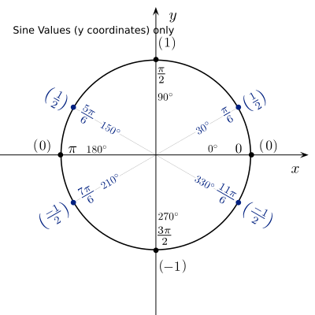

## The Building Blocks for All Sounds

Before we get into complex waves, let's dive a little deeper into _sine waves_. A _sine wave_ or _sinusoidal wave_ is a basic building block of audio. As mentioned multiple times, all sounds can be broken down and described as a series of sine waves at various amplitudes and initial phases.

This type of signal is essentially an "unwrapped" circle. This is important to understand, as it allows for a visual connection to the simplicity and beauty of sine waves. Just as a circle is one of the fundamental building blocks for many visual compositions, we can think of the circle (or rather it's sine wave representation) as a fundamental building block for sound.

## Sine Wave Formula

The sine function (if you remember back to trigonometry), along with the related cosine function, can be used to describe the $$x$$ and $$y$$ coordinates on the unit circle for any angle ($$t$$). (_Angles will be written in radians. I.E. With respect to pi, $$\pi$$_)

$$x = \cos(t)$$

$$y = \sin(t)$$

The following image is of the Unit Circle. It also contains the $$x$$ and $$y$$ coordinate values in relationship to various angles.

For the time being, we are only concerned with the $$y$$ coordinates, which represent the sine value of the angle.

---

#### Angle = 0

So, if we have an angle of $$0\pi$$ (which of course equals $$0$$), we get a $$y$$ value $$0$$.

$$\sin( 0 ) = 0$$

---

#### Angle = $$\pi$$ / 6

Likewise, if we have an angle of 30° which is also $$t=\frac{pi}{6}$$, we get a sine value of $$0.5$$.

$$\sin(\frac{\pi}{6}) = \frac{1}{2} = 0.5$$

---

#### Angle = $$\pi$$ / 2

If we have an angle of 90° which is also $$t=\frac{pi}{2}$$, we get a sine value of $$1$$.

$$\sin(\frac{\pi}{2}) = 1$$

---

#### Repeating Patterns

These values repeat as a pattern around the unit circle. So,

$$\begin{array}{ll}
\sin\left(0\right) &= 0\\
\sin\left(\frac{\pi}{6}\right) &= 0.5\\
\sin\left(\frac{\pi}{2}\right) &= 1\\
\sin\left(\frac{5\pi}{6}\right) &= 0.5\\
\sin\left(\pi\right) &= 0\\
\sin\left(\frac{7\pi}{6}\right) &= -0.5\\
\sin\left(\frac{3\pi}{2}\right) &= -1\\
\sin\left(\frac{11\pi}{6}\right) &= -0.5\\
\sin\left(2\pi\right) &= 0\\
\end{array}$$

The following image shows the Unit Circle with a reduced number of relationships and only the values associated with the sine function or the $$y$$ coordinates. You can see how related angles result in related $$y$$ values, with sign flips depending in whether the angle is on the top half or bottom half of the unit circle.

For more review of sine and cosine functions and relationships, please read:

- [5.3: Unit Circle - Sine and Cosine Functions - Mathematics LibreTexts](https://math.libretexts.org/Bookshelves/Precalculus/Book%3A_Precalculus_(OpenStax)/05%3A_Trigonometric_Functions/5.03%3A_Unit_Circle_-_Sine_and_Cosine_Functions)

The following video will serve to remind you about some of the properties associated with the unit circle. Which is our key to understanding how the sine function creates a circle.

<iframe class="embed-responsive-item" src="https://www.youtube.com/embed/c819bGfH8FA" frameborder="0" allow="accelerometer; autoplay; encrypted-media; gyroscope; picture-in-picture" allowfullscreen></iframe>

## Sine Wave Signal Formula

Knowing the relationship between the unit circle and the sine function, we can now consider the sine wave formula.

A sine wave signal can be represented with respect to time in the following function:

$$y(t) = A \sin{(2\pi_{} f t + \phi)}$$

Where:

- $$y(t)$$ is the resulting sine wave value, with respect to time.
- $$t$$ is a reference to time.
- $$A$$ is amplitude, or the peak deviation of the function from zero.
- $$f$$ is ordinary frequency, the number of cycles per second (Hz).
- $$\phi$$ is initial phase ($$t = 0$$), specified in radians.

Essentially, we are replacing the angle from the unit circle sine function information above, with a representation of frequency with respect to time. This results in a value, which represents a an angle with respect to the unit circle.

 

So, as an example, lets assume the following;

- $$f = 1Hz$$ - We will use an example frequency of 1Hz, or 1 cycle per second.
- $$\phi = 0$$ - We will start with a phase of 0.
- $$A = 1$$ - Let's assume we want a signal with a maximum amplitude of 1.

This results in;

$$y(t) = 1 \cdot \sin\left(2\pi \cdot 1 \cdot t + 0\right)$$

 

So, at 0 seconds ($$t=0$$);

$$\begin{array}{ll}
0 = 1 \cdot \sin\left(2\pi \cdot 1 \cdot 0 + 0\right)\\
0 = 1 \cdot \sin\left(0\right)\\
\end{array}$$

At 0.25 seconds ($$t=0.25$$);

$$\begin{array}{ll}
1 &= 1 \cdot \sin\left(2\pi \cdot 1 \cdot 0.25 + 0\right)\\
1 &= 1 \cdot \sin \left( \frac{\pi}{2} \right)\\
\end{array}$$

At 0.5 seconds ($$t=0.5$$);

$$\begin{array}{ll}
0 = 1 \cdot \sin\left(2\pi \cdot 1 \cdot 0.5 + 0\right)\\
0 = 1 \cdot \sin\left(\pi\right)\\
\end{array}$$

At 0.75 seconds ($$t=0.75$$);

$$\begin{array}{ll}
1 &= 1 \cdot \sin\left(2\pi \cdot 1 \cdot 0.75 + 0\right)\\
1 &= 1 \cdot \sin\left(\frac{3\pi}{2}\right)\\
\end{array}$$

And, finally at 1 seconds ($$t=1$$);

$$\begin{array}{ll}
0 = 1 \cdot \sin\left(2\pi \cdot 1 \cdot 1 + 0\right)\\
0 = 1 \cdot \sin\left(2\pi\right)\\
\end{array}$$

## Visualize a Sine Wave & Circle

In the following interactive element, you can see this relationship between a circle and sine wave. As the angle moves from $$0$$ around the circle to $$2\pi$$, you can see the resulting sine wave created.

<table>
	<tr class="figureCaption">
		<td width="100%" style="max-width: 800px; padding-left: 20px; padding-bottom: 20px; padding-top: 60px; text-align: left;">
		<b>Figure 1.</b>&nbsp; The Sine Wave
		   animation from: <a href="https://jackschaedler.github.io/circles-sines-signals/sound.html">jackschaedler.github.io/circles-sines-signals/</a> 
		</td>
	</tr>
	<tr>
		<td style="text-align:left;">
			<svg id="phasor" class="svgWithText" width="600" height="150" style="margin-left: 50px; text-align: left;"></svg>
			

			

				<label for=freqFader>Frequency</label> 
				<input type=range min=2 max=16 value=2 id=freqFader step=1 width=150 oninput="updateFreq(value);"> 
				<label for=ampFader>Amplitude</label> 
				<input type=range min=0 max=5000 value=5000 id=ampFader step=1 width=150 oninput="updateAmp(value);">
			

			</td>
	</tr>
</table>

As you can see from the above image, the movement of a circle unwraps nicely into a sine wave signal.

## Hear a Sine Wave

When you press the "Play Sound" button for the below interactive element, you can hear a sine wave. Grab the frequency bar and move it left or right to hear various frequencies.

Notice, as you interact with the following, the qualities of this signal. Try to describe it.

<table>
	<tr class="figureCaption">
		<td width="100%" style="max-width: 800px; padding-left: 20px; padding-bottom: 20px; padding-top: 60px; text-align: left;">
		<b>Figure 2.</b>&nbsp; Listen to a Sine Wave 
			Click and Drag to Change the Frequency 
			X-Axis: Frequency in Hz 
			 animation from: <a href="https://jackschaedler.github.io/circles-sines-signals/sound.html">jackschaedler.github.io/circles-sines-signals/</a> 

		</td>
	</tr>
	<tr>
		<td style="text-align:left;">
		

			<svg id="sineListen" class="svgWithText" width="750" height="250" style="cursor:pointer; text-align: left;"></svg>
			
			

			</td>
	</tr>
</table>
