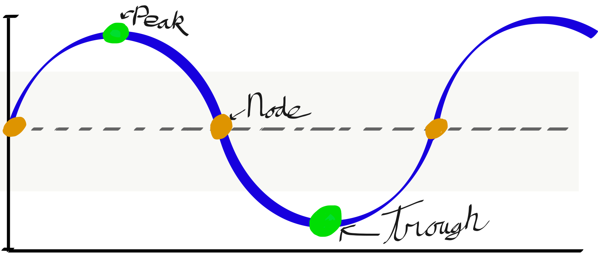
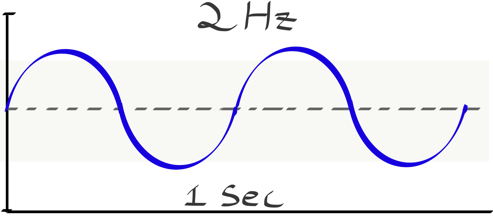
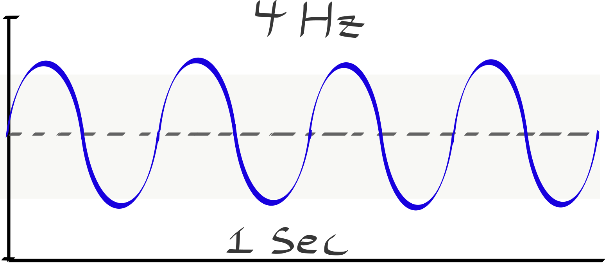

Before we go any further, we need to insure you understand the qualities and properties that define a wave.

## Compression and Rarefaction

As mentioned on the last page, sound waves are mechanical waves and are typically longitudinal waves. Longitudinal waves are created when a sounding surface pushes against a medium (often air). This push pushes air molecules away from the source, which then bounce into their neighbors, and continue the chain of events. This appears as a dense clumping of air molecules, that radiate outward from the sounding source.

This creation of a denser set of air molecules (in relation to the resting state of air molecules) is known as a **_compression_**.

<!-- Insert graphic -->

When the sounding source pulls back, it creates a vacuum of sorts, which causes air molecules to pull back, creating an outward motion of sparse air molecules (compared to their normal resting state). This sparse collection of air molecules is known as a **_rarefraction_**.

<!-- Insert graphic -->

## Peak and Trough

Even though sound waves in the physical world are often longitudinal waves (especially when considering them in gas or air), we will almost always represent them as transverse waves. This make our ability to visually discuss and analyze them easier.

<!-- Insert image relating transverse and longitudinal waves -->

> Next, while we discuss the properties of waves, we will primarily display [sine waves](https://en.wikipedia.org/wiki/Sine_wave) (also known as sinusoidal waves). A sine wave is the most basic building block of sound. When heard, a sine wave is a single frequency or pitch. All sounds in our world can be broken down into complex sets of sine waves.

When we discuss transverse waves, we will always include a horizontal, center line. This center line represents a resting state, in which no sound waves are present. This is equivalent to the resting or normal state of air molecules. As we visualize waves, we will show them moving above and below this center line. This represents sound wave energy.

When the wave is visualized above the center line, it is equivalent to a longitudinal wave compression. Likewise, when the wave is visualized below the center line, it is equivalent to a longitudinal wave rarefraction. These points in our transverse wave are respectively known as **_peaks_** and **_troughs_**.

<!-- Insert Image -->

## Node

A wave **_Node_** is anywhere that a wave crosses the center, zero line.

## Amplitude

The amplitude of a wave correlates to the amount of energy present in a wave in the real world. (_As you may already remember, amplitude in digital waves (i.e. those in our DAW), represents the amount of energy relative to 0dBFS or the max amplitude representation possible in a digital system. Waves in the physical world can be infinitely loud (technically), whereas we can only represent digital data as discreet values within an range._) The amplitude is defined as the distance between the center resting line and the absolute maximum value of the largest peak or trough.

To calculate the amplitude of a wave, we look for the maximum absolute value of every moment in a wave.

$$A = max( | f(x) | )$$

This means that the absolute distance from center of a peak or trough could be the amplitude of a wave.

We can also describe the amplitude at every moment of a wave as the absolute value of distance from center for that specific moment in time.

$$A = max( | f(t) | )$$

 

Amplitude is usually expressed in terms of **_Decibels_** (abbreviated _dB_). It is important to note, that decibels are a relational value, and require reference to some known sound pressure level. That is why on the computer, we often measure gain or amplitude in relation to 0.0dBFS (_zero decibels, full-scale_), which again is the maximum possible representation of amplitude within a digital audio file. When we express the amplitude of a sound wave in the physical or real world, we use a reference to the theoretically lowest level that can be heard by humans. This is then set as 0dB. Everything above 0dB is then in relation to this quietest level of human hearing (because obviously, signals can be quieter than we can hear).

Amplitude can also be expressed as a floating point linear value between 0.0 and 1.0 (which is common in coding languages for sound or digital representations).

## Cycle

A wave **_Cycle_** is the completion of one full wave. So, considering a transverse sine wave whose _phase_ has it beginning at 0 (the center line, or starting with a node), a complete cycle consists of going up to a peak, crossing zero down to a trough, and returning to the zero node.

<!-- Insert image -->

## Period

The **_Period_** of a wave is defined as the amount of _time_ it takes for one cycle to complete. Period is represented with a upper case 'T' ( $$T$$ ).

## Wavelength

Wavelength is the length, in units of length (e.g. meters), of one complete cycle or period of a wave. It's convenient to measure wavelength from node-to-node, peak-to-peak or trough-to-trough, but it can be anywhere, as long as the chunk of time represents one complete cycle of the wave. Wavelength is usually given the Greek symbol lambda ( $$\lambda$$ ).

## Frequency

The **_Frequency_** of a wave is defined as the number of cycles completed in 1 second of time. The symbol for frequency is often the Greek lower-case letter nu ( $$\nu$$ ). (It's basically a lower-case "v" that looks like the wind is blowing it over from the right.) However, we will use the a lower case 'f' ( $$f$$ ).

### Hertz

The frequency of sound is always written with the Hertz unit attached, (abbreviated _Hz_). It assumes that a 1 Hz signal is equivalent to 1 cycle per second. Therefore a 200Hz wave would have 200 cycles in 1 second.

## Relationship between Period and Frequency

The **_Frequency_** of a wave is inversely related to the **_Period_** of a wave. And vice-versa.

$$ f = \frac{1}{T} $$

_and_

$$ T = \frac{1}{f} $$

 

As an example if we know our frequency is 2Hz, then the period is equivalent to 0.5".

$$ 0.5 = \frac{1}{2} $$

Likewise, if we know the period is 0.2", then we know the frequency is 5Hz.

$$ 5 = \frac{1}{0.2} $$

## **_{ TODO: }_**

Please read and complete the test questions from the following lessons in
**["Waves" from The Physics Classroom](https://www.physicsclassroom.com/class/waves/)**

- Lesson 2 - Properties of a Wave
	- [The Anatomy of a Wave](https://www.physicsclassroom.com/class/waves/Lesson-2/The-Anatomy-of-a-Wave)
	- [Frequency and Period of a Wave](https://www.physicsclassroom.com/class/waves/Lesson-2/Frequency-and-Period-of-a-Wave)
	- [Energy Transport and the Amplitude of a Wave](https://www.physicsclassroom.com/class/waves/Lesson-2/Energy-Transport-and-the-Amplitude-of-a-Wave)
	- [The Speed of a Wave](https://www.physicsclassroom.com/class/waves/Lesson-2/The-Speed-of-a-Wave)
	- [The Wave Equation](https://www.physicsclassroom.com/class/waves/Lesson-2/The-Wave-Equation)
