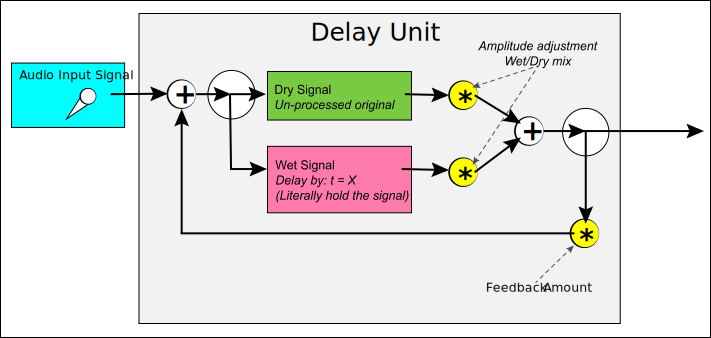
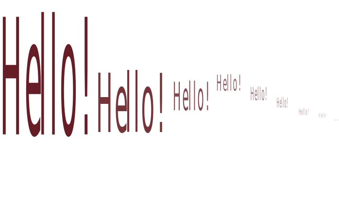
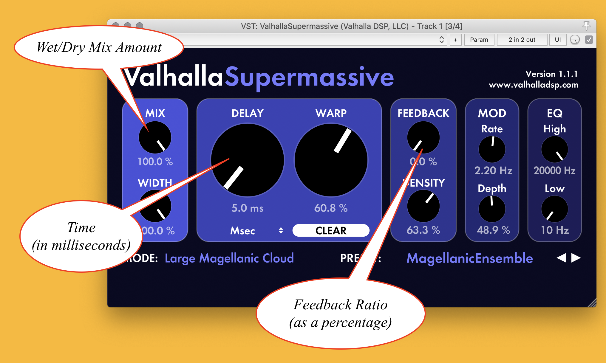

A delay in signal processing takes a sound, and _delays_ it by some amount of time. This sound is then released back into the signal.

Typically, a delay will pass both the _dry_, original, un-effected signal, as well as the _wet_ processed, delayed signal.

This combination of both the dry and wet signals causes listeners to perceive that there was in fact a delay. Often times, delays are perceived as "echoes", similar to that of sound returning to someone who screams in a canyon and hears there voice return to them after a delayed amount of time.

> In signal processing, the term **dry** refers to unprocessed signal. This is the original signal as it comes into the signal processing unit or plug-in. The term **wet** refers to the resulting processed signal. It is common in signal processing plug-ins for there to be some sort of **dry/wet** mix parameter. This allows the user to select how much processed signal versus unprocessed signal to mix together.

 

The signal processing diagram for a delay will often be represented as follows;

## Delay Parameters

There are a number of typical parameters for delay signal processing processes. These are;

- delay time (_in samples, seconds, or in reference to tempo/BPM_)
- wet/dry mix (_how much of the original signal and the delayed signal should be output_)
- feedback amount or coefficient (_should the resulting signal be fed back to the input again, and further delayed? If so, how much of this signal should be fed back?_)

### Delay Time

All delay processors will allow you to specify the delay amount. This will sometimes be expressed in time, either second or milliseconds (most common). This value can also sometimes be expressed as either a function of the tempo (eighth note, quarter note, etc.) or in samples (ignore this for now).

Milliseconds is the most common value, as the user often times wants to create a short delay, that will be perceived as an echo. This is one method for creating thick spaces full of reflections and reverberation.

### Wet/Dry Mix

This parameter allows the user to specify how much of the original signal versus the delayed signal to mix together. This can be useful to adjust when creating complex delays.

### Feedback Amount

This will sometime be expressed as a coefficient value (i.e. $$0.0 \to 1.0$$) or as a percentage (i.e. $$0-100\%$$).

In the diagram above, the feedback is the arrow that goes from right to left, taking the resulting output sound and returning it to the input of the delay processing unit.

The amount specifies how much to multiply the feedback signal by.

$$0\%$$ will of course _zero_ out the signal, resulting in no fed back sound. Whereas, $$100\%$$ will mean that the signal will continue to build infinitely over time. Any value in-between these two will cause fed back sounds to repeat for some amount of time, before eventually becoming so quiet as to be perceptually inaudible. This can create the sense of a fading echo or reflection.

When the feedback amount is set to a value such as 50%, it is as though someone who says "Hello!" will hear it half as loud each time, until it is inaudible.

Likewise, there are delay units that allow you to set a feedback rate that is greater than $$100\%$$. This will cause the delays to get increasingly louder, until they blow up in amplitude.

## Delay Plug-Ins

With the plug-ins you installed at the start of this week's content, you should have at least three delay plug-ins to explore and play with.

These are;

- ReaDelay (Cockos)
	- This is the default delay plug-in packaged with Reaper
- ++delay (SoundHack)
	- A delay unit developed by Tom Erbe
	- _{ NOTE: }_ When loading this plugin, choose the 'VST' version (NOT THE 'VST3' version)
- Valhalla SuperMassive (Valhalla DSP LLC.)
	- A complex delay unit with otherworldly sound possibilities.
	- _{ NOTE: }_ To load this unit, search for `SuperMassive`

The following two images highlight where the _wet/dry mix_ parameter, _delay amount_ parameter, and _feedback amount/coefficient_ parameter are.

## Relation to Tape

Delay, as we conceive of it, is another digital technology that had its origin in the tape-based analog studios of the 20th century.

In analog studios, there tended to be two types of delay available, phase delay, which would delay a signal by a small amount, on the order of a signal's period length, and tape delay. Tape delay would actually record sound to a tape with one record head, then read it back from the play head, based on the physical difference between the two heads. Tape delay could also be created with tape loop machines, which, as the name suggests, would loop a piece of tape.

Please read the following article on integrating a hardware-based tape delay unit into a studio from Sound on Sound, to get a sense of how tape-delay could be utilized in a studio.

- [Tape Delay In Your DAW](https://www.soundonsound.com/techniques/tape-delay-your-daw)
- [Exploration to the origin of the delay : the tape echo - Anasounds](https://anasounds.com/origin-of-the-delay-tape-echo/)

## Video Discussion

<iframe class="embed-responsive-item" src="https://www.youtube.com/embed/oJYYVKMVkt0" frameborder="0" allow="accelerometer; autoplay; encrypted-media; gyroscope; picture-in-picture" allowfullscreen></iframe>

