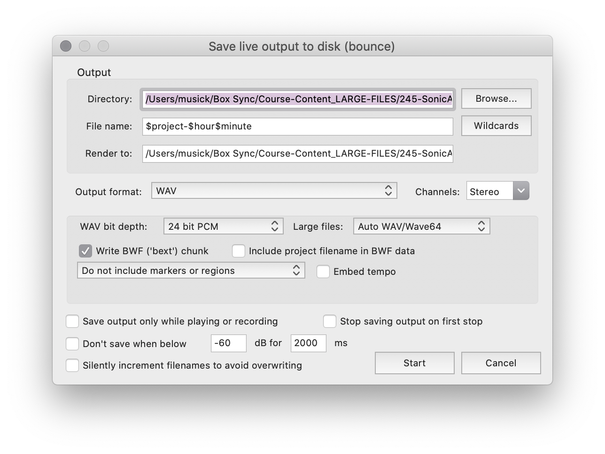
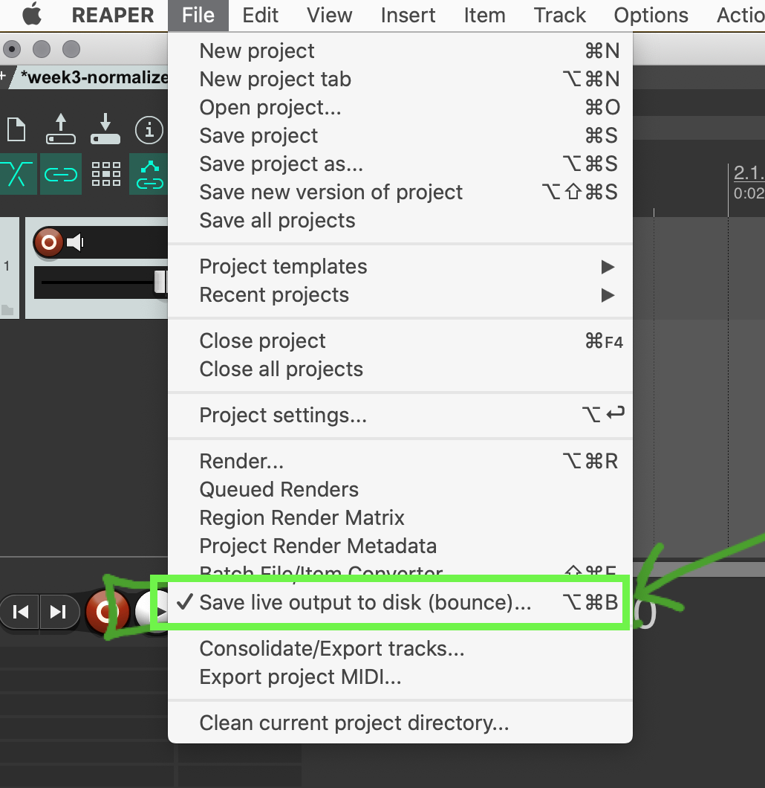

As was demonstrated on the last page, it is possible to capture live performances from within Reaper. This page explicitly outlines the steps needed to accomplish this.

## Setup Your Performance Environment

The first thing to do, is setup your performance environment.

If you choose to do a live performance for your homework this week, you can take suggestions from the previous content pages.

## Save Live Output to Disk

What we are specifically aiming to do, is save the "live output" from Reaper, directly to disk. To do this in Reaper, select the so-called option under the file menu (`File → Save live output to disk (bounce)...` NOTICE the use of the word _bounce_! We are bouncing audio from multiple tracks down to 2-tracks in real-time!).

## Settings

You should consider the following settings in the dialogue box that pops up.

### Directory

For directory, I would suggest you create a new sub-directory in your project's directory/folder, labeled `live-recording`. Select this as the directory.

### File name

For your file name, you can call it whatever you like. But I would suggest leveraging Reaper's built-in wildcard file-naming capabilities. This way, you can easily capture multiple recordings without having to later change the file names. Something like;

- `$project-$hour$minute`

### Output Format

- Select `WAV` as the output format type.
- Select `Stereo` under the channels selector
- Set "bit depth" to `24 bit PCM`

### Additional Checkboxes

Finally, I would suggest you uncheck all boxes at the bottom of the box. This leaves all control to you, and removes the computer from making any choices about when to start, when to stop, or what to record.

## Press Start

Finally, when you are ready, press `Start`.

Remember, this is an audio file, like any other audio file, so you can try a few times, leave a large break at the beginning, etc. You will bring this file into a new Reaper session later to clean it up.

## While Bouncing

You will be able to tell that Reaper is capturing your live output by verifying it in the transport section. Next to the time display, it should now say "BOUNCING 0:00", where 0:00 is the amount of time that has elapsed.

## When Finished Capturing

When you are finished capturing your performance, you can select the "Save live output to disk (bounce)..." option again from the File menu. You will notice that it is "checked" while bouncing. Pressing it again will stop the process, and "uncheck" this option.

## Clean Up the Finished Art Work

When you have finished capturing or _bouncing_ your work, you can then navigate to the directory where it was saved.

I would suggest you create a **new** Reaper session. Save this session as `week-7_HW-master`, or something of the sort.

Drag you bounced audio into this session.

Then, remove any excess silence from the start or finish. Or, if this track contains multiple performances (or false starts), split the audio so it is only what you want to submit (**{ NOTE: }** _You should leave 0.25-1 second of silence before you track starts).

Finally, _normalize_ your track, so that it has approximately -1dBFS of _headroom_ or the distance between the loudest point and 0.0dBFS / _max-volume_.

Finally, you can export the track, as we have for all of our other works up to this point. 
