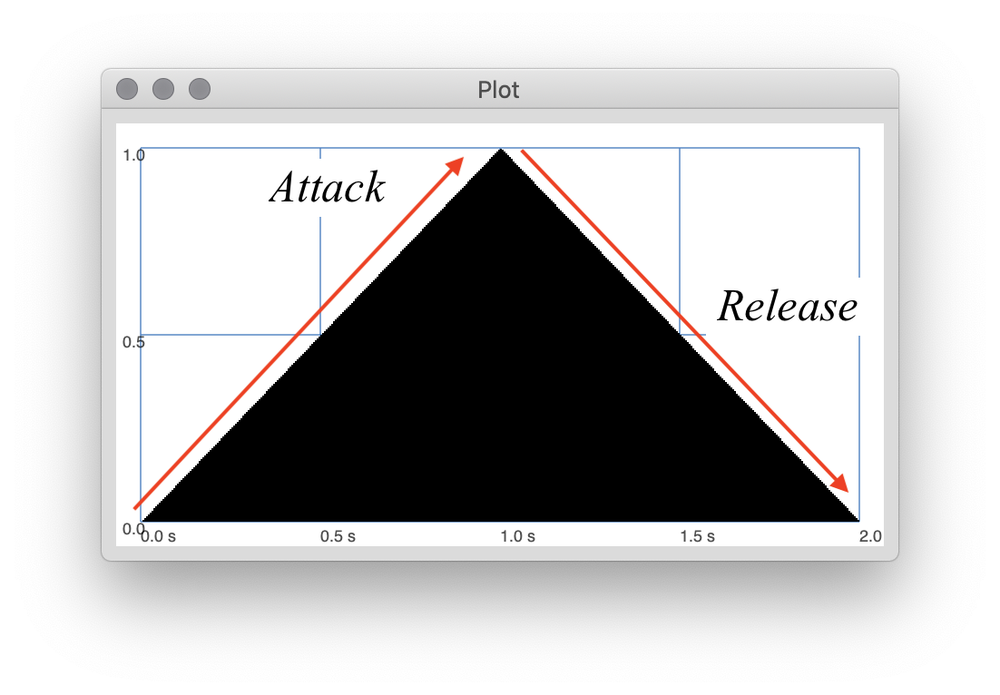
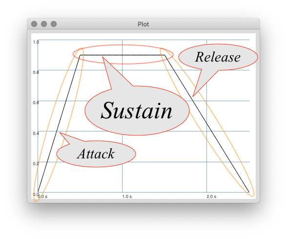
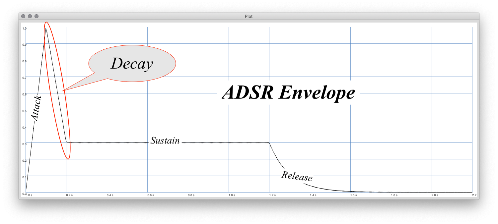

In sonic art and electroacoustic music, synthesis is the act of creating sound through mechanical or computational means. This is in opposition to ways which we have primarily examined up to this point in the semester of capturing sound using a microphone, then processing and utilizing it in the DAW.

The [Tone Generator](https://montana-media-arts.github.io/sound-fundamentals/modules/week-7/install-vsts/) plugins from last week are examples of synthesis in action. These generators can create one of six sounds (sine wave signal, saw up/down wave signal, triangle wave signal, square wave signal, and white noise). Each of the signals that the generator creates are synthesized from computational means that calculate the signal and then create it from nothing.

In the early days of sonic art and electroacoustic music synthesis techniques were rather simple, involving oscillators, filters, and delays. However, by the mid-20th century engineers such as [Robert Moog](https://www.moogmusic.com/news/dr-robert-moog) and [Don Buchla](https://buchla.com/history/) were working to create massive, modular synthesizers, capable of creating other-wordly sounds.

# Basic Synthesis Concepts

## Additive vs Subtractive Synthesis

Generally, there are two broad categories of sound synthesis, _Additive Synthesis_ and _Subtractive Synthesis_.

As you can potentially imagine, _Additive Synthesis_ creates sounds by adding oscillators or other sound generating devices together.

Although additive synthesis is a fairly straight forward concept, and seems logical, it was not the predominate form of synthesis. Although it is rather easy to ad a few sine wave oscillators together, to create complex sound may mean adding hundreds or thousands of them together. In the earlier days of synthesis, especially when everything was an analog electrical component, this was impractical at best and realistically financially impossible.

Instead, engineers favored subtractive synthesis, which works under the assumption that a complex signal will be created (such as a noise generator) and then filters will be used to remove sound until what is left is desirable.

<iframe class="embed-responsive-item" src="https://www.youtube.com/embed/pEQg13EYJqs" frameborder="0" allow="accelerometer; autoplay; encrypted-media; gyroscope; picture-in-picture" allowfullscreen></iframe>

### Modulation

One way of creating complex signals we have not talked about yet (in addition to using signals such as noise, or saw/triangle/pulse waves) is through modulation. In this scenario, one sine wave is used as the input to another sine wave. Typically, this modulating signal will either effect the amplitude of the carrier signal (which would then be known as amplitude modulation, or _AM Synthesis_) or the frequency (known as frequency modulation, or _FM Synthesis_).

<iframe class="embed-responsive-item" src="https://www.youtube.com/embed/yP71ydOgV1c" frameborder="0" allow="accelerometer; autoplay; encrypted-media; gyroscope; picture-in-picture" allowfullscreen></iframe>

## Envelopes

Another basic synthesis concept that you need to know about is that of envelopes. An envelope is essentially a "shape" which _contains_ and _defines_ some parameter of a sound. (_Think of a hand-written letter's envelope, which contains the letter itself._)

The most basic type of envelope that gets used in synthesis defines the amplitude of a sound. By defining the amplitude of the sound, an envelope is used to create the beginning, middle, and end of a sound event (or a note).

Envelopes can have all kinds of shapes and parameters. However, knowing that initially, we will use envelopes to define a sound event's amplitude, there a few specific qualities of sections to think about. From a basic level, we can think of a note as having a beginning (or _attack_) and end (or _release_). So, a basic envelope may look like the following;

However, as you will hear in the video, this creates a rather artificial and stiff sound. Instead, we may want an attack that is much shorter, resulting in a more natural sound. This might look like;

 

This is all fine and dandy, however, we may want to be able to define sound events that sustain (i.e. not always increasing then decreasing in amplitude). This would be known as a _sustain_ section. When combined with an attack and release, this creates a basic _ASR_ or _Attack, Sustain, Release Envelope_.

This sustain allows for a sound event or note to be held as long as is necessary.

In the real-world when analyzing sounds, you will notice that after the initial _attack_, most sounds have a loss of energy before they stabilize at their _sustain_ level. This is known as the _decay_. The _decay_ occurs directly after the initial attack, and allows a sound to appear as though it has been struck or some amount of energy has been exerted to create the sound.

Together, these four sections create the **_ADSR_** Envelope (standing for _Attack, Decay, Sustain, Release Envelope_.) This is a standard envelope shape in sonic art and electroacoustic music.

<iframe class="embed-responsive-item" src="https://www.youtube.com/embed/5x_xsAn-K7k" frameborder="0" allow="accelerometer; autoplay; encrypted-media; gyroscope; picture-in-picture" allowfullscreen></iframe>

# Artists Working With Synthesis

One of the first commercially successful compositions for synthesizer was by Morton Subotnick, who used a Buchla Synthesizer to compose _Silver Apples of the Moon_. Please read about Mort, his work, and then listen to this piece.

- [Morton Subotnick on 50 years of Silver Apples of the Moon](https://www.factmag.com/2017/07/13/morton-subotnick-silver-apples-of-the-moon/) (_Please note, there are a number of videos within the article you should watch._)

<!--
<iframe class="embed-responsive-item" src="https://www.youtube.com/embed/3G1hRNLlYpg" frameborder="0" allow="accelerometer; autoplay; encrypted-media; gyroscope; picture-in-picture" allowfullscreen></iframe>
-->

# **_{ TODO: }_**

Please also read the chapter on Synthesis in the Indiana University textbook. _Read the technical information closely. When they start talking about VCV Racks, you can choose whether you want to continue following along or not._

- [Synthesis Chapter Four: Synthesis Concepts](https://cmtext.indiana.edu/synthesis/chapter4_synthesis_concepts.php)
- [Synthesis Chapter Four: Envelopes](https://cmtext.indiana.edu/synthesis/chapter4_envelopes.php)
- [Synthesis Chapter Four: The Basic Patch](https://cmtext.indiana.edu/synthesis/chapter4_patches.php)
- [Synthesis Chapter Four: Modulation](https://cmtext.indiana.edu/synthesis/chapter4_modulation.php)
- [Synthesis Chapter Four: Audio-rate FM Synthesis](https://cmtext.indiana.edu/synthesis/chapter4_fm.php)
- [Synthesis Chapter Four: Audio-rate AM and RM](https://cmtext.indiana.edu/synthesis/chapter4_am_rm.php)
