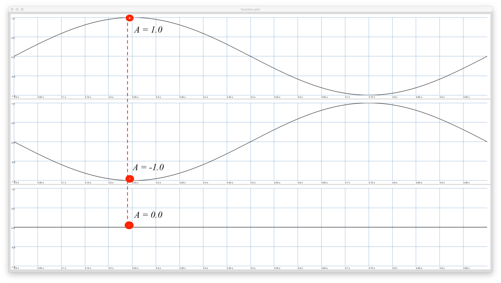
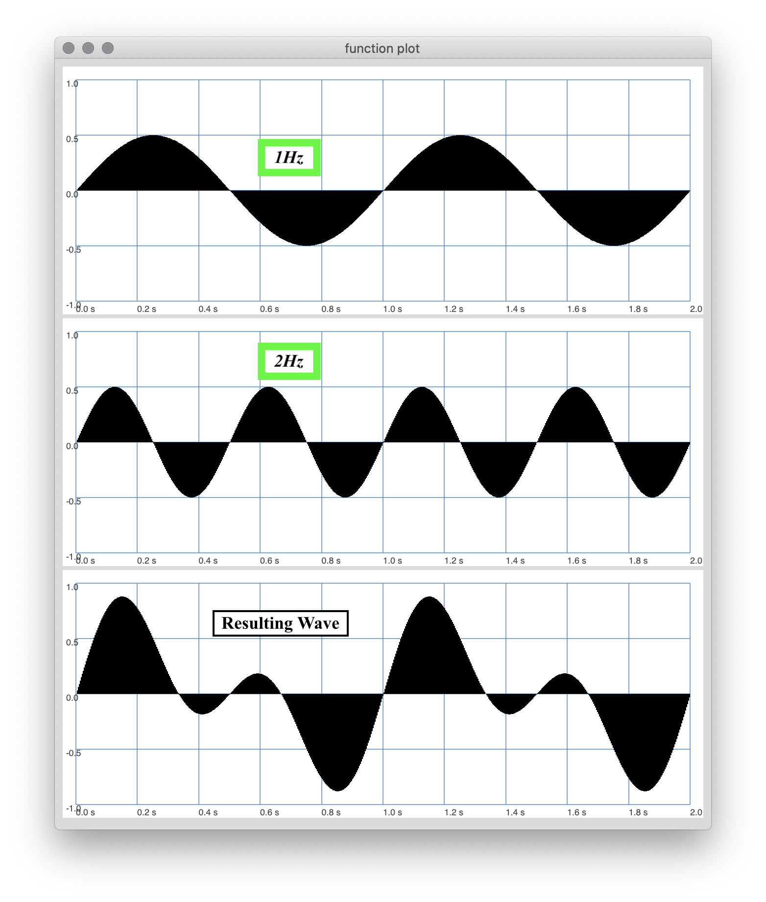
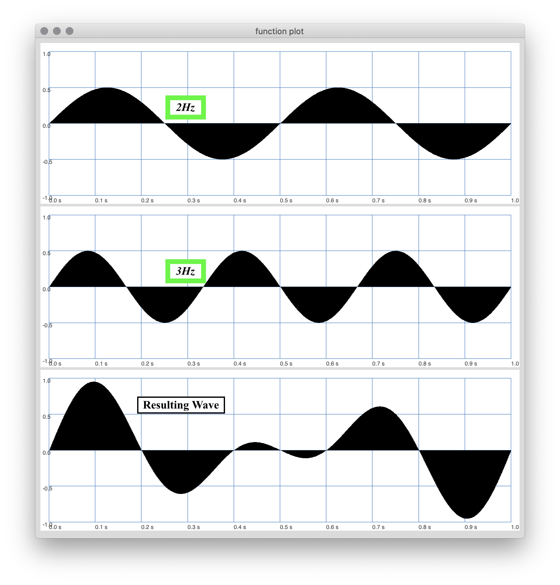

As mentioned previously, all sounds in our world can be described or broken down into a series of sinusoidal waves, added together, with various amplitudes and phases.

Obviously, not all sounds, signals, or waves that we work with will be simple sine waves. For example, the audio files that you have been working with in Reaper, visualized in the arrangement view, are clearly more complex than simple sine waves.

We will consider a complex wave, one that contains two or more simple sinusoidal components.

# 2 Sine Waves

As mentioned earlier, most sounds we hear are "complex", meaning they are comprised of multiple sine waves at varying frequencies, with various amplitude and phase relationships. Therefore it is important that you understand how waves behave when they are added together.

In the below images, two sine waves, each with an amplitude of $$A=0.5$$ and a phase of $$\phi=0$$ are shown, with the resulting summation of these waves shown in the lowest wave plot. Notice that at each moment ($$t$$), the addition of the waves causes a resulting amplitude that is double.

However, if the phase of either of these waves changes, then the resulting signal is also altered.

**_Phase_** is where a wave begins. So a phase of $$ \phi = \frac{pi}{2} $$ creates a resulting wave whose amplitude is half that of the original waves $$(A=0.25)$$.

As the two signals, with equal frequency move out of phase, the waves sum together "destructively", where they cancel each other out.

The following image demonstrates two waves, who are out of phase by $$\pi$$ resulting in a signal whose peak amplitude is $$A=0$$. This of course means the two waves have completely canceled out and there is nothing to hear.

The following interactive, allows you to visualize two sine waves whose frequency is equal, while adjusting their phase and amplitude. This should help you get a sense of how this effects the resulting signal.

<table>
	<tr class="figureCaption">
		<td width="100%" style="max-width: 800px; padding-bottom: 20px; padding-top: 60px; text-align: left;">
		<b>Figure 2.</b>&nbsp; Summing Sine Waves with Equal Frequency  
		 animation from: <a href="https://jackschaedler.github.io/circles-sines-signals/sound.html">jackschaedler.github.io/circles-sines-signals/</a> 
		</td>  

	</tr>
	<tr>
		<td style="text-align:left;">
			<svg id="sineSummationInteractive" class="svgWithText" width="600" height="400" style="padding: 20px; margin-left: 70px;"></svg>
			

			

			

				<label for=simpleCorrelationOffset>Phase Shift For Signal B</label> 
				<input type=range min=0 max=100 value=0 id=simpleCorrelationOffset step=1 oninput="updateSimpleCorrelationOffset(value);"
				onMouseDown="" onMouseUp="" style="width: 150px"> 

				<label for=simpleCorrelationAmp>Amplitude of Signal B</label>
				 
				<input type=range min=0 max=1 value=1 id=simpleCorrelationOffset step="0.1" oninput="updateSimpleCorrelationAmp(value);"
				onMouseDown="" onMouseUp="" style="width: 150px">
			

			</td>
	</tr>
</table>

## Video Example

In the following video, you can see and hear this relationship.

There are two sine waves, each at 300Hz. These are the lower two channels of the wave scope view. The top track represents the summation of these two signals. Notice, that as the two signal's phase relationships alter with each other, that the resulting signal is eventually cancelled out.

<iframe class="embed-responsive-item" src="https://www.youtube.com/embed/vdgRz3jJe2c" frameborder="0" allow="accelerometer; autoplay; encrypted-media; gyroscope; picture-in-picture" allowfullscreen></iframe>

> All of this is to say, that phase relationships are important!

# 2 Sine Waves of Different Frequencies

## Closely Related Frequencies

Now that we know waves are summed together, and that at each moment, the amplitude of one signal is added with the amplitude of the other, resulting in the complex wave, we can explore more principles of sound.

When two waves are close in frequency to each other, they will create the same destructive phase relationship effect you heard above. Let's say one signal has a frequency of 300Hz (as before), and the other has a frequency of 301Hz. Perceptually, when these waves are added together, we cannot tell them apart. So instead, they will create an oscillating effect of the resulting amplitude. As one wave will get "in phase" with the other, then "out of phase". The following video demonstrates this phenomenon.

<iframe class="embed-responsive-item" src="https://www.youtube.com/embed/GUCgcm7gxgc" frameborder="0" allow="accelerometer; autoplay; encrypted-media; gyroscope; picture-in-picture" allowfullscreen></iframe>

## 1:2 Ratio of Frequencies

These same principles apply when the frequency ratio's are greater between the waves. But, perceptually, we will start to actually hear two separate waves, forming into a signal, complex signal.

In the following example, you can see what happens when two waves with a $$1:2$$ ratio are combined. The frequencies are 1Hz & 2Hz. The peak amplitudes are both set at $$A=0.5$$. Notice how the summation changes.

Let's now listen to a similar relationship with 300Hz and 600Hz frequencies, respectively.

> This is also an **octave** relationship. So if thinking in terms of musical note names, these two frequencies would have the same name, but with an octave separation. (In this case, roughly a 'D')

<iframe class="embed-responsive-item" src="https://www.youtube.com/embed/NlxNZfp-FsM" frameborder="0" allow="accelerometer; autoplay; encrypted-media; gyroscope; picture-in-picture" allowfullscreen></iframe>

## 2:3 Ratio

Likewise, we can began to explore other ratio based relationships. A $$2:3$$ ratio relationship also creates nice math.

> A 2:3 ratio relationship is known as a **Perfect 5th (P5)** in music. If we begin with a frequency of 300Hz (roughly a 'D'), a 2:3 ratio results in a second frequency of 450Hz (roughly an 'A').

Let's now hear and watch the relationship of this $$2:3$$ ratio, using the frequencies of 300Hz and 450Hz.

<iframe class="embed-responsive-item" src="https://www.youtube.com/embed/5DSezx8C9kw" frameborder="0" allow="accelerometer; autoplay; encrypted-media; gyroscope; picture-in-picture" allowfullscreen></iframe>

## Various Ratios

The next video demonstrates the result of various frequency ratios between two sine waves.

<iframe class="embed-responsive-item" src="https://www.youtube.com/embed/HT6IhF_7sdg" frameborder="0" allow="accelerometer; autoplay; encrypted-media; gyroscope; picture-in-picture" allowfullscreen></iframe>

