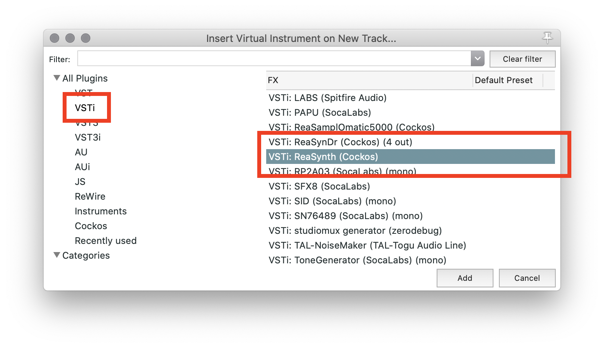
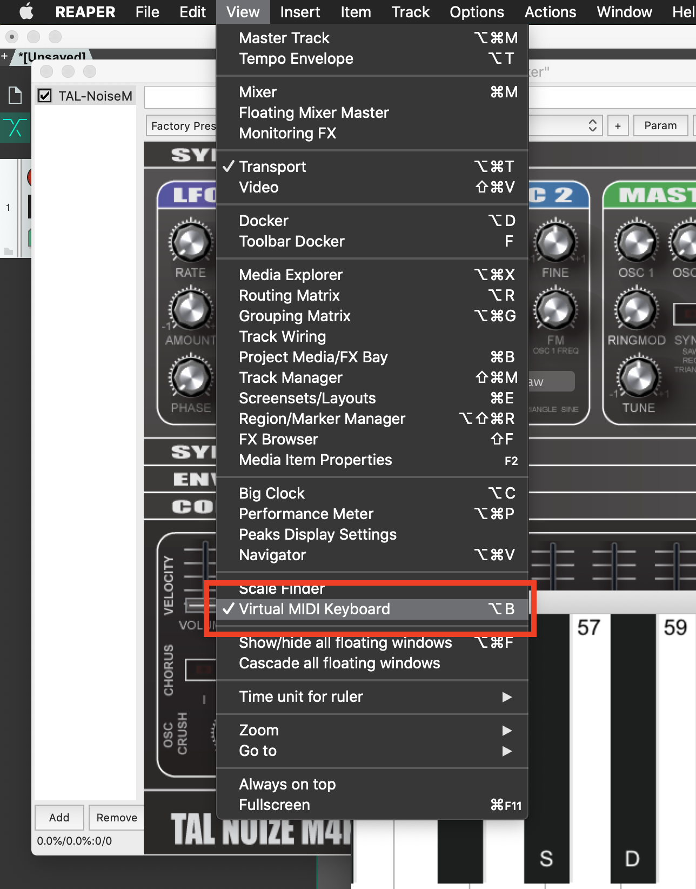
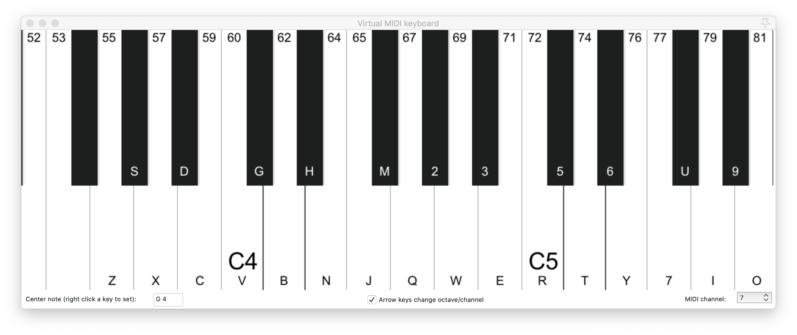

# Getting MIDI Setup in Reaper

MIDI works quite easily in Reaper, however, we need to follow a few specific processes that will make working with MIDI easier.

Please watch the following video to get information on working with MIDI in Reaper.

> The proceeding pages correspond to the content in this video.

<iframe class="embed-responsive-item" src="https://www.youtube.com/embed/bbdU7H_KDNk" frameborder="0" allow="accelerometer; autoplay; encrypted-media; gyroscope; picture-in-picture" allowfullscreen></iframe>

# Getting MIDI Setup in Reaper

Getting up and running with MIDI in Reaper is surprisingly simple.

## Create a MIDI Track

To get started, open Reaper, start a new session, and save it.

To insert a MIDI/Instrument-specific track, I suggest you actually use the "Insert Virtual Instrument on New Track" option under the _"Track"_ menu in reaper. (_This is opposed to the easier way of double-clicking in the track control panel_)

Alternatively, you can also right-click or control-click (mac) / option-click (Windows) in the Track Control Panel (TPC) to pull up a window where you can select "Insert virtual instrument on new track".

## Add a VST Instrument

Either of the above actions will automatically pull up the plug-in selection window.

In the plug-in selection window, I suggest you select the `VSTi` category. From there you should select the `VSTi: ReaSynth`.

## Playing MIDI

Once you have loaded the ReaSynth, we are almost ready to start playing. But first, we need to create a way of playing the MIDI Instrument. If you have a MIDI Controller or Device at home, such as MIDI Keyboard, you are welcome to hook that up and utilize it.

_If you hook up your MIDI device before opening Reaper, it should automatically recognize it, and use it. Try pressing a key, and you should hear sound. If it does not work, first verify that your instrument works with the following method, then either setup a meeting with me, or do some searching on the Internet._

 

### Virtual MIDI Keyboard Controller

Because this is an asynchronous online class, we work from the assumption that all you have at your disposal is a computer, phone, and headphones. So instead, we will utilize a virtual MIDI keyboard controller within Reaper.

Reaper has a built in MIDI Keyboard controller. You can open this controller under the 'View' menu by selecting "Virtual MIDI Keyboard".

This should pull up a keyboard window. You can play this window by clicking on the keys with your mouse.

If you click this window, or ensure it is the top-most and active window, you can also play this keyboard by pressing the corresponding keys on your computer's keyboard.

You should, now hear sound being played from the VST MIDI Instrument!
