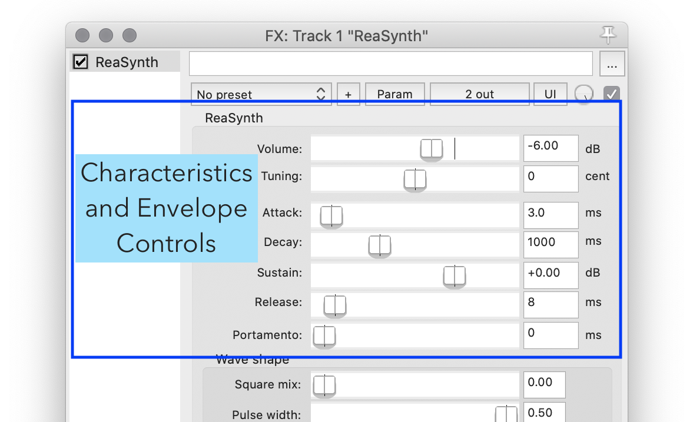

ReaSynth is a very basic VST MIDI-Enabled Instrument that allows for the creation of basic types of digital synth sounds. You will notice by looking at the controls, that they are very similar to the tone-generator plug-in we used last week. Likewise, the upper-section (more later) mirrors the information we [discussed about envelopes and events from earlier this week]({{site.baseurl}}/modules/week-8/synthesis/#envelopes).

## Tone Quality Selection or Wave Shape

In many ways, ReaSynth is similar to the tone generator we were utilizing last week. The lower section of the synth has a series of slider boxes, which correspond to the mix of straight sine wave oscillator. triangle oscillator, pulse-width oscillator, or sawtooth oscillator. Altering the amount of these oscillators will alter the resulting sound of the synth.

**_{ TODO: }_** Play with these settings to get a sense of how they change the resulting sound.

## Synth Characteristics and Envelope

The upper section of this synth allows you to specify the qualities of the envelope and how the synth moves from note to note.

**_{ TODO: }_** Please play around with each parameter to get a sense of how it changes/alters the resulting sound of the synth. _As a reminder, you will either need to click the keys in the piano-style keyboard to auction changes with you mouse, or re-ensure it is the top-most window before you can use your computer keyboard.

#### Volume

The `Volume` slider if hopefully self-explanatory. It adjusts the gain level of the synthesizer, setting its overall level.

#### Tuning

The `Tuning` slider adjusts the base-frequency for the entire synth. Moving this slider will cause every note the synth can play to be higher or lower by the corresponding amount of _cents_.

_Unless you are wanting to play with tuning, non-western music, or particular "effects" you are unlikely to alter this setting often. But please play with it now, so you are aware of what it does.

#### Attack

The `Attack` setting alters how drastically the attack portion of the envelope is shaped. Shorter values will result in "quick" and "sharp" attach sounds. Longer values will result in notes that "fade-in".

#### Decay

The `Decay` occurs immediately after the initial attack finishes. This determines how long it takes for a note event to attenuate to the set `sustain` level.

Short decay times will sound more like percussive instruments, where longer decay times will perceptually mirror larger instruments, where it takes longer for the initial energy to dissipate.

#### Sustain

The `sustain` level is the amplitude level that the synth will sound at for the majority of a note event. Greater sustain values create "louder" instruments, that lack punch. Lower sustain levels can result in percussive sounding instruments with large transients.

#### Release

The `release` time is the amount of time it takes for the sound of the synth to fully dissipate or diminish _AFTER_ it is finished being activated. This quality helps create organic sounding instruments. We expect tp hear some diminuendo or gradual release of sound energy after a note is played. The length of this parameter determines this quality.

Shorter values create "dry" sounding instruments that stop playing as soon as they are told to. Longer values create instruments that decay slowly over time, as though they have a mass and energy that needs to more slowly dissipate.

#### Portamento

When `Portamento` is set to greater than `0` this causes the synth to _"glide"_ between notes that are played consecutively.

To try out this characteristic, set this value to something quite larger, like `500 ms`. Then click one note with your mouse, and while keeping the mouse button down, move to a new note. You should hear the synth "glide" between the two notes smoothly. You can also experience this by making the keyboard the active window, then playing one note with your computer keyboard, followed by pressing another key on the keyboard simultaneously.

#### Monophonic vs Polyphonic

When the portamento value is greater than `0` then then synth becomes what is know as a _monophonic_ synth. This means the synth is only capable of voicing or playing a single note at a time. That is what you hear the glide between two notes when you press two notes one-after-the-other.

When the portamento value is set to `0`, this allows the synth to be _polyphonic_. A _polyphonic_ synth is one that can voice or play "multiple" notes at once.

**_{ TODO: }_** Please play with this parameter. Make the portamento value `0`, then play multiple notes. Likewise, then make the portamento value greater than `0`, and try playing multiple notes. Notice that you only hear a single note in the latter instance.
