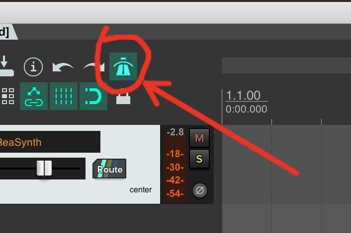
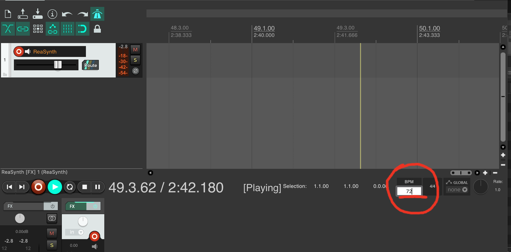

If you are wanting to play your synth instrument "in time", you may want to activate a metronome to hear a clicking sound that will let you hear the passing of each "beat".

A metronome is a device that helps musicians keep "time" by clicking at a specified Beats per Minutes or _BPM_.

So for example, at `60 BPM`, the metronome would click once per second, or 60 times per minute. At `120 BPM` the metronome would play 2 clicks per second or 120 clicks per minutes. Likewise, at `30 BPM` the metronome would click once every 2 seconds, or 30 times per minutes.

Obviously, not all music is locked to some multiple of a second. So, you may set the metronome to `52 BPM` or `138 BPM`. In these instances you would hear a click every `1.153` seconds or `0.434` seconds, respectively.

To turn on the metronome in Reaper, you need to select the metronome button, which is shaped like a traditional, pendulum-based metronome.

If you select this, then hit play, you should now hear a metronome click.

You can specify the BPM that the metronome and session should be set to, within the Transport section. Simply type in the BPM you desire.

> Metronomes are useful depending on the type of music or sonic art you are creating. This is one of the tools that you may use a lot, or never. It will depend on the artistic practices you are interested in pursuing.
