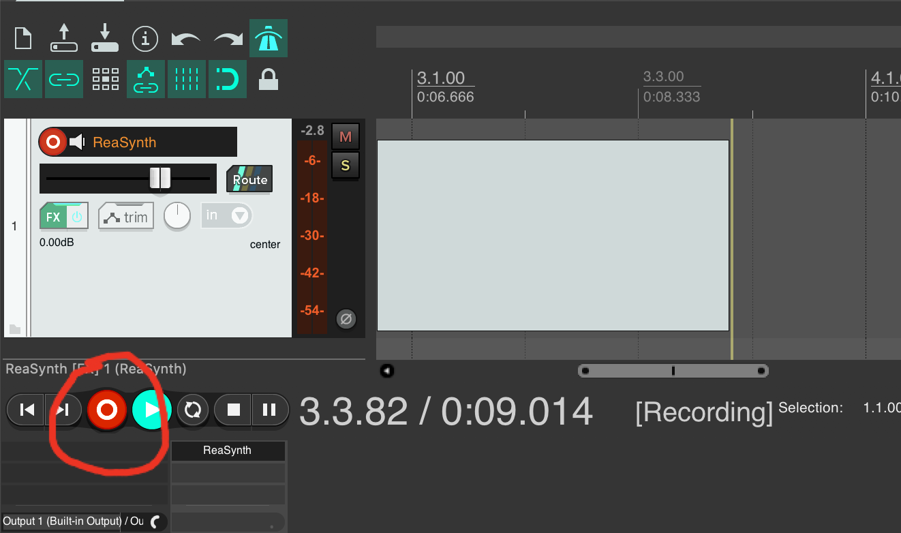
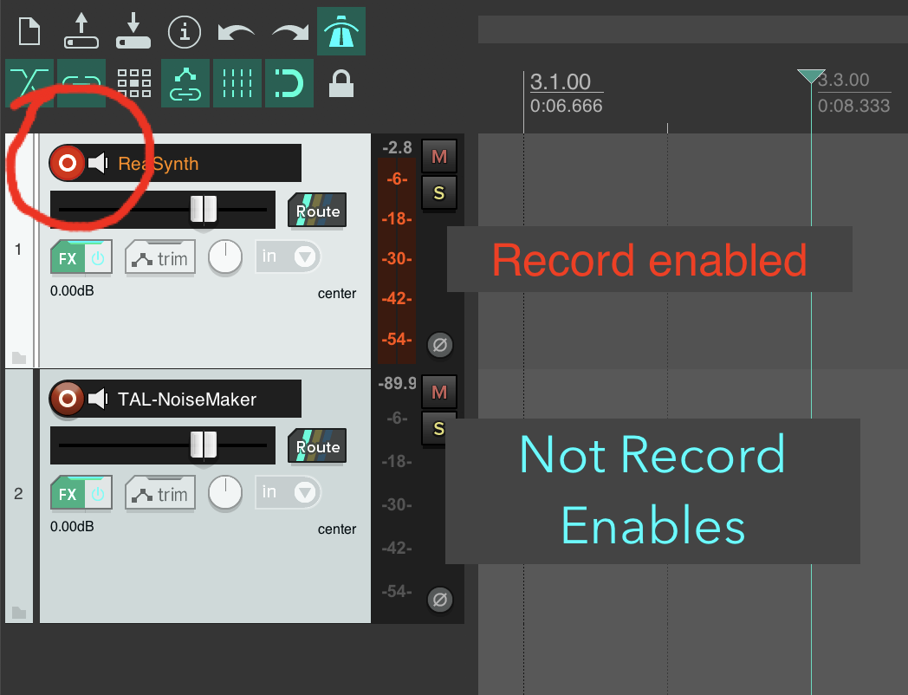
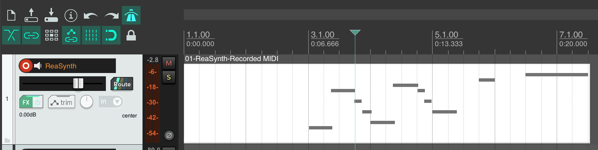
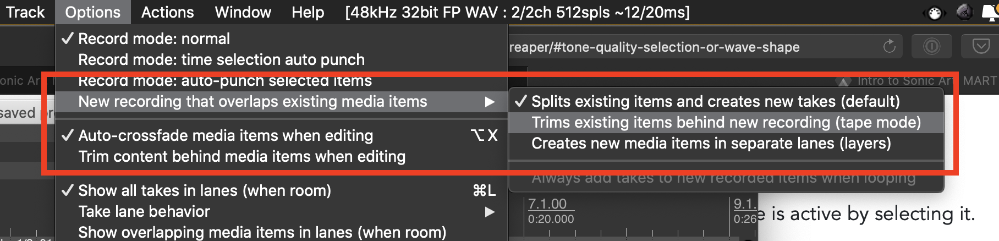
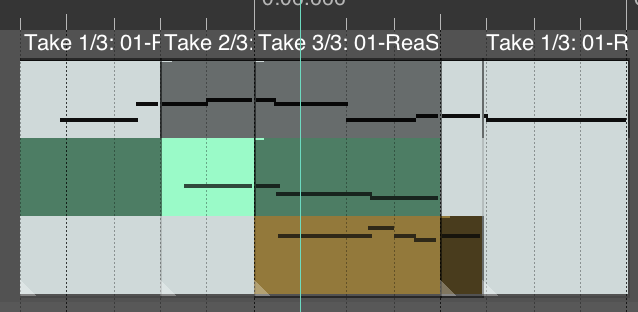
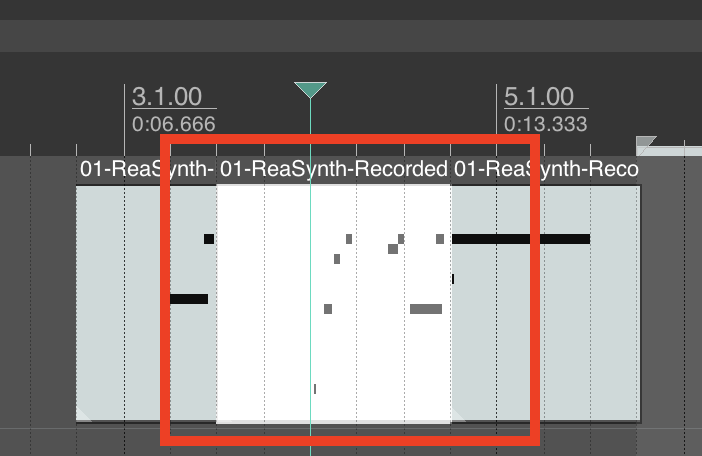
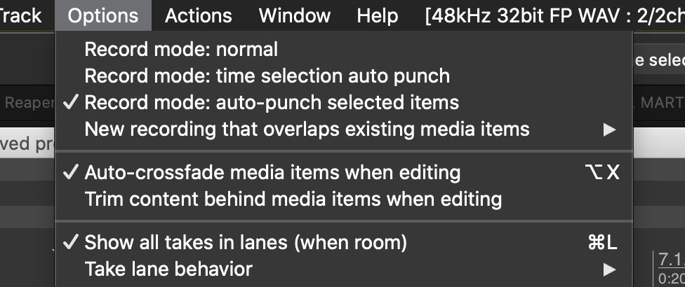

We are setup and ready to start laying down MIDI data into our Reaper session.

When you are ready, put Reaper into "_recording_" by pressing the "record button" in the transport.

You should start to see a new media item getting created in your Synth-MIDI track.

## Track Based Record Enable

If you did not see a media item also get created in your Synth track, double-check and ensure that the track is "_record enabled_". This is visualized with the record button that is specific to each track. If it is bright red, the track should be _record enabled_. The meter should also change color slightly to visually indicate that the track is record enabled.

## MIDI Media Item

When you press record, you should see a media item being created. Likewise, if you play the MIDI keyboard, you should see MIDI data populating this new MIDI-based media item.

## Recording Modes

I suggest, that initially, while you are working in Reaper, you change the default recording behavior of the program to "Tape Mode".

You can adjust or change the record mode under the `Options` menu. There you will find a sub-menu `New recording that overlaps existing media items`. Within this sub-menu you can select;

- `Splits existing items and creates new takes (default)`
- `Trims existing items behind new recording (tape mode)`
- `Creates new media items in separate lanes (layers)`

`

#### Take Mode (Default)

In the default "take mode" multiple performances are stacked as takes, where you can choose which one is active by selecting it.

This will be useful to you later on. You may also want to do your own research this week and dive more into this mode on your own. However, I believe this mode adds unneeded complexity for a beginners course.

#### Tape Mode

In _Tape Mode_ the media item (be it a MIDI item or audio item) will be spliced or cut at the point where recording begins and ends. This will result in a single "lane" of data. Much like physical tape, you can splice in new material, but the material cannot exist simultaneously.

The below image demonstrates _tape mode_. You can see where the new recording was spliced in.

## Auto Punch

Tape Mode also works really well with another record option. If you notice, in the `options` menu, above the record take or tape mode section, there was the option for:

- `Record mode: normal`
- `Record mode: time selection auto punch`
- `Record mode: auto-punch selected items`

The first of these (`normal`), is the default selection. With this selected. you will start capturing or recording in your track at the moment you press `record` in the transport.

Alternatively, the latter two options will allow you to make a selection in the timeline, then recording will only "_punch in_" at the selection location.

> We will dig deeper into these techniques next week. But I wanted to prime you with them for this week.
