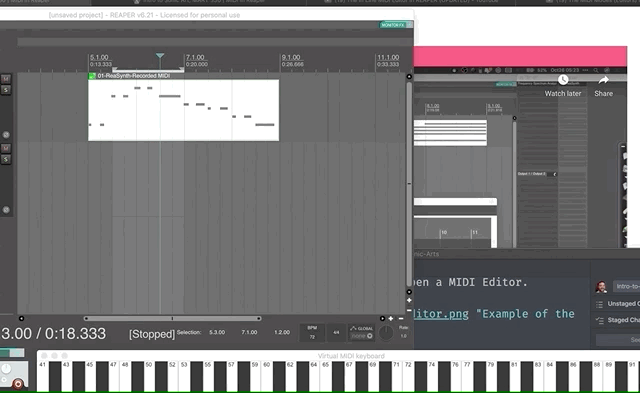
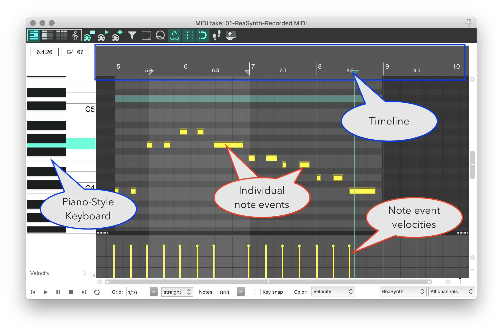
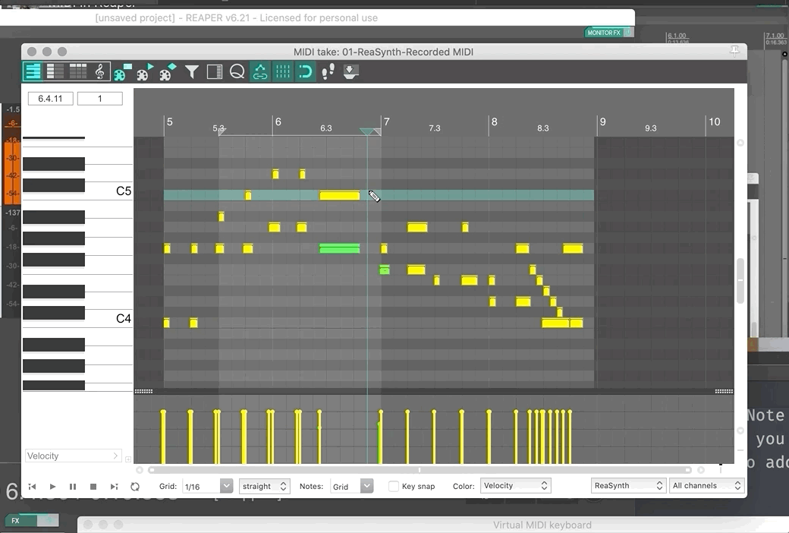
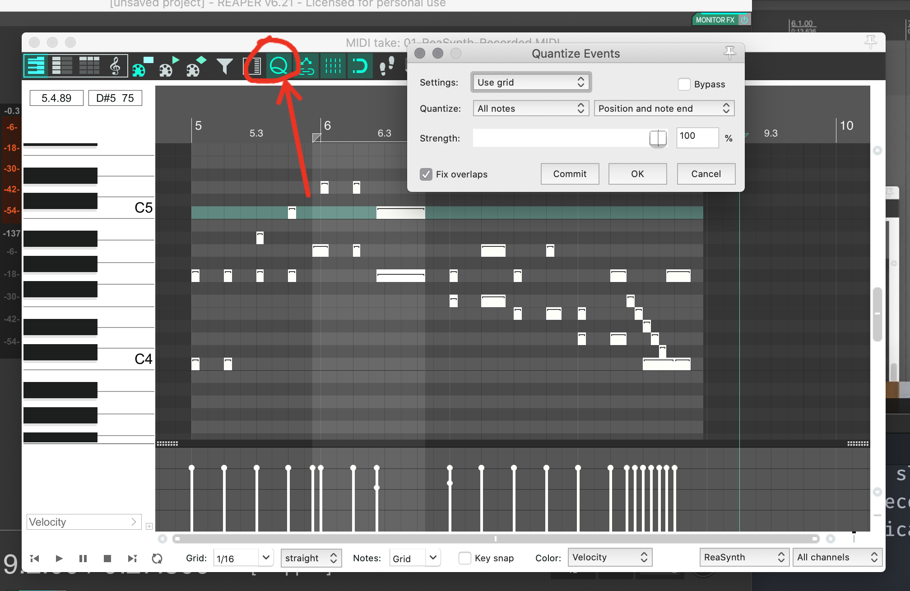

# Open MIDI Editor

After recording your first MIDI Media Item, you have the ability to further work with this data in a number of ways. The first way to learn is in the "MIDI Editor". To open the MIDI Editor, double-click on the MIDI-based Media Item that was created when you recorded. This will open a MIDI Editor.

In the MIDI Editor, what you will see if a piano-style keyboard on the left. This informs you as to what notes have MIDI data.

The main window to the right of the keyboard shows MIDI events, in relation to the piano-style keyboard. These are also in relation to the main timeline, which is present in the top-portion of the window.

Finally, the bottom lane, by default, displays the _velocity_ of each note. This typically maps to the amplitude that each note will be performed with.

# Move and Adjust Notes

In the MIDI Editor, you can work with, tweak, and perfect your MIDI data.

The first thing to try is moving notes. Adjust the view of the MIDI Editor window so that you can see the notes in your item.

## Move MIDI Events

Of you move your mouse over the individual note events, you should notice that you can "click", "grab", and the "move" the notes. You can do the same for the corresponding MIDI note event's velocity.

## Trim MIDI Events

Likewise, if you place your mouse at the start or end of a MIDI note event, your mouse should become a bracket, which allows you to trim or extend the start or end of a MIDI note event.

## Add New MIDI Events

You have also hopefully noticed that if your mouse if just in the MIDI Editor, it is shaped like a pencil. This allows you to draw in new MIDI Note Events. To add a new MIDI note event, double-click at the location where you want the note (with regard to time and pitch), or simply click and drag to add in a note of a specific value.

## Erase MIDI Events

You can erase notes by holding the `option` (mac) or `alt` (windows) key, which will turn your mouse into an eraser. Then you can click and drag over the notes you want to remove. You can also click a single note event, so that it is highlighted, then press delete.

# Quantizing MIDI Data

_Quantizing_ is a very common practice in music and sonic art production. Quantize means to _restrict the possible number of options down to a discreet few_. With respect to MIDI data, often this translates to automatically moving note start and stop data to be "in-line" with a tempo-based grid.

You may have noticed, that your recorded performance, is just so slightly (or maybe not so slightly) out of time from the metronome or other recorded material. Quantization is the process of asking a DAW to automatically adjust events so that they line up with your specified grid.

To quantize MIDI note event data select the notes you want to move. You can select all notes with `Cmd+A` (mac) or `Cntrl+A` (windows). You can also hold the shift key and select individual notes you want to quantize.

After selecting the notes you want to quantize, you can open the quantize menu by pressing the 'Q' in the MIDI Editor window.

When this editor is open, you can see how the quantization will effect your MIDI note events. Likewise, you can change the behavior by altering the quantization setting between:

- position (when does a note start)
- position and note end (when does a note start and end)
- position and note length (is the length standard i.e. quarter note or eighth note)

As you select these various options, you will see how it changes the positioning of your notes.

Likewise, you can choose how strongly you want the algorithm to be applied. At `100%` strength, the notes are snapped perfectly to the grid. As you lower this amount, they will get proportionally further away from perfect. (**{ NOTE: }** Allowing for some inconsistency and "dirt" can make music and art sound organic and more "human like". That is why you may choose to not utilize 100% strength.)

Finally, you can check how much movement will occur, by selecting the "bypass" switch in the upper-right corner, which will show the original state of all of the MIDI note events.

When you are finished, you can press `Commit` or simply `OK`.

Finally, please note that you can change the `Grid` value in the lower portion of the MIDI Editor, where it says `Grid`. Smaller values allow for greater granularity and complexity. Larger values, likewise, create larger blocks for the notes to fit within.
