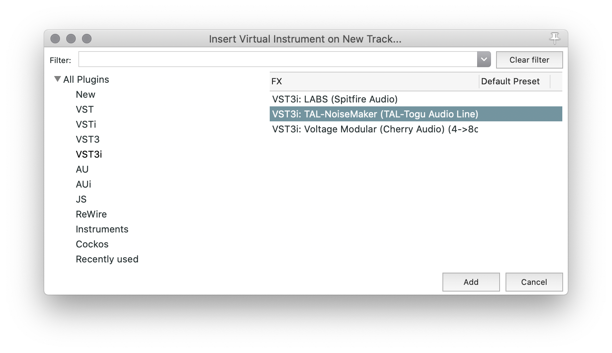
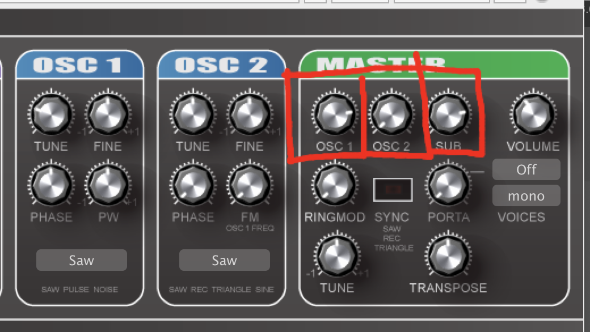
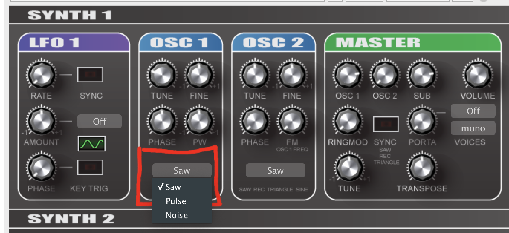

For this week, we will work with an external MIDI VST instrument, [TAL-NoiseMaker](https://tal-software.com/products/tal-noisemaker). To get started, please navigate to the relevant page, and download the VST Instrument (choose the option that is appropriate for your operating system):

- [https://tal-software.com/products/tal-noisemaker](https://tal-software.com/products/tal-noisemaker)

This instrument will download with an installer package, so installation will be automatic.

> The TAL-NoiseMaker is provided as a free software download. TAL has a number of other free VST plug-ins that you can check out at their [plugins](https://tal-software.com/products) page.
>
> There are numerous free VST Instruments on the web, Search for them if you want to explore other sounds. **{ NOTE: }** Please be careful in downloading software that has reviews and you can find discussed in multiple places. It is possible that free software can be malicious. Also, always read the user agreement, to ensure you are comfortable with the use rights or data collected by the software.

## Open TAL-NoiseMake

After downloading and installing the above, you should create a new instrument track, like previously demonstrated. To add the TAL-NoiseMaker, I suggest you select the `VST3i` category (This is a VST3 - _instrument_)

From there, you can select the TAL-NoiseMaker. (_Some systems will not support VST3i, in which case, you will need to select the appropriate version that is the older `VSTi` category. Alternatively, if you filter by "instruments" you should see which version you have.)

## Working with NoiseMaker

The TAL-NoiseMaker is based off a classic style synth module. It is comprised of three oscillators, which can be mixed together to create an array of possible timbres or sound qualities.

The three oscillators can be mixed in the right section of the plug-in.

Adjusting the relative values for those will change the mix of the oscillators.

### Main Oscillators

The main oscillators can be altered just to the left of the mixer. The tuning, phase, and pulse width can all be adjusted. More importantly though, the oscillator type can be selected. The types include expected classics:

- Saw
- Pulse
- Noise

## Play!

**_{ TODO: }_** I want you to explore the various settings of this synth, based on the knowledge of acoustics, and basic synthesis that you have gathered over the last few weeks.

## Select a Preset

To really get a sense of the variety that this synthesizer is capable of, you should also explore the presets that come with the instrument.

There is a preset dropdown menu near the top of the instrument plugin. Selecting it should open a menu with a bunch of various options for you to try out.

## SocaLabs

In addition to the built-in Reaper instruments, and the TAL-NoiseMaker, [SocaLabs](https://socalabs.com/synths/), (who we got the tone generator from), also has a number of classic synth emulation instruments, which are free. Feel free to explore and install their offerings as well.

- [SocaLabs Synths - https://socalabs.com/synths/](https://socalabs.com/synths/)
