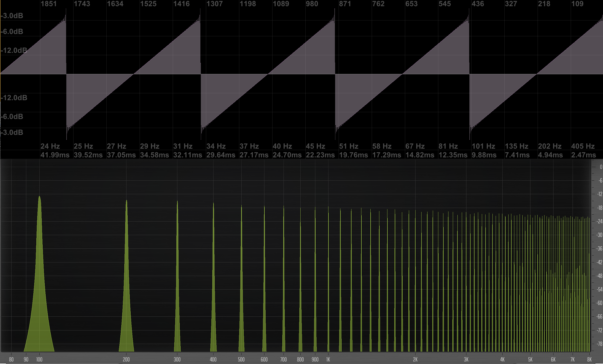
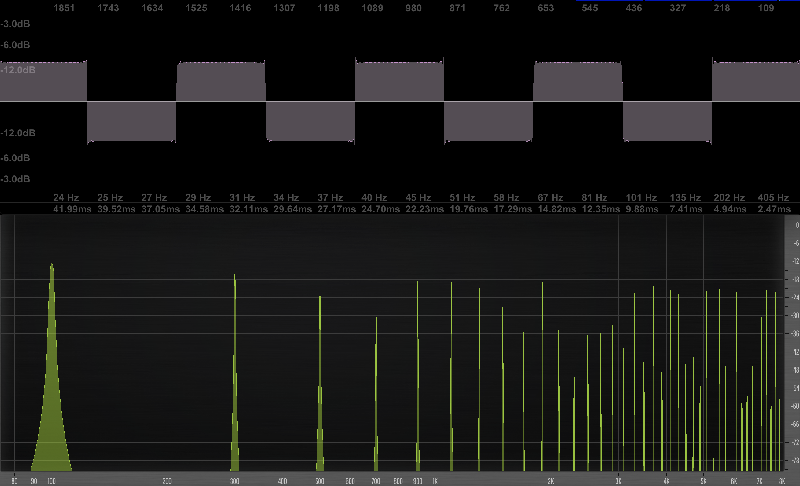
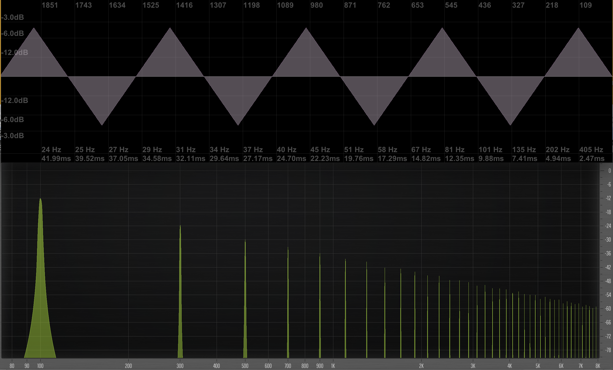


This page should probably be added to week 8


Oscillators are one of the basic tools of sonic art and electroacoustic music.  Oscillators are at the heart of synthesizers and are fundamental in creating the sounds of famous synthesizers. They have also been used extensively throughout sonic art, sound design, and electroacoustic music.

An oscillator is a _sound generator_ that creates a periodic (something that repeats) audio signal. One specific type of an oscillator is a sine wave oscillator, which creates and emits a sine wave. Typically, an oscillator will have the ability to adjust the fundamental frequency and amplitude of the signal being created.

In the pages exploring sound, and for the demonstrations exploring sound, you heard sine wave oscillators.

<iframe class="embed-responsive-item" src="https://www.youtube.com/embed/JIP84H-sFgg" frameborder="0" allow="accelerometer; autoplay; encrypted-media; gyroscope; picture-in-picture" allowfullscreen></iframe>

## Types of Basic Generators

The sine wave oscillator or generator is the most basic sound signal that can be represented or created. And by its definition, it is a single frequency.

There are three other types of basic signal generators. These wave shape types are;

- Sine Wave
- Triangle Wave
- Sawtooth Wave
- Square (or Pulse) Wave

As you notice from the above image, the wave types are named after the _way_ the wave signal looks.

Since any sound can be represented as a series of sine wave signals, we will actually describe these additional basic waves in terms of sine waves.

### Harmonics

These additional wave types are based on the _harmonic series_. As you know, a sine wave signal is, by definition, a single frequency signal.

The following image compares the visual oscilloscope view of the signal, against the _frequency spectrum_ view. It visually shows a 100Hz sine wave.

> A Frequency Spectrum is a momentary representation of a signal and all of the frequencies that are represented in that signal.
>
> The x-axis represents the frequency spectrum, typically showing 20Hz at the left to 20,000Hz at the right. Although sometimes only a portion of this spectrum is shown.
>
> The y-axis is the decibel level of the frequencies.

As you can see, for a 100Hz sine wave, the frequency spectrum analysis shows energy only at 100Hz.

The **fundamental frequency** of a sound is the lowest frequency and is also the **1st Harmonic**.

To determine a harmonic's frequency above the fundamental frequency or 1st harmonic, calculate the product of the harmonic and the fundamental frequency.

$$f_{n} = f_{1} \cdot n$$

Where $$n$$ is the harmonic number and $$f_{1}$$ is the fundamental frequency.

So, let's assume a fundamental frequency of $$f_{1} = 100Hz$$.

The harmonics above $$100Hz$$ are as follows;

- 1st Harmonic: $$100Hz = 100Hz \cdot 1$$
- 2nd Harmonic: $$200Hz = 100Hz \cdot 2$$
- 3rd Harmonic: $$300Hz = 100Hz \cdot 3$$
- 4th Harmonic: $$400Hz = 100Hz \cdot 4$$
- 5th Harmonic: $$500Hz = 100Hz \cdot 5$$
- 6th Harmonic: $$600Hz = 100Hz \cdot 6$$
- etc.

To play harmonics on a string, one would simply divide the string up in to the number of segments as the harmonic. This is demonstrated in the following image.

> **_{ TODO: }_**
>
> Open the tone generator plugin in, and turn the amplitude for the sine generator up. Move the frequency dial around. Listen to the quality of the signal.

### Sawtooth Wave

A saw (or sawtooth) wave is comprised of all of the harmonics, with a slight attenuation in amplitude.

The saw wave has a thick quality to its sound. I personally consider it to sound the most aggressive of the basic wave types.

> **_{ TODO: }_**
>
> Open the tone generator plugin in, and turn the amplitude for the saw (down or up) generator up. Move the frequency dial around. Listen to the quality of the signal.

### Square Wave of Pulse Wave

Unlike the saw wave, the square wave is comprised only of the odd harmonics. (You will notice in the spectrum analyzer below that there is energy at 100Hz, 300Hz, 500Hz, and so forth.)

The square wave is called as such, because of its visual similarity to squares, with immediate transitions from $$1.0$$ to $$-1.0$$.

This wave is sometimes referred to as a pulse wave, instead of square wave. This takes into consideration that this wave is can easily be manipulated by altering the relative length of the pulses. In the following image, there are three versions of the same frequency pulse wave signal. In the first version, the pulse is set at $$0.1$$, which means that the signal emits an amplitude value of $$1.0$$ for $$10%$$ of the time, and then $$-1.0$$ for the remaining $$90%$$ of the waves period or cycle. In the second signal, the ratio is set to $$0.5$$, which means it emits $$1.0$$ for $$50% of the period and $$-1.0$$ for the remaining $$50$$. The final signal contains a width value of $$0.9$$, which is the opposite of the first. These varying width pulse waves result in different harmonic makeups for the waves, meaning that the perceived quality or timbre is different for listeners.

### Triangle Wave

The last basic type of signal generator is the so-called triangle wave. Like the square/pulse wave, this signal also only contains odd harmonics. However, the amplitude attenuation as the harmonic count increases is significantly higher. This results in a mellower sound, and the triangle shape that this signal is names after.

## **_{ TODO: }_**

Please read from an **Introduction to Computer Music**:

- [Synthesis Chapter Four: History](https://cmtext.indiana.edu/synthesis/chapter4_synthesis_history.php)
    - Please note that there is only 1 page.
- [Synthesis Chapter Four: Waveforms](https://cmtext.indiana.edu/synthesis/chapter4_waveforms.php)
  - Please note that there are 2 pages.
