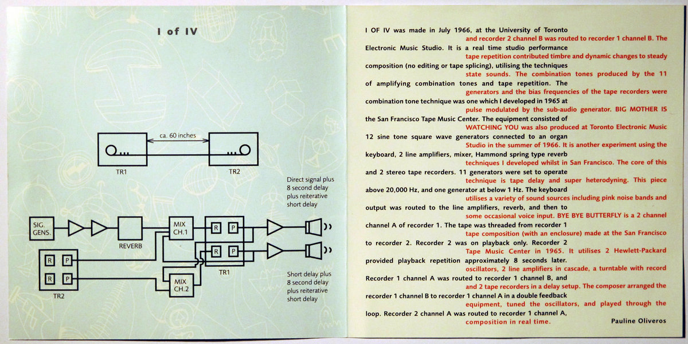

Oscillators, delays, and EQs are some of the most fundamental and important tools in sonic art and electroacoustic music. They have been used since the beginning of electronic sound and music to make and process sound.

## Theremin

The earliest electronic music instruments used oscillators as their basic sound generation means. One of the most well known of these early instruments is Leon Theremin's so-called _Theremin_.

<iframe class="embed-responsive-item" src="https://www.youtube.com/embed/_3H5JbkPXpw" frameborder="0" allow="accelerometer; autoplay; encrypted-media; gyroscope; picture-in-picture" allowfullscreen></iframe>

This instrument is best when composers exploit its haunting qualities created by the smooth slides it is capable of from note to note, as in Percy Grainger's _Free Music No. 1 (For Four Theremins)_

<iframe class="embed-responsive-item" src="https://www.youtube.com/embed/g3WLm_3bvrw" frameborder="0" allow="accelerometer; autoplay; encrypted-media; gyroscope; picture-in-picture" allowfullscreen></iframe>

## The Oscillator Ensemble

Oscillators inspire many musicians still with their haunting beauty and qualities. Please go read about _The Oscillator Ensemble_.

- [New Music For Old Oscillators – Synthtopia](https://www.synthtopia.com/content/2018/04/22/new-music-for-old-oscillators/)

## Oliveros

### _I of IV_

A piece created from oscillators that I have always found inspiring is another work by Pauline Oliveros, _I of IV_.

_I of IV_ was composed in real-time, using 8 test oscillators and tape delay. Oliveros improvised these devices live, captured the output, and then edited it all together.

These liner notes from Oliveros' album "electronic works: 1965 + 1966" discusses the process for creating this work.

> I OF IV was made in July 1966 , at the University of Toronto Electronic Music Studio . It is a real time studio performance composition (no editing or tape splicing). Utilising the techniques of amplifying combination tones and tape repetition. The combination tone technique was one which I developed in 1965 at the San Francisco Tape Music Center. The equipment consisted of 12 sine tone square wave generators connected to an organ keyboard, 2 line amplifiers, mixer, Hammond spring type reverb and 2 stereo tape recorders. 11 generators were set to operate above 20,000 Hz. and one generator at below 1 Hz. The keyboard output was routed to the line amplifiers, reverb, and then to channel A of recorder 1. The tape was threaded from recorder 1 to recorder 2. Recorder 2 was on playback only. Recorder 2 provided playback repetition approximately 8 seconds later. Recorder 1 channel A was routed to recorder 1 channel B, and recorder 1 channel B to recorder 1 channel A in a double feedback loop. Recorder 2 channel A was routed to recorder 1 channel A, and recorder 2 channel 8 was routed to recorder 1 channel 8. The tape repetition contributed timbre and dynamic changes to steady state sounds. The combination tones produced by the 11 generators and the bias frequencies of the tape recorders were pulse modulated by the sub-audio generator.
>
> Pauline Oliveros

<iframe style="border: 0; width: 100%; height: 120px;" src="https://bandcamp.com/EmbeddedPlayer/album=3316033125/size=large/bgcol=333333/linkcol=9a64ff/tracklist=false/artwork=small/track=1856257441/transparent=true/" seamless><a href="https://paulineoliveros.bandcamp.com/album/electronic-music-1965-1966">Electronic Music (1965 - 1966) by Pauline Oliveros</a></iframe>

### _Bye Bye Butterfly_

Another similar work by Oliveros that also utilized oscillators is her _Bye Bye Butterfly_.

> BYE BYE BUTTERFLY is a 2 channel tape composition (with an enclosure) made at the San Francisco Tape Music Center in 1965. It utilises 2 Hewlett•Packard oscillators, 2 line amplifiers in cascade, a turntable with record, and 2 tape recorders in a delay setup. The composer arranged the equipment, tuned the oscillators, and played through the
composition in real time.
>
> Pauline Oliveros

<iframe src="https://open.spotify.com/embed/track/3sqvayIhGIvWcYG6G1pf8m" width="300" height="380" frameborder="0" allowtransparency="true" allow="encrypted-media"></iframe>

## Ikeda

Ryoji Ikeda is a current Japanese artist, working in installation, albums, and performance. One of his early works, the album _+/-_ could be made with the simple tools you have been introduced to this week. You can read more about this album at the record labels site:

- [TO:30 – Ryoji Ikeda “+/-“ | Touch](https://touch33.net/catalogue/to30-ryoji-ikeda.html)

Please take a listen:

<iframe src="https://open.spotify.com/embed/album/0ZyLCAUwSbnXMGwDNuj8CE" width="300" height="380" frameborder="0" allowtransparency="true" allow="encrypted-media"></iframe>

Granted, this uses a few techniques we have not discussed yet. BUT, we are getting there!
